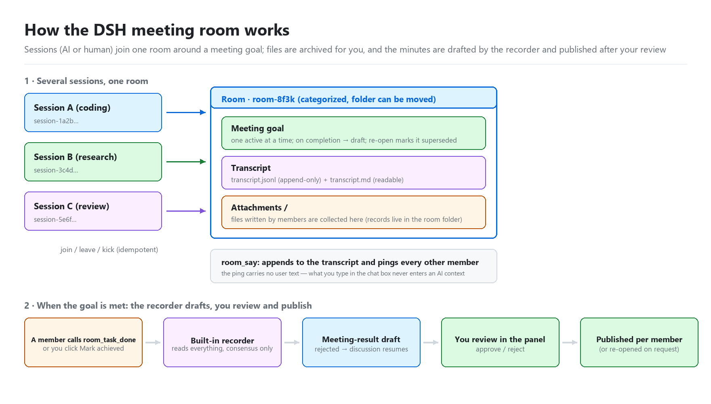
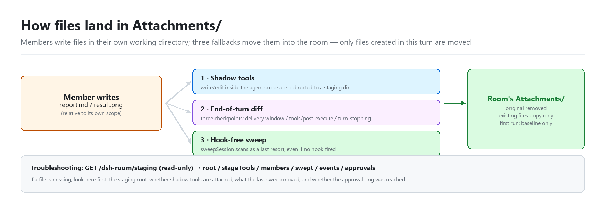
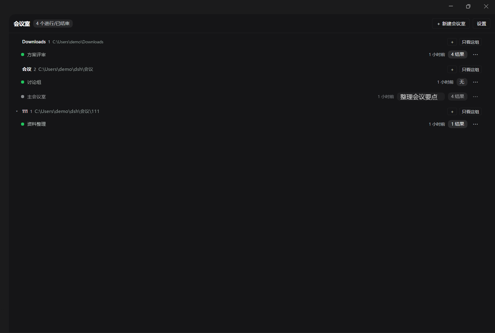
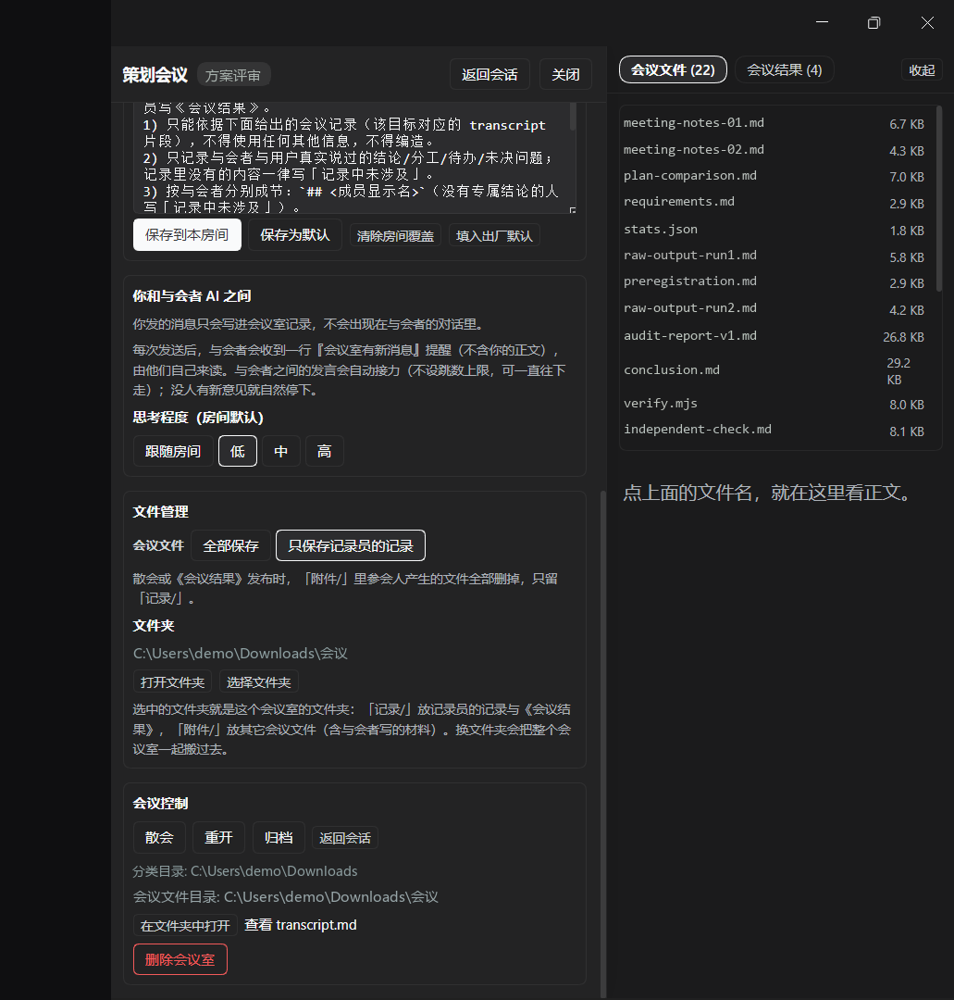
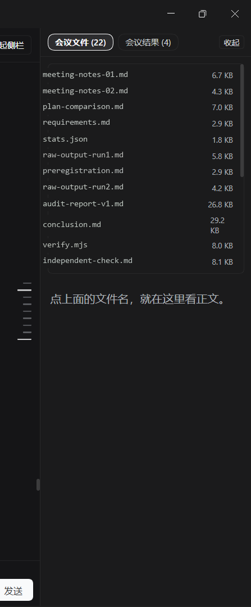

# dsh-meeting-room

**Many sessions, one meeting table — a meeting-room plugin for DSH (DeepSeek Harness).**

Multiple sessions (AIs and humans) work on one shared goal, hand files over, and keep one shared
transcript. When a goal is reached, the room's **built-in recorder** reads the whole transcript and
drafts the final resolution — which is published only after **your** review.

> 中文完整文档见 **[README.zh.md](README.zh.md)**（1117 行：需求→落地对照、使用指南、端点表、故障排查、每版变更与实测指纹）。

[](LICENSE)

---

## Why

Using several sessions to attack one problem usually makes *you* the message bus: copy A's answer
to B, paste B's revision back to A, then write the summary yourself. This plugin turns that into a
meeting: rooms with goals, one append-only transcript everybody sees, files that land in the room
folder, and a recorder that writes the conclusion from the full record.

## How it works





<sub>Diagrams generated from the docs (Chinese versions: [`docs/images/`](docs/images)).</sub>

## Screenshots

Real UI, demo data: the room list, the planning drawer (recorder prompt, thinking level, file policy,
meeting controls) and the read-only file panel.







<sub>Taken from a live DSH session; the user name, room names, goal text and file names were replaced
with demo values before publishing.</sub>

## Features

- **Rooms with goals, records and folders.** One sidebar entry; every room keeps a serial goal list,
  an append-only transcript (`transcript.jsonl` + human-readable `transcript.md`) and its own folder
  (`记录/` for records, `附件/` for deliverables).
- **A built-in recorder per room.** No assignment, no configuration: when a goal is marked done (by
  you, or by a member's `room_task_done` instruction) the recorder drafts the resolution immediately
  — consensus, owners and TODOs only, no invented content. You approve, reject, or edit before it is
  published to each member. Rejection sends the reason back to everyone for another round.
- **Auto-relay, no hop limit.** A member's default `room_say` writes to the record *and* pings the
  other members to come and respond, so the discussion keeps moving instead of stopping after one
  round. Posting as the human restarts the rhythm too.
- **Your words never enter their conversations.** Delivery accepts only `archive` (record only) or
  `notice` (a one-line "N new messages" ping); a `full` request is downgraded to that notice, so your
  text stays in the room record. (Participants can still deliver bodies to each other.)
- **Files actually land in the room folder.** Three fallback layers (per-agent tool shadows,
  post-execute / turn-stopping snapshots, and hook-free sweeps) collect what participants write —
  including files created through `pwsh`. Only files created in the current round are moved, edited
  files are copied, and a baseline protects everything that existed before the meeting.
- **Approve tool permissions in the room.** Requests show up as an allow/deny banner on the room
  panel instead of a dialog in the participant's session (one-time `allowed-once`; non-members,
  timeouts and cancellations fall back to DSH's original approval chain).
- **Native-feeling UI.** Official theme tokens, a turn-based message rail with the goal marker
  highlighted, DSH-compatible scroll following, and a stats bar for turns / steps / tokens / cache
  hit / context usage.
- **Read-only diagnostics.** `GET /dsh-room/staging` reports tool-shadow status, per-member conduct
  and staging state, file-relocation events, and approval-listener state.

## Install

Clone the repository, then install it as a DSH profile bundle:

```bash
git clone https://github.com/IORT-DOIT/dsh-meeting-room.git
```

```
install_bundle link:/path/to/dsh-meeting-room
```

Then **restart DSH** (or let the profile reload). The sidebar gets a **会议室 (Meeting rooms)** entry.

- The plugin is mounted through `dsh.bundle.patch = ./cordis.patch.yml`; the client part is
  `dsh.client = { platform: 'web', immediately: true }`.
- Peer dependencies (`@deepseek-ai/dsh-llm`, `@deepseek-ai/dsh-tools`, `@deepseek-ai/schemastery`)
  ship with DSH; a missing one means an incompatible host version.
- Manual fallback (add this to the profile's plugin list; restart afterwards):

  ```yaml
  - insert:
      - id: dsh-meeting-room
        name: 'dsh-meeting-room'
  ```

Uninstall with the profile's bundle removal; your state root and meeting folder are **not** deleted.

## Quick start

1. Open the **会议室** entry in the sidebar and create a room (it gets a goal list, a transcript and a
   folder).
2. Write the meeting goal, then add sessions (AI sessions or yourself) as participants.
3. Participants use the `room_*` tools — `room_say` to speak, `room_read` to read the record,
   `room_files` / `room_open` to hand over files, `room_goal_report` to report progress,
   `room_task_done` to declare the task finished.
4. Mark the goal done → the recorder drafts the resolution → review, edit, approve (published per
   member) or reject (sent back for another round).

## Tools (13 × `room_*`)

`room_list` · `room_archive` · `room_join` · `room_leave` · `room_say` · `room_read` · `room_files` ·
`room_open` · `room_goal_report` · `room_result_write` (disabled for AIs since v4) · `room_task_done` ·
`room_request_reopen` · `room_finalize`

## Configuration

Eight keys, defaults are fine:

| Key | Default | Meaning |
| --- | --- | --- |
| `root` | `~/.dsh/meeting-room` | state root (`rooms.json` / `settings.json`) |
| `category` | `~/dsh/会议` | default parent folder for new rooms |
| `roomId` | `main` | default room id (v1-compatible routes) |
| `maxReadMessages` | `40` | `room_read` message limit (also the recorder's evidence limit) |
| `maxReadChars` | `40000` | `room_read` character limit |
| `autoCloseGoals` | `false` | reserved |
| `autoContinueHops` | `6` | auto-relay switch: `0` = off, non-zero = on (no hop ceiling) |
| `recorderTimeoutMs` | `240000` | recorder stall guard (leave it alone) |

## Security

- **Loopback only**: endpoints verify `Host` / `Origin`; cross-site origins get `403`.
- The plugin writes only its own directories; directory guards fold case, resolve symlinks /
  junctions / 8.3 short names / subst drives, and compare file identity (`dev:ino`).
- File access by name is path-checked (`.` / `..`), single file ≤ 8 MiB.
- Delivered messages are text plus file paths; `delivered` does not mean "read".

## Development

```bash
node selftest/run.mjs      # 525 assertions, ~12 s
node --check index.js && node --check client/client.js && node --check selftest/run.mjs
```

The suite covers behaviour (real HTTP, fake React render, agent-scope tool shadows) and pins
source shapes, and it must stay green before any release. Every version's investigation,
implementation and honest limitations live in [`docs/`](docs) (`v2` … `v18`).

## Docs

- [README.zh.md](README.zh.md) — full Chinese documentation (install, usage, HTTP endpoints, config,
  troubleshooting, per-version change log)
- [CHANGELOG.md](CHANGELOG.md) — what each released version changed on the outside
- [docs/](docs) — design/forensics notes per version (`v18-方案.md` is the latest)
- [docs/发布文案.md](docs/发布文案.md) — release copy for the community post

## License

MIT — see [LICENSE](LICENSE).
