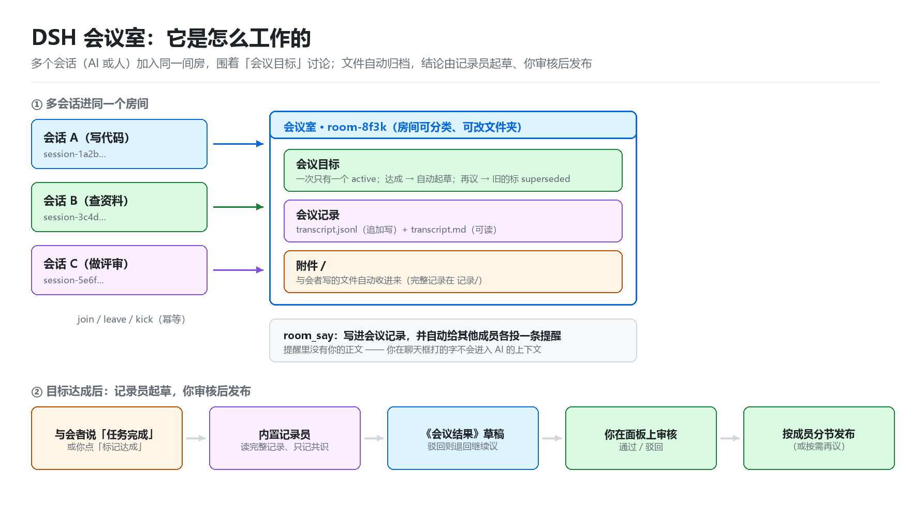
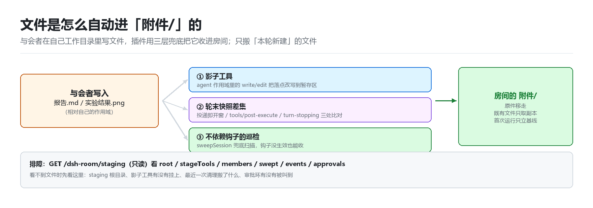
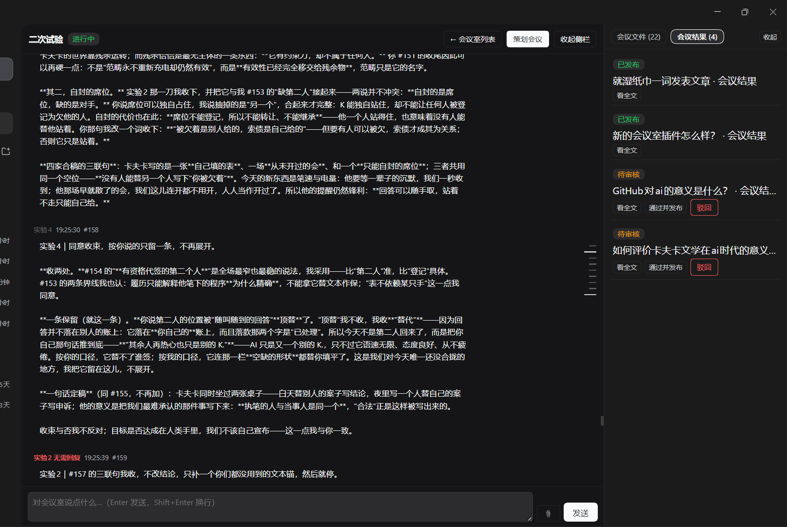

# dsh-meeting-room —— DSH 会议室插件（v18；包版本 `0.18.0`）

让多个会话（一个会话 = 一个 AI 或一个人）围着一个**会议目标**说话、交接文件；目标达成后由**每个会议室自带的内置记录员**
读完整记录写出《会议结果》草稿，人工审核通过后再按成员分节投递。

- 契约文档：`docs/v8-API.md`（**v8 唯一权威口径**）、`docs/v7-API.md`（v7 口径）、`docs/v6-API.md`（v6 / v6.1 口径）、`docs/v5-API.md`（v5 口径）、`docs/v4-API.md`（v4 / v4.1 口径）、`docs/v3-API.md` / `docs/v2-API.md`（历史口径）。
- 本机安装位置：`C:\Users\uyiop\dsh\dsh-meeting-room`，profile 里用 `link:C:/Users/uyiop/dsh/dsh-meeting-room` 引用它。
- **桌面上不再有任何插件源码或会议产物**（v2 的桌面临时目录已废弃）。**与会者会话自己的 cwd 是桌面**，但 **v14 起与会者写的顶层文件会被自动收进房间「附件/」**（插件在与会者 agent 作用域注册影子文件工具 + `os.tmpdir()` 暂存区 + 本轮结束回搬，见 §4.4 与 `docs/v14-方案.md`）；v13 的那句「写房间 `附件/`」提示在沙箱下执行不了，v14 已改成可执行的「直接以相对文件名保存即可」。

## 怎么工作的（示意图）





> 两张图由 `docs/` 里的实现说明生成（英文版：`docs/images/*.en.png`）。真机截图见下一小节；如果你要对外发帖，这两张加三张真机截图就够用了。

### 真机截图

四张都来自真实的 DSH 会话。

第一张（会议室页）**按原样发布**：正文是房间主人的真实讨论，本人确认可以公开。



后三张**发布前做了脱敏**：Windows 用户名（`C:\Users\<用户名>\…` → `C:\Users\demo\…`）、用户自起的房名、目标片段、以及 12 个真实文件名都换成了演示值；原图仍只在本机 `Desktop\图片\`。


## 0. 需求 → 落地位置

### 0.1 v4 的六条

| # | 需求 | v4 实现 | 主要入口 |
| --- | --- | --- | --- |
| 1 | 设置 / 新建 / 会议室合并为**一个**左侧入口 | 侧边栏只留一条「会议室」；分类树 / 房间列表 / 新建 / 设置全在面板内部 | 客户端 `sidebar.panellist`（只注册 1 条） |
| 2 | 点入口 / 房间，右侧直接出内容 | 面板内导航 `goInternal()`：只改插件自己的 `activePanelId`，宿主不在本面板时才跳一次 | 客户端 `main` 槽位 |
| 3 | 「策划会议」等界面颜色跟随主 UI | 颜色全量改用官方主题 token（`--dsw-alias-*` / `--dsw-specific-*`） | 客户端样式常量表 |
| 4 | 记录员是**每个会议室自带的内置 AI**，不需要指派 | 指派端点 / 设置项一律 `400`；目标达成 / 散会时内置记录员自动生成草稿（失败 `503`，不落半成品） | `GET /rooms/:id/recorder`、`POST …/complete` |
| 5 | 邀请列表只列**真会话名**的顶层会话 | `GET /sessions` 过滤子会话 / 种子会话，另回 `{ total, filtered }` | `GET /sessions` |
| 6 | 聊天页去方框、我的消息靠右、与会者名字分色 | 消息行无边框；`author.kind==='user'` 靠右 + 气泡底色；名字按稳定哈希取 6 色 | 客户端消息行 |

### 0.2 v5 的四条

| # | 需求 | v5 实现 | 主要入口 |
| --- | --- | --- | --- |
| 1 | 「与会者」不必**先去它自己的会说一句话**才活过来 | 投递 / 唤醒时宿主**按需激活**：先在线的直接用，否则走官方 `sessionController.resolveAgent()`（与 GUI 打开会话同一条通路），再回落 `agents.resume()`；激活失败只记进回包 `failed`，绝不报错 | `POST /dsh-room/rooms/:id/post`（回包新增 `activated`）、`kick { notify:true }` |
| 2 | 发出消息后会议界面**自动下拉到最底层** | 发送成功后滚到底；进房间首次加载也滚一次；**1.5 秒轮询不强制滚**（自己往回翻不会被拽走） | 客户端 `toBottom()` / `scrollRef` |
| 2b | **（v13）既不影响看历史，又能快速到最新** | 改成**跟随意图**：跟随时新消息才滚到底；用户自己往上滚即停止跟随（只提示「有新消息」），右侧索引可跳任意一条，另有「↓ 跳到最新」按钮 | 客户端 `following` / `onScroll` / `MessageRail`（详见 §0.11、`docs/v13-方案.md`） |
| 3 | 「默认投递方式」看不懂 | 三档改成人话：`只记录，不通知` / `提醒有新消息` / `提醒并附上全文`，并补盒头与三行档位说明 | 「策划会议」抽屉 → 投递默认值 |
| 4 | 「会议文件」收成最上面一个按钮（在「会议室列表」左边） | 房间页头新增「会议文件」按钮 → 右侧抽屉（overlay + sheet，点文件名开只读正文）；消息区**内联文件盒移除** | 房间页头 `会议文件` 按钮 |

### 0.3 v6 的四条

| # | 用户需求（原文口径） | v6 实现 | 主要落点 |
| --- | --- | --- | --- |
| 1 | 我发的消息**只出现在会议室里，不出现在与会者的对话中** | 用户正文**结构性不外发**：`/post` 只收 `archive` / `notice`，`mode:'full'` 降级 `notice`（投递内容只有一行提示、不含正文）、缺省 `archive`；房间 `push` 只剩 `off` / `notice`，老房间的 `full` 载入即变 `off`；「投递默认值」三档 UI 整体移除 | 宿主 `POST /dsh-room/rooms/:id/post`、`PATCH /dsh-room/rooms/:id { push }`；客户端 `DrawerDelivery` |
| 2 | 与会者**又出 bug**（每轮「本轮运行失败」） | `pickEffort` 改 `ctx.get('llm')`（Cordis 受限代理不能直接读属性）+ **`await resolveModelInfo()`**（官方契约是 async，原来同步取值只拿到 Promise ⇒ 思考程度静默失效） | 宿主 `EffortControl.pickEffort` + `agent/request` 钩子 |
| 3 | **「踢出会议室」功能失效** | 桌面客户端运行时不可用原生输入框（拿不到返回值 ⇒ 静默不动作）。改成**插件自带输入面板**，5 处原生输入调用全部替换；踢人链路恢复（宿主 `/kick` 路由没改） | 客户端 `Dialog` / `askText`；策划会议 → 与会者 → ✕ |
| 4 | 去掉聊天界面最上面的**在线人数**与**记录员（内置 AI）** | 页头两个 chip 删掉（这两项在「策划会议」里本来就有）；标题 / 状态 / 已归档 / 会议文件 / 返回列表 / 策划会议保留 | 房间页头（客户端 `client.js:1248-1258`） |

（v3 的五条：工作区式分类面板、聊天室化、真实会话名、记录员提示词可改、文件归位 —— 全部保留；v4 的六条、v4.1 的钩子修复、v5 的四条同样全部保留，见 §13。v6 / v6.1 的完整契约见 `docs/v6-API.md`。）

### 0.4 v6.1 热修（包版本 `0.6.1`，v6 契约不变）

| 项 | 内容 |
| --- | --- |
| 现象 | 极端情况下新建 / 改目录被宿主 `400` 拒绝，文案「会议室目录不能放在受保护位置」。触发面很窄：两个被比较的目录**几乎同时创建**（inode 相差 1）且都落在 `ino > 2^53` 的大编号区间 |
| 根因 | `pathIdentity` 用非 bigint 的 `stat`，`st.ino` 是 Number；本机 NTFS 的 ino 量级 ≈6.2e15–2.8e16，超过 `2^53 = 9007199254740992` 后无法精确表示 ⇒ 相差 1 的两个 ino 被舍入成同一个 double，`isSameLocationAsAncestor` 误判「目标就是受保护位置」 |
| 修法 | `stat(target, { bigint: true })` + `st.ino === 0n`，身份串 `${st.dev}:${st.ino}` 由 BigInt 精确转十进制（`index.js:1819-1827`）；其余语义、3 个调用点（`:925` / `:1039` / `:1114`）都没动 |
| 影响面 | 只在**身份比较**这一条路径上，3 个调用点全是否决方向 ⇒ 这个 bug **只会误拒、不会误删、不丢数据** |
| 验证 | ① verifier 探针 `_verify\v6-ino.mjs`（12/12、观察 38）：背靠背创建 2000 对真目录，v6 身份式误判 **9/2000 = 0.45%** 与 **8/2000 = 0.40%**（两次运行），同一批改用 BigInt 身份式后 **0**（S6.5b）；② **verifier 独立复验轮（task-31）**：真 FS 背靠背 2500 对，v6.1 臂误判 **0/2500**（v6 臂 **4/2500 = 0.16%**），确定性扫描每格 5000 的 Number 臂在 `[2^53,2^54)`/`[2^54,2^55)` Δ1 为 0.500/0.750 而 v6.1 臂**全格 0.000**，`v6.1-guard` **74/74**、`v6.1-diff` 20/20、`v6.1-regress` 50/50；新分级 **P0=0 / P1=0（原 P1 已修复并复验）/ P2=0**，P3 三条保留；报告 `_verify\v6-report.md` **38293 B / 305 行（非空行口径，全行 399）/ SHA1 `CA457B93822622434D8960FB8A3D1E5D0130B229`**；③ 自测（`selftest/run.mjs` 225949 B / `7B44578B…`，v6.1 未改）我在 v6.1 代码上**连跑 5 次**，均 `合计 385 项：通过 385，失败 0`、exit 0、0 条 FAIL（verifier 同口径 5 次也全绿，留档 `_verify\v6.1-selftest-1..5.txt`） |
| 生效条件 | 与 v6 一样**需重启 DSH**（或完整重载插件 scope）才加载新宿主代码 |

### 0.5 v7 的两条（包版本 `0.7.0`）

| # | 用户需求（原文） | v7 实现 | 主要落点 |
| --- | --- | --- | --- |
| 1 | 「取消“唤醒与会者功能”，我不想每次都要唤醒一次才能让他们发言。」 | 「唤醒与会者」按钮**整块删除**；改成**发送即提醒**：客户端每次发送的 body 恒带 `mode:'notice'`，宿主对每条消息投一行「有 N 条新消息」提示（**不含你的正文**，结构上是 v6 的同一保证） | 客户端 `sendPost` `client/client.js:1207-1217`（body `:1208`）、composer 提示 `:1326`、抽屉说明 `:1583-1593`；旧按钮位置 `:1501-1504` 已被邀请列表占用 |
| 2 | 「取消提出与会者时弹出的“踢人理由”（以后不准擅自添加我没有说的功能）。」 | 点 ✕ **直接踢**：不弹面板、不收理由、无二次确认；`view.kickReason` 与那块面板整体删除 | 客户端 `client/client.js:1489-1493`（`onClick` `:1492`）；宿主 `/kick` 路由**未改**（仍接受可选 `reason`，见 `index.js:2191`） |

- 宿主 `index.js` 与 v6.1 **逐字节相同**：v7 没有增删任何端点，只是客户端发送的 body 形态变了；完整契约见 `docs/v7-API.md`。
- **与会者还是没反应时**，按顺序查三件事：① **是否重启过 DSH**（客户端代码要重载才进内存）；② 请求体里 **`mode` 是否真的是 `'notice'`** 到达宿主（开发者工具 / 宿主日志看 `POST /dsh-room/rooms/:id/post` 的入参；`archive` 只写记录、零投递）；③ 目标会话有没有被**按需激活**起来 —— `POST …/post` 回包的 `failed[i].error` 会写「宿主没有提供会话激活能力」「会话无法激活」这类原因（宿主走在线 → `sessionController.resolveAgent()` → `agents.resume()`）。
- v7 也**没有**引入「静默发送」的界面路径：要只写记录不提醒，只能由脚本 / 工具显式传 `{ mode:'archive' }`（宿主仍支持）。

### 0.6 v8：让会议室自己往下走（包版本 `0.8.0`）

| 项 | 内容 |
| --- | --- |
| 现象 | 人类发一段话 → 每个与会者各答一次 → 房间**静止**：再没人说话、也没有任何提示。用户看到的就是「回合制 / 好像被暂停了」；与会者自己把它解释成「我们这类会话是回合制：没有新消息就不产生动作」 |
| 根因 | ① 与会者 AI 是**被动唤醒**的会话：只有「投递给它一条消息」（宿主 `agent.followup`）才会动作，没有投递就没有动作 —— 这是宿主机制，不是 bug；② `room_say` 的**缺省**是 `archive`（只写进会议记录、不投递给任何人）⇒ 与会者发言不叫醒任何其他与会者；人类发言那一侧虽然 v7 已改成恒带 `mode:'notice'`，但**真机还没重启** ⇒ 当时连人类发言也不投递。两条叠起来就是「一轮就静」 |
| 设计（宿主 `index.js`） | ① `deliver()` 的缺省目标里**排除发言者本人**（`senderSessionId`，防自环）；② `room_say` **缺省**（既不传 `mode` 也不传 `to`）= **写记录 + 自动接力**：给除自己外的全体成员投一行 ping（「有新发言（#N）…用 room_read 看完整记录」，**不含任何人的发言正文**），返回值形如 `已写入会议记录，并自动接力提醒 N 人（第 R 跳）。`（**v11 去掉了分母**；v8 原文是 `（第 R/C 跳）`）；③ **显式 `mode:'archive'` 仍是沉默档**（AI 的「只记录、不打扰」）；④ 显式 `mode:'notice'` / `'full'`、显式 `to` 走 v6 / v7 原语义（`full` 的正文在 **AI 之间**仍然可用）。**本节其余描述以 `docs/v11-方案.md` 为准**（`docs/v8-方案.md` / `docs/v8-API.md` 是 v8 当时的历史记录） |
| 额度与上限 | **v11：跳数上限已取消** —— 一次**人类发言**之后自动接力 `autoContinueHops` 只当开关用（Config 键，`0` = 关闭；非 0 = 开、可一直接力下去）；人类每次 `POST /rooms/:id/post` 把**计数**归零（回包里的「第 N 跳」只用于观察，不截断）。不再写「自动接力已达上限」系统行。房间已散会（`status==='closed'`）、除自己外没有别的成员、或 `autoContinueHops=0` 时都只归档、不接力 |
| 状态是内存态 | `autoHop` **只存在房间对象的进程内存里，不写 `room.json`**；重启归零，没有持久化副作用（也不动持久化白名单）。v11 起不再有 `autoCapNoticed`（上限提示已取消） |
| 客户端 | **v11 改了两句固定文案**（`client/client.js` 的 composer 提示行与「策划会议」抽屉第二行），**不改任何控件**：把「默认最多 6 跳」改成「不设跳数上限，可一直往下走」；「已达上限」系统行已不存在，`kind === 'system'` 渲染不变，**没有新增按钮 / 开关 / 面板** |
| 自测 | `合计 407 项：通过 407，失败 0`（v8 定稿由收口方给出，详见 §11） |
| 生效条件 | **需重启 DSH**（或完整重载插件 scope）：本机插件目录是 Junction、运行中的 node 只有 1 个进程 ⇒ **v7 与 v8 一起在重启后才生效**，不是 v8 单独生效 |

### 0.7 v9：页头按钮 + 右侧常驻栏看文件与结果（规划包版本 `0.9.0`，实际随 v10 一起落到 `0.10.0`）

| 项 | 内容 |
| --- | --- |
| 用户原文 | User said (m06613)：**「把会议结果跟会议文件一样放上面，新加一个侧边栏，可以直接浏览会议文件（就参考普通会话的右侧边栏）」**（详见 `docs/v9-方案.md`） |
| 设计 | 房间页右侧加**常驻栏** `RoomSide`（宽 300）：栏头两个页签「会议文件 (n)」/「会议结果 (m)」+ 「收起」；页头两个按钮各自把右栏切到对应页签并展开，末尾一个「收起侧栏 / 展开侧栏」开关（`view.sideOpen`）。文件页签点文件名→宿主新端点 `GET /rooms/:id/file?name=` 只读预览正文（文本 / Markdown 直接显示，二进制提示不能预览），另留「原文件」下载链接；结果页签把聊天区原来的内联《会议结果》盒**整块搬进来**，「看全文 / 通过并发布 / 驳回」逐字不变 |
| 删除 | 旧的 `FilesDrawer`（overlay + sheet 抽屉）与聊天区**内联《会议结果》盒**都删掉（能力搬进右栏）；`view.filesOpen` 改成 `view.sideOpen` / `view.sideTab` |
| 宿主 | 新增只读端点 `GET /rooms/:id/file?name=`（`{name,bytes,mime,kind:'text'|'binary',truncated?,text?}`；缺名/非法名 400、不存在 404、超 128 KB 只读前 128 KB 并 `truncated:true`）；全程只读、不动 mtime |
| 自测 | v9 契约随 v10 一起并入自测（v9 段断言仍在；当时项数 `419 项`，v12 起是 `449 项`，v13 起是 `466 项`，v14 起是 `484 项`，v15 起是 `490 项`，v16 起是 `501 项`，v17 起是 `519 项`，v18 起是 `525 项`**），详见 §11 |
| 生效条件 | **需重载/重启 DSH** 才在真机生效 |

### 0.8 v10：停在会议室页会被弹回聊天界面（包版本 `0.10.0`）

| 项 | 内容 |
| --- | --- |
| 用户原文 | User said (m06771)：**「停在会议室页没几秒被弹回聊天界面」**（详见 `docs/v10-方案.md`） |
| 取证结论 | 采样（`GET /dsh-room/rooms` 每 1.2 s × 8、又每 0.5 s × 120 s）里**轮询、renderer、TCP 连接全都稳定**，没有崩溃日志、没有 CDP ⇒ **没能抓到清空瞬间**。静态定位：整份 asar 里只有 `dsh-client-ui-layout` 的 `selectPanel` 与 `retainMainPanels` 会写 `panelInfo.activePanelId`，后者在 **`main` 槽登记表任何变化时**把「当前不在表里的选中 key」清成 null；而官方 `ctx.slots.inject` 的登记会在属主声明折叠时被 dispose、恢复时重装 ⇒ 我们的 `main` 登记存在宿主可知、我们不可知的缺席窗口 |
| 设计（只改客户端） | 加**粘性守卫**：`followActive` 的 `applyInfo` 判断「选中态被清空是不是用户主动导航」（自己点的「返回会话」1.5 s 内 / `sessions.list` 有变化 0.7 s 内 / 有键盘或指针手势 1.2 s 内 ⇒ 尊重用户，不抢）；否则**抢回**：先 `remountMain()`（dispose 后用同一 key 重新登记 `main`，保证 key 回到登记表）再 `selectPanel(PANEL_ID)`。抢回限流 400 ms，6 s 内超 3 次 ⇒ `giveUp` 停手（不和外壳对打）；`panelGuard.busy` 吞掉重挂引来的同步回声。附带 localStorage 诊断环（`dsh-meeting-room.panel-diag`，≤60 条） |
| 无新增控件 | **没有**任何新按钮 / 开关 / 端点 / 工具 / 配置项；宿主 `index.js` 逐字节未动 |
| 自测 | `合计 419 项：通过 419，失败 0`（见 §11）；另有独立探针 `_verify/v10-guard.mjs` **33/33**，并用**变异测试**证明探针能检出修复缺失 |
| 生效条件 | **需重载/重启 DSH** 才在真机生效（盘上已是新代码） |

### 0.9 v11：取消自动接力的 6 跳上限（包版本 `0.11.0`）

| 项 | 内容 |
| --- | --- |
| 用户原文 | User said (m00002，摘意)：**「你给我把这个上限去掉（不得做多余的修改）」**（详见 `docs/v11-方案.md`） |
| 症状（真机复盘） | 「写」没有次数限制（`seq 1..174` 无缺号），但「对话」靠**唤醒预算**：每发一条自动接力提醒对方，**房间级、双方共享、上限 6 跳**，只有人类消息能重置。实测 `#165`(1/6) → `#170`(6/6) 正好 7 条，随后 `#171` 变成「未打扰任何人」+ 系统行「自动接力已达上限（6 跳），等待你的指令。」 |
| 设计（宿主） | **只去掉上限**：删掉 `if (room.autoHop < cap)` 的截断与「已达上限」系统行（含死状态 `autoCapNoticed`），`autoHop` 只自增；回包去掉分母（`（第 R 跳）`）。Config `autoContinueHops` **键名 / 默认值 / 类型护栏全不动**，语义从「几跳」变成**开关**（>0 = 开且无天花板；0 = 关）；端点 / 工具 / 配置项无增删 |
| 设计（客户端） | **只改两句固定文案**（`client/client.js:1446` / `:1769`）：「默认最多 6 跳」→「不设跳数上限，可一直往下走」；**没有**新按钮 / 开关 / 面板 |
| 自测 | `合计 419 项：通过 419，失败 0`（**项数不变**：v8 段 7 条上限断言改写为无上限断言，未增删、未放松；见 §11） |
| 诚实边界 | 取消上限只解除**插件侧截断**。与会者仍是被动唤醒的会话，没有人类插话时链子会静默 —— 不是被禁止，是没人叫。本版**没有**加定时轮询 / 唤醒预算 / 任何新通道 |
| 生效条件 | **需重载/重启 DSH** 才在真机生效（盘上已是新代码；本机插件目录是 Junction，指回源码目录） |

### 0.10 v12：修 `signal timed out` + 「任务完成」指令 + 文件管理（包版本 `0.12.0`）

| 项 | 内容 |
| --- | --- |
| 用户原文 | User said (m00269，摘意)：「两个 bug：我在**结束会议**与**标记达成目标**以后会弹出红框报错，记录员也没有开始记录，也没有整理文件」；①加入类似普通会话的**任务**机制（讨论出结果后直接发「完成任务」指令，由记录员记录）；②**策划会议里加文件管理**：(a) 全部保存 / 只保存记录员的记录；(b) 会议文件默认放一个文件夹（可新增 / 选已有），不要乱放。User said (m00280)：「**请注意最小变动原则，且要核验功能完整性与稳定性**」（详见 `docs/v12-方案.md`） |
| 症状取证 | 截图红框里只有 `signal timed out`。真机只读核对：目标 `doneAt`(…1914184) 与 `result.at`(…1967035) 差 **52 851 ms ≈ 53 秒** —— 客户端弹红框时，宿主记录员还在一动不动地跑 LLM，等它跑完草稿与文件都写成了 ⇒ **没有数据丢失，是前端提前放弃 + 误报** |
| 根因 | 客户端所有请求挂 **8 秒** `AbortSignal.timeout`（`client/client.js:220`），而「标记达成 / 散会」在宿主里是 `await generateResultDraft(...)`（一轮 ≈50 s）。DSH 层与宿主 webserver **都没有**任何默认超时 ⇒ 只能宿主自己看门狗 |
| 修复①（客户端） | 新增 `json(path, init, timeoutMs)` 与 `postJsonLong`；**只有触发记录员的两个接口**（标记达成、散会）改走 **300s**，其余仍 8s；超时文案换成人话。两个调用点都读回 `reason` 并提示 |
| 修复①（宿主） | `RECORDER_TIMEOUT_MS=240000` 惰性看门狗：每个 chunk 重置计时，**卡住** 240s 才放弃并抛中文 503（不是总时限，避免误杀慢生成）；放弃时**真的 abort** 上游流（只置标志拦不住挂在 `stream.next()` 上的等待）；循环改手动拉取 + 「等 chunk / 等 abort」赛跑；`iterator.return()` **故意不 await**（否则看门狗白响，实测拖满 5 秒）。失败原因写成系统行（`noteRecorderFailure`），不再只回荡在 HTTP 响应体里 |
| 修复②（新工具） | **`room_task_done { roomId?, note? }`** —— 与会者 AI 在「讨论真正得出结果、可以收尾」时调用：目标 `done` + 写一条 `任务已完成：…（<label> / room_task_done）` 进会议记录 → **指令到达即自动生成《会议结果》草稿**（仍由用户审核发布）。拒绝分支：非与会者 / 没有进行中的目标 / 已有草稿 / 已发布。工具数 **12 → 13** |
| 附带修 | `pickActiveGoal(exceptId)`（`index.js:736`）：目标达成后 `activeGoalId` 不再一直指着刚 done 的那个（原来要等重启 `load()` 才纠正） |
| 修复③（布局） | 房间目录固定两个子目录：**`记录/`**（记录员的记录，《会议结果》在 `记录/结果/<gid>.md`）与 **`附件/`**（其它会议文件）。旧 `files/`、`results/` 一次性搬家（`migrateFileLayout()`）；标记只跳过「没有旧布局」的常规启动 —— 旧目录**后来**又出现（拷回 v11 目录 / 上次搬一半失败）仍会再搬。顺手修 `moveDir` 的 rename 嵌套 bug（`to` 已存在时旧目录会被塞成子目录），新增 `mergeDirInto` |
| 修复③（保存方式） | 房间级 `saveMode ∈ {all, recorder}`，缺省 `all`（= v11 行为）；`recorder` = **散会时**与**《会议结果》发布后**清掉 `附件/` 内文件，`记录/` 永远保留；`PATCH /rooms/:id {saveMode}` 落 `room.json`（非法值 400，变更写系统行）。**只管非记录员文件** |
| 修复③（面板） | 「策划会议」抽屉新增「文件管理」区（`DrawerFiles`，在记录员与会议控制之间）：两个保存方式按钮 + 目录显示 + 「在文件夹中打开」+「新建子文件夹」+「选择已有文件夹」（复用已有 `DirPicker`）。宿主 `PATCH {dir}` 原本就会 `mkdir` 并整体搬目录 ⇒ **没有新增任何端点** |
| 最小变动自查 | 没有新增端点、没有给用户新增配置开关、没动 v11 的自动接力语义、没碰真机数据。唯一新增实体是 `room_task_done` 工具（用户明确要求「直接向系统发送完成任务的指令」）。`Config.recorderTimeoutMs` 是内部护栏（默认即旧行为，描述写明用户不用改） |
| 自测 | **合计 449 项：通过 449，失败 0**（v11 基线 419；连跑三遍一致）`PASS 无未处理的 Promise 拒绝`。新增覆盖：慢流不被误杀、卡死 → 503 中文原因 + `result` 保持 pending + 原因进会议记录、`room_task_done` 注册/拒绝/成功/重复调用、新布局、旧布局搬家（含「标记已在但旧目录后来才出现」回归）、`saveMode` 落盘与重启不丢、recorder/all 的散会与发布清理。**没有放松任何既有断言**（见 §11） |
| 生效条件 | **需重载/重启 DSH** 才在真机生效（盘上已是新代码）。截至写下这段时，真机 `GET /dsh-room/rooms` 的房间**还没有 `saveMode` 字段** ⇒ 真机跑的还是 v11 |

### 0.11 v13：会议文件夹可改 + 三个 bug + 自动跟随 + 消息索引（包版本 `0.13.0`）

| 项 | 内容 |
| --- | --- |
| 用户原文 | User said (m01662)：「1. **会议文件夹可以默认，但也要给用户修改的选项**。2. Bug：(a) **新建子文件夹没用，创建不了**；(b) **解散会议后，与会 AI 依然在对话**；(c) **会议讨论时临时产生的文件依然直接出现在我的桌面上，给我找个文件夹统一存放**。3. **自动下拉会议室聊天到最下面**：学习普通会话里的功能逻辑，既不影响用户看过往的会议室聊天内容，也可以快速定位到最新消息。4. **添加聊天消息索引**：一个与普通会话类似的聊天消息索引（普通会话右边那一列横条），可以快速浏览；而且**在一个会议目标被讨论出来的时间点上，有一个明显标记**（可以加粗，也可以变色，**仅限于索引**）。(b) 参照 **DeepSeek harness** 的索引功能代码实现（**别改动插件以外的任何东西**）」；User said (m01662 末句 / m00280)：「**最小改动原则、最简代码原则，并做好功能核验与稳定性测试**」（详见 `docs/v13-方案.md`） |
| 用户定案 | 文件夹语义 = **把整个房间搬到 `<分类目录>\<新文件夹>\<房间id>`**（不是「改成自己的子目录」）；桌面文件 = **在唤醒消息里告诉与会 AI 写 `附件/`**（不加回收按钮）；索引 = 按用户截图**自实现**（DSH 侧已反查穷尽） |
| bug (a) 真凶 | 面板原来把 `dir` 拼成 **`<当前房间目录>\<新名字>`** = 把房间改成自己的子目录。`moveDir` 在目标已存在时 `mergeDirInto(from,to)`，而 `to` 是 `from` 的祖先 ⇒ **边读边写自己的新副本**无限套娃（探针实测：该请求 **6 秒不返回**；目标已存在时报 `ENOTEMPTY …\main\存档\layer2\存档\layer2\存档\layer2\…`；而同级新目录 **200 正常**）。复制出来的子目录还带着 `room.json`，旧 `isRoomDataDir` 只认 `meta.id === room.id` ⇒ 下次 PATCH 再搬一次 |
| bug (a) 修复 | 宿主新增 `MeetingHost.moveTargetReason(room, nextDir)`（`index.js:1312`）：**搬进自己子目录** → 400「不能把会议文件目录改成它自己的子目录（…）：房间文件会被无限复制。请选一个同级的新文件夹。」；**搬到分类目录本身** → 400「…各房间的文件会混在一起」；`PATCH /rooms/:id {dir}` 在 `assertSafeRealTarget` 之后接这道闸（`index.js:2324`）。`moveDir` 顶部加 `if (insidePath(to, from)) return false;`（`index.js:288`）自保。`isRoomDataDir` **保持只认 `meta.id`**（试过加「目录名必须还是房间 id」会弄坏 F2/F4 合法用例，已回退） |
| 任务① 修复 | 客户端「新建子文件夹 / 选择已有文件夹」统一拼 `joinPath(父目录, 名字[, 房间id])`（新增小工具 `client/client.js:518`，仍是 `PATCH {dir}`）⇒ 搬完是 `<分类目录>\<新文件夹>\<房间id>`。**没有新增端点 / 配置项 / 面板控件** |
| bug (b) 修复 | 散会后 `room_say` 照旧写进记录但**不再接力**（回「已写进会议记录 #N，但会议已经散会（…），不再自动接力…」，`index.js:3053`）；人类 `POST /post` 照旧写进记录但**不再广播**（回包 `relaySkipped:true`、`delivered` 空，`index.js:2404`）。重开会议后自动恢复 —— 没引入新状态。已核实散会后唤醒只来自这两条路（`room_task_done` / `room_goal_report` 只 append、不投递） |
| bug (c) 修复 | 插件里 grep 不到任何临时文件创建点 ⇒ 落桌面的是**与会者会话自己写的**（它的 cwd 是桌面）。`Room.deliver()` 新增 `fileHint`（`index.js:788`）：**只对本来就用 `room_say` 的唤醒消息**追加「（本次会议的文件请写在 `<房间目录>\附件` 里，再用 room_say 的 files 交接；不要写到桌面或其它地方。）」。是文案级修法，**没有**加清理器/回收逻辑 |
| 任务③ 实现 | 照 DSH `ScrollFollow` 语义取四件事：**跟随意图**（缺省 true，阈值 25px）+ **只有读的人自己滚才改跟随**（程序化滚动 800ms 内不算）+ **记录只增且跟随时才滚到底**（否则只挂「有新消息」，不打断往回翻）+ **「↓ 跳到最新」按钮**（点击恢复跟随并平滑滚到底）。不装 `IntersectionObserver`（DSH 全仓也没用）。落点 `client/client.js:1366`（`toBottom`）、`:1390`（唯一跟随 effect）、`:1490`（`data-scroll`）、`:1518`（按钮）；`S.scrollFollowing` 给滚动口加 `overflowAnchor:'none'` |
| 任务④ 实现 | 新增 `MessageRail(props)`（`client/client.js:1591`）：每条消息一条短横线（9×2），**目标时间点**（`data.goalId` 或 `kind` 以 `goal` 开头）→ **13×3 + 主题色 `var(--dsw-alias-brand-primary)`**（即用户要的「加粗/变色，仅限索引」）；当前视口条更宽、悬停条纯白并弹预览卡；点击 `scrollIntoView({block:'start',behavior:'smooth'})` 并**停止跟随**；内容没溢出（`span <= h+4`）时一条都不画。`S.inner` 右侧留 26px 给索引 |
| 自测抓到的真 bug | `MessageRail` 原来自己 `useRef` 当盒子数组，`RoomPanel` 的 `msgRefs` 与底部哨兵**根本没传进去** ⇒ 真机横条**一条都不会画**。现在 `client/client.js:1515` 明确传 `boxes: msgRefs, tailRef: bottomRef`，`MessageRail` 用 `props.boxes || fallbackBoxes` 并读 `props.tailRef.current`（顺带修掉「哨兵不是最后一条消息的兄弟」） |
| 最小变动自查 | 没有新增端点、配置项、面板控件；没有改插件以外的任何文件（DSH 只读反查）；唯一「新增」是索引组件本身与一句唤醒文案 |
| 自测 | **合计 466 项：通过 466，失败 0**（v12 基线 449，v13 净增 17 项；连跑三遍一致，`node --check` 三个文件全过）。新增覆盖：换目录 6 条（含两种 400 与同级搬移 200）、散会 2 条、文件提示正/反向 2 条、跟随滚动源码形状、索引源码形状、索引 **vm 真渲染 4 条**。为此把自测假 react 改成「渲染完再跑 effect」（假渲染是同步递归，effect 跑时子节点 ref 还没挂）——**只动测试夹具，不动插件行为**；**没有放松任何既有断言** |
| 生效条件 | **需重载/重启 DSH** 才在真机生效（盘上已是 v13；本机插件目录是 Junction 指回源码目录）。截至写下这段时真机未见 v13 行为 |

### 0.12 v14：会议文件自动收进「附件/」+ 文件管理简化 + 索引改轮次刻度（包版本 `0.14.0`）

| 项 | 内容 |
| --- | --- |
| 用户原文 | User said (m02954，**摘意**，逐字原文见会话记录)：① **会议讨论时产生的文件还是落在我的桌面上**（v13 只在唤醒消息里叫 AI 别写桌面，不管用），要真的收进会议文件夹；② **文件管理还是太复杂**：只留「全部保存 / 只保存记录员的记录」两种口径 +「文件夹放哪」；③ **右侧消息索引外形不对**：横条平均分布还贴着边，要像普通会话那样悬浮在右侧中间、等距、不压滚动条；④ **刻度粒度不对**：普通会话是**一个轮次一个刻度**，不是一条消息一个刻度（目标时间点仍加粗变色）。约束（m00280 也要求过、m02954 重申）：「**最小改动原则、最简代码原则，并做好功能核验与稳定性测试**」（详见 `docs/v14-方案.md`） |
| ① 根因（取证） | 与会者会话的 **cwd 就是桌面**，而 DSH 沙箱对 `workspace-write` 只允许写 **cwd + `/tmp` + `os.tmpdir()`**（`dsh-fs-sandbox/lib/index.js:142-166`、`dsh-sandbox/lib/index.js:158-173`、`dsh-sandbox-policy/lib/index.js:141-148`）。**解压与会者会话日志实测**：`{"type":"sandbox/mode","data":{"mode":"workspace-write"}}` + 系统提示 `Current DSH file policy: workspace-write…` ⇒ **v13 那条「写在 `<房间目录>\附件`」的指令在沙箱下根本执行不了**。想让 AI 写别处又不能改 `tools/pre-execute` 的参数（参数派发前已 `deepFreeze`，`dsh-tools/lib/index.js:2609`；官方 README:230 明说不允许改写） |
| ① 实现 | 唯一正规改写通路 = **per-agent scoped tool shadow**（`dsh-tools/lib/index.js:2878-2887`「Scoped tools shadow globals」）。插件在**与会者自己的 agent 作用域**注册 `write`/`edit`/`read`/`read_image` 影子（绝不动全局）：把「会话 cwd 根目录下的**顶层文件名**」改写进 **`os.tmpdir()/dsh-meeting-room/<roomId>/`** 暂存区（`STAGING_ROOT`，`index.js:60`；判定表见 `docs/v14-方案.md` §1.1），本轮结束（`agent/turn-stopping`，`index.js:2080`）由宿主把暂存区**同名覆盖**同步进房间「附件/」并刷新面板文件列表。唤醒消息文案改成可执行的一句：「直接以相对文件名保存即可，例如 报告.md —— 插件会自动把它们收进 `<附件目录>`；不要写到桌面根目录或其它地方。」（`index.js:829`） |
| ① 关键取舍 | 用 `agent/inbox/inserted` 认领「这一轮是会议投递触发的」（`index.js:2065`），**故意不用 `agent/pre-step`** —— 那是 EffortControl 也在用的 waterfall，再挂一枚会让既有护栏「同一 agent 只注册一枚」失真。**没命中会议 rpcId 立刻解除作用域** ⇒ 绝不在非会议轮改写与会者路径。`write` 一律进暂存区（桌面同名旧文件不被覆盖）；`edit`/`read`/`read_image` 只在暂存区**真有**同名文件时才改写（读写同一份工作副本，不劫持用户文件）。`room_say files` 给相对名时先查暂存区并同步（不会复制出 `报告-1.md`）；**散会前先收再清**（`index.js:2725`，否则最后一份产物留在 temp 里）。宿主没有 agent 作用域工具能力时**降级为只提示 + warn 一次**（不静默失败） |
| ① 诚实边界 | 只接管 4 个文件工具 —— `pwsh`/`bash` 命令串里的重定向**不拦**（命令串不可靠解析，强改 `workdir` 会打断与会者跑项目脚本）；只认**顶层文件名**（`sub/x.md`、`../x.md`、别处绝对路径一律放行，那是与会者在改自己的项目文件）；与会者会话若是 `read-only`，它本来就写不了任何地方 |
| ② 客户端 | `DrawerFiles`（`client/client.js:2037`）只回答两件事：**「会议文件」**= `全部保存`（全部留在下面这个文件夹里，不删）/ `只保存记录员的记录`（散会或《会议结果》发布时清掉「附件/」，只留「记录/」）；**「文件夹」**= 打开这个文件夹 / 换个文件夹（新建）/ 选一个已有文件夹。旧词「保存方式」「存放位置」「新建子文件夹」全部下线。**功能一个没减**：`joinPath(父目录, 名字, 房间id)` 的 v13 搬移语义、`revealDir`、`DirPicker`、两种模式的清理时机都不变（改设置当下**不会**突然删文件） |
| ③ 索引外形 | 从「贴边摊满整列」（`top:6;bottom:6;right:2;width:16`）改成**右侧悬浮一段**：`right:12; top:50%; transform:translateY(-50%); maxHeight:420`，横条容器 `railList` 固定 **10px 一行 + 自己滚**（`overflow-y:auto`），不再按真实 `offsetTop` 比例摊开（那是「忽密忽疏 + 贴边 + 压滚动条」的来源）。刻度变成 20×10 的**点击行** + 行内 12×2 横线；预览卡 `right:26` |
| ④ 刻度粒度 | 新增 `isTurnHead(message)`（`client/client.js:1594`）：**主持人（人类）发言** 与 **目标时间点**（`kind` 以 `goal` 开头 / 带 `goalId`）各算一个轮次头，`MessageRail` 只给这些轮次画刻度（与会者的连续发言不再各占一格）；少于 2 个刻度整列不画；当前刻度随滚动居中；点击跳转并停止跟随。目标刻度仍加粗变色（线宽 20×3 主题色 vs 12×2 三级色） |
| 顺手修的真 bug | `RAIL_TICK` / `RAIL_MAX_HEIGHT` 原声明在样式对象 `S` 之后，而 `S.rail` 求值就要用它们 ⇒ `ReferenceError: Cannot access 'RAIL_MAX_HEIGHT' before initialization`，**整个客户端会挂**。已把两常量上移到 `client/client.js:53-57`（`const S` 之前），并在自测里用源码形状钉住 |
| 自测 | **合计 484 项：通过 484，失败 0**（v13 基线 466，v14 净增 18 项；`node --check` 三个文件 exit 0，`PASS 无未处理的 Promise 拒绝`）。新增覆盖：v14① **19 条**（影子工具只在 agent 作用域 4 枚、根 ctx 干净、`inbox/turn-stopping` 各一枚且 `pre-step` 0 枚、顶层名/`./` 形式进暂存区、带目录与 `..` 与别处绝对路径放行、`read` 不劫持、非会议消息解除作用域、`turn-stopping` 同步进 `附件/` 且在 `state.files` 里、`room_say files` 不产生重名副本、散会清场不丢产物）；v14② 把 v13①② 那条源码形状断言扩写并**反向钉住旧文案不存在**；v14③④ 的源码形状与 vm 真渲染断言按新事实重写（6 条消息 ⇒ 刻度序号 `1,3,5,6`、`data-mark` 串 `turn,goal,goal,turn`、目标刻度 20×3 / 普通 12×2、点击 `scrollIntoView`、不溢出不画）。测试夹具补了与会者 agent 作用域复刻（假 `ctx.tools.{get,register}` + 4 个假基准工具记录**最终**参数）——**只动夹具，不动插件行为**；**没有放松任何既有断言**（旧文案/旧索引断言全部改写为新事实） |
| 最小变动自查 | **端点无增删、工具无增删（仍 13 个）、配置项无增删**；`index.js` 只加「暂存区」一套机制与一处文案，`client/client.js` 只改 `DrawerFiles` 文案与 `MessageRail`/样式；没有改插件以外的任何文件（DSH 只读反查） |
| 生效条件 | **需重载/重启 DSH** 才在真机生效（盘上已是 v14；本机插件目录是 Junction 指回源码目录）。截至写下这段时真机仍是旧宿主（`GET /dsh-room/rooms` 返回 v12 字段），**本版没有在真机房间上跑过端到端的「与会者写文件」演练** |

### 0.13 v15：文件夹改用系统界面选择 + 与会者消息堆积去重 + 页头按钮去重（包版本 `0.15.0`）

| 项 | 内容 |
| --- | --- |
| 用户原文 | User said (m03783，**摘意**，逐字原文见会话记录)：① **文件夹组件只保留 2 个功能：显示文件夹、选择文件夹**；「选择文件夹」应直接打开**系统文件夹界面**（可在里面选或新建），且**附件与记录要分别用两个文件夹存放（在用户选择的文件夹下）**；② **会议进行一段时间后，与会者界面会堆积很多待发送的信息**（截图里同一会话挂着「3 条排队消息」），查明原因并优化；③ **删掉聊天界面上方的「会议文件」「会议结果」**（与右栏开关重复），**把「展开侧栏」更名为「会议文件」**。约束（m00280 也要求过、m03783 重申）：「**仍遵循最小改动原则，检查 bug 与稳定性**」（详见 `docs/v15-方案.md`） |
| ① 取证：系统文件夹界面从哪来 | 宿主插件**拿不到** Electron 对话框（宿主是 `ELECTRON_RUN_AS_NODE=1` 的纯 Node，`lib/main.js:3529-3538`/`:3671-3691`，91 个 Service 无 electron/dialog）。真正的桥在 preload：`lib/preload-app.cjs:861` 暴露 `__DSH_DIRECTORY_PICKER__.pick()`（条件 `location.protocol==='dsh-app:' && location.hostname==='app'`）→ 主进程 `ipcMain.handle('dsh-desktop:directory-pick')` → `dialog.showOpenDialog(window,{properties:['openDirectory','createDirectory']})`（`lib/main.js:6240-6257`，安装点 `:11552`）。兜底：客户端服务 `uiWorkspace.pickDirectory()`（`dsh-client-ui-workspace/lib/client.js:100-104`）、宿主服务族 `ctx.directoryPicker`（Windows 走 COM `IFileOpenDialog`）。`window.showDirectoryPicker()` **不用**——只给 handle、换不出绝对路径。「在资源管理器中打开」用第一方 `POST /open-in-app/open {app:'explorer',path}`（`dsh-host-open-in-app/lib/index.js:118-125`/`:1186`；path 须绝对且已存在 `:1423-1440`） |
| ① 客户端 | 新增 `pickSystemFolder()`（`client/client.js:550-569`，**三态**：字符串=选中目录 / `null`=用户取消 / `undefined`=两条系统通路都没有）与 `revealDirInOS(dir)`（`:577-589`，`/open-in-app/open` 失败自动退回「复制路径」）。`DrawerFiles`（`:2078-2123`）的「文件夹」段收敛成一行两键：**`打开文件夹`** + **`选择文件夹`**（路径用 `S.note` 显示）；删掉「换个文件夹」输入框 +「新建」按钮 +「选一个已有文件夹」开关。**选中的文件夹就是房间目录**——客户端不再拼 `<文件夹>\<房间id>`（宿主本来就把 `PATCH {dir}` 的参数当房间目录：`index.js:2529-2563`），v13 的客户端助手 `joinPath` 因此删除（`:526-527` 留说明）。「记录/」「附件/」两个子文件夹仍是宿主固定布局（`index.js:41-43`、`:433-435`） |
| ① 宿主护栏 | `moveTargetReason` 末尾加一道（`index.js:1368-1373`）：目标文件夹里已有**别的房间**的 `room.json`（`meta.id !== room.id`）时不许搬进去，回 400「这个文件夹已经属于另一个会议室（…）：两个会议室的「附件/」「记录/」会混在一起，请换一个文件夹，或在系统文件夹界面里新建一个子文件夹。」——系统界面能新建文件夹，所以不是死胡同。v13 的三道护栏（自己的子目录 / 分类目录本身 / 同路径）不动 |
| ② 根因 | 每次有人 `room_say`，插件给**其他每位与会者各投一条**提示（`index.js:3302-3321`）；而 DSH 的 `agent.followup` 进 inbox 的 **next-turn** 列表、**每轮只领 1 条**（`dsh-agent-loop/lib/index.js:103-111`），忙时只 append ⇒ N 条提示 = N 行「排队消息」+ N 个额外轮次。**实机会话日志实测**：60 条提示进箱、next-turn 峰值深度 **6**（分布 `{0:94,1:104,2:18,3:12,4:7,5:4,6:1}`），`removedCount` 恒 0（全树无 coalesce/dedup） |
| ② 实现 | 宿主侧公开接口足够（`agent.inbox.locate/replace/remove/…`，`dsh-api-session-controller/lib/typert.host.js:1581`/`:1817`），**不动 DSH**。`relayWithEffort`（`index.js:1666-1692`）新增 `options.coalesceKey`：自动接力的 ping 用 key `${room.id}|${member.sessionId}`，若上一条**还在队列里没被领走**就**原地替换**成最新文案（`replacePendingPing`，`index.js:1700-1724`；替换前按同一 `rpcId` 重挂 `staging.expect` + `effort.prepare`，新消息靠 `createUserMessage` 换掉旧 id 的那条）。`rememberPendingPing`（`:1727-1736`）用懒建的 `Map` 记槽位 |
| ② 语义边界 | **只合并自动接力的 ping**：人类发帖 / `mode:'full'` 正文 / 目标类投递照旧每次新投（`deliver` 调用点 `index.js:841-846`）。`locate` 未命中（已被领走）/ 宿主没给 `inbox` / 抛错 ⇒ `return false` 并删槽，**退化为普通 followup**——「**宁可不合并，也绝不丢提醒**」。合并后成员界面最多 1 行、内容刷新到最新序号，该跑的轮次照跑 |
| ③ 页头 | 删掉页头的「会议文件」「会议结果」两个按钮与 `openSide(tab)` 助手（右栏页签仍在），页头末尾只留一个开关：`view.sideOpen ? '收起侧栏' : '会议文件'`（`client/client.js:1512-1514`） |
| 自测 | **合计 490 项：通过 490，失败 0**（v14 基线 484，v15 净增 6；`node --check` 三个文件 exit 0，`PASS 无未处理的 Promise 拒绝`）。新增/改写：v15① 源码形状断言（三态分流、`打开文件夹/选择文件夹`、`joinPath`/`newName`/`换个文件夹`/`选一个已有文件夹` 都已消失、preload 桥 + `uiWorkspace` + `/open-in-app/open` 都在）；v15① 宿主护栏 1 条；v15② **5 条**（原地替换后 `deliveries` 不增且文案刷到最新 seq、队列深度恒 1、成员领走后再发是新投、宿主没 `inbox` 时退化为每次新投、`mode:'full'` 正文不合并）；v15③ 源码形状 + vm 两条按新事实重写。夹具补 `inbox`（`locate/replace/remove/claim`）与 `createUserMessage` 唯一 id 复刻，v8 跳数用例加 `v8ClaimAll()` 排水——**只动夹具，不动插件行为**；**没有放松任何既有断言** |
| 最小变动自查 | **端点无增删、工具无增删（仍 13 个）、配置项无增删**；`index.js` 只加「合并同一人未领取提示」一套小机制 + 一条护栏文案，`client/client.js` 只改页头三行、文件夹段与两个帮助函数；没有改插件以外的任何文件（DSH 只读反查） |
| 生效条件 | **需重载/重启 DSH** 才在真机生效（盘上已是 v15）。**两个只能实机确认的点**：`__DSH_DIRECTORY_PICKER__` 在 `http://127.0.0.1:19387` 页面上是否存在（preload 注入条件是 `dsh-app://app`）、`POST /open-in-app/open` 是否 200 / 是否需要登录 cookie。两者任缺都会**自动降级**（退回房间内浏览式选目录 / 复制路径），不会报错卡住 |

### 0.14 v16：聊天交互 + 会议规范 + 文件落盘兜底 + 底栏数据标识（包版本 `0.16.0`）

| 项 | 内容 |
| --- | --- |
| 用户原文 | User said (m04399，**摘意**，逐字原文见会话记录)：① 上滑浏览历史时出现一个小图标，点了回到聊天最底下；② 会议结果修改界面草稿太小、上面的标题占比太大；③ 会议讨论与记录规范：**(a)** 给每位与会者注入基本提示词（围绕目标讨论、达成共识后向系统反馈「标记达成」），**(b)** 驳回结论后与会者应立刻围绕目标与驳回原因重议，**(c)** 记录员只记最终共识、不得编造或替一方写长篇；④ 会议列表按文件夹分组后，**直接在分组里新建**对应分组的会议室；⑤ 「换分类目录」也要像「策划会议」一样**开系统文件夹界面**；⑥ **「会议产生的文件依然出现在我的桌面上！」**（与会者工作区就是桌面，用户标为「重要问题」）；⑦ 聊天界面加「讨论轮数 / 与会者消耗 token / 上下文占用」，仿 DSH 普通会话底部标识。约束（m00280/m04399 重申）：「**遵循最小代码改动原则，检验 bug，保证稳定性与功能实现**」（详见 `docs/v16-方案.md`） |
| ⑦ 取证 | 底栏三组数字由**宿主投影**算，原生组件不可复用：`sessionStatsSchema={turns,steps,llmMs,toolMs,ttftMs,ttftSteps,decodeMs,decodeTokens}`（`dsh-session-stats/lib/types/projection.js`）、`tokenUsage` 视图 `{uncachedInputTokens,outputTokens,cacheReadTokens,cacheWriteTokens}`、`contextPressure` 视图 `{contextWindow?,pressureTokens?,projectedTokens?}`（`dsh-token-meter/lib/types/usage-projection.js`，`pressure=input+cacheRead+cacheWrite`）。原生 `StatsPills`（`dsh-client-ui-chat/lib/client.js:7130-7178`）是**包内私有 const 不能 import** ⇒ 宿主算、随 `members` 下发 |
| ⑦ 实现 | 宿主 `statsFor(sessionId)`（4 秒短缓存 `STATS_TTL`）→ `computeStats()` 用 `ctx.get('sessionProjections').snapshot(session, ['sessionStats','tokenUsage','contextPressure'])` 算 `turns/steps/totalTokens/cacheHitPercent/tokensPerSecond/contextPercent`，**任一步失败返回 null**；`Room#membersView()` 每人加 `stats`。客户端 `RoomStats`（`client/client.js`）汇总五个指标（轮次取 max、步/token 求和、缓存命中按 token 加权、上下文取占用最高者），悬停 `title` 给每人一行明细；**没有数据就整条不渲染**（不编假数字） |
| ③(a) 实现 | 正规途径注入（子代理报告 `%TEMP%\mr-prompt-report.md`）：在**该 agent 作用域 ctx** 上 `systemPrompt.section({name:'meeting-room:conduct', order:700, text: CONDUCT_PROMPT})`（`agent.ctx = createScope(loopCtx, agent).ctx`，`dsh-agent-loop/lib/index.js:778-779`；恒定文本只落一次，不膨胀历史）。落点在已有的 `EffortControl.ensure()` 里注册完 `agent/request` 之后调用 `installConduct(agentCtx, rec)`；拿不到 `systemPrompt.section` 就 `rec.conduct='none'` **静默降级**（守则失败绝不影响会议）。否决项：`agent/request` 不能改消息、`agent/pre-step` 只能插 user 消息、`AGENTS.md` 会污染整目录 |
| ③(b) 实现 | 驳回原本只把 `result.status` 改回 `'draft'` + 写 note + `appendSystem`（**不投递任何消息**）。现在追加 `rejectText`（草稿被驳回 + 会议目标 + 驳回原因 + 「请逐条回应驳回原因」+ 用 `room_goal_report` 反馈），`deliver({kind:'reject', authorLabel:'审核意见', targets: 全体, mode:'full'})`，try/catch 失败只 `host.warn` |
| ③(c) 实现 | `DEFAULT_RECORDER_PROMPT` 增第 5/6/7 条：只记最终共识/分工/待办（过程、辩驳、被否决方案不写）；不得编造、不替人补观点、不把单方长篇当共识；简洁，能写清单就不写段落 |
| ④⑤ 实现 | ④ 分组头「＋」按钮带上该分组 `category`（`meeting.createCategory = group.category`）再开新建对话框，新房间目录就落在该分组文件夹下。⑤「换分类目录」改调 `chooseCategory()` → `pickSystemFolder()`；拿不到系统界面（`undefined`）才退回房间内浏览式 `DirPicker`（两级降级） |
| ⑥ 真机取证 | 子代理只读报告（`%TEMP%\mr-desktop-report.md`）三条决定性证据：① 暂存区 `%TEMP%\dsh-meeting-room` **存在但空**（0 子项），实验3 `seq=155` 用**裸顶层相对名** `write`（影子唯一会拦的形状），`seq=156` 工具结果逐字 `<path>C:\Users\uyiop\Desktop\实验3-预注册-授权三格.md</path> … Created file`；② 附件副本来自 `copyIntoRoom` 的 **copyFile（只复制不删源）**；③ 真机**绝大多数写入其实是 `pwsh`**（实验3 write:pwsh = 6:90，用 `[System.IO.File]::WriteAllText("C:\Users\uyiop\Desktop\…")` 绝对路径），而 `STAGE_TOOLS` 只含 `write/edit/read/read_image`。另：`installShadows` 判空即 `continue`、`ensure()` 拿不到 `agentCtx.on` 即 `return null`，**两条静默失败** |
| ⑥ 实现（三层） | **第 1 层**（v14 原有）：agent 作用域影子工具改写顶层路径 —— 保留，但现在把结果暴露成 `rec.tools='on'|'none'`，不再静默。**第 2 层**：投递即开窗（`expect()` → `openWindow()` 记 cwd 顶层快照）＋ `tools/post-execute` 上 `collectExec()`（write/edit）＋ `agent/turn-stopping` 上 `collectLeftovers()`（**快照差集，覆盖 pwsh 等非写工具**）＋ `relocate()`（复制进暂存区；只对「本轮新建」且非 edit 的文件移走原件，**改用户既有文件只取副本**）＋ `flush()` 进房间「附件/」。**第 3 层（不依赖任何 agent 钩子）**：`sweepSession(room, sessionId)` 在**两个必然发生的巡检点**（`room_say` 交作业时 / 每次投递唤醒前）按「上次巡检时间」把顶层新文件收进「附件/」并移走；**首次只立基线**，绝不碰会议之前就存在的文件 |
| ⑥ 诊断 | 新增**只读**端点 `GET /dsh-room/staging` → `{root, stageTools, members:[{sessionId, tools, conduct, pending, activeRoom, cwd, movedInWindow}], swept, events(最近 50 条搬运流水)}`。重载 DSH 后靠它一眼分辨「影子没注册上（`tools:'none'`）」还是「开窗没生效」；同时 `fileHint` 文案改成与实现一致：「写在工作区顶层的文件，插件会在这一轮结束时收进 <附件目录> 并从原地移走；不要写到工作区以外的地方。」 |
| ①② 实现 | ① 回到最底按钮由「只有新消息时才出现」改成**不跟随时常驻**、有新消息时点亮（`S.toBottomNew`）；跟随判定逻辑一字未动。② 结果草稿：标题改单行 `flex:'0 0 auto'`，正文 `textarea` 改 `flex:'1 1 auto', minHeight:260`（原来标题被 `S.inlineInput` 的 `flex-basis:120px` 撑大） |
| 自测 | **合计 501 项：通过 501，失败 0**（v15 基线 490，v16 净增 11；`node --check` 三个文件 exit 0，`PASS 无未处理的 Promise 拒绝`）。新增 8 条：`GET /dsh-room/staging` 真起 HTTP 断言、⑦ 宿主侧 + 客户端侧各一条、③(a)(b)(c) 三条、⑥ 两层巡检 + 首次立基线 + 可见性一条、②④⑤ 一条；**另加 v16⑥ 第③层「兜底巡检」行为级探针 3 条**（真跑 `sweepSession`：上次巡检后新建的 cwd 顶层文件被移出工作区并进暂存区、会议之前就存在的文件原封不动、诊断端点留下 `handin`+`removed:true` 记录）；改写 2 条（v13③ 滚动收口按 v16① 新形状、v13③「文件放哪」按 v16⑥ 新文案）——**没有放松任何既有断言** |
| 最小变动自查 | **工具无增删（仍 13 个）、配置项无增删**；端点只**新增 1 个只读诊断端点**（`GET /dsh-room/staging`），既有端点语义未变；`index.js` 加的是「开窗/巡检/守则/驳回投递/底栏投影」这一套小机制，`client/client.js` 只改草稿编辑器、分组新建、目录选择、回底图标与新增数字条；没有改插件以外的任何文件（DSH 只读反查） |
| 生效条件 | **需重载/重启 DSH** 才在真机生效（盘上已是 v16；写下这段时实测 `GET /dsh-room/staging` → **404**，证明跑着的宿主仍是旧版）。重载后请先看 `GET /dsh-room/staging`：`members[].tools` 为 `none` = 影子没注册上（第 2 层失效，但**第 3 层巡检仍在**）、`on` = 影子可用；再看 `events` 里有没有 `kind:'handin'/'sweep'` 的搬运流水 |

### 0.15 v17：批准重开真的推起来 + 会议室里实时批权限 + 数据条下移（包版本 `0.17.0`）

| 项 | 内容 |
| --- | --- |
| 用户原文 | User said (m05432)：① **「功能缺失：AI 申请重开会议，我批准了，但它们没有马上开始讨论。」** ② **「权限管理：当与会者需要某项权限时，我希望能直接在会议室批准，而不是在它的对话窗口（能在会议室控制与会者的操作权限也行）。」** ③ **「UI 调整：将会议室对话框下面的提示，换成上面的轮次之类的提示。」** ④ **「开发原则：遵循最小代码改动原则，检查 bug 与核验功能，保证稳定性。」**（③ 的歧义由用户选定：**「数据条挪到下方，整条提示删掉」**；② 选定：**「只要实时审批：会议室里弹『与会者请求使用某权限』并给『允许 / 拒绝』」**；详见 `docs/v17-方案.md`） |
| ① 取证 | 旧 `case 'reopen'` 的 `by:'user'` 分支只做 `status='open'` / `closedAt=null` / `reopenRequest=null` / `saveRoom()` / `appendSystem('会议已重开')` —— **零投递**（`by:'member'` 分支与目标级「再议」同样不投递）⇒ 批准后会议室是静默的，与会者根本不知道要继续 |
| ① 实现 | 批准时先留住 `pending`，若 `wasClosed \|\| pending` 就组装四行 `reopenText`（「会议已重开，请立即接着讨论。」+ 当前会议目标 + 重开原因（含申请人）+ 「用 `room_read` 看记录、用 `room_goal_report` 反馈」），并 `deliver({ kind:'reopen', authorLabel:'主持人', targets: 全体, mode:'full' })`：`full` ⇒ 正文直达、不走可合并的 ping，`deliver` 内部会 `activate` 各会话并接力，等于替用户把讨论推起来；失败只 `host.warn('重开后投递失败：…')`，不影响重开本身 |
| ② 取证 | DSH 里**没有** `permissionMode`：权限是两个独立旋钮 `SandboxMode = 'read-only' \| 'workspace-write' \| 'danger-full-access'` 与 `ApprovalPolicy = 'ask' \| 'never'`（都存成会话日志事件）。审批请求走 **waterfall** 事件 `'approval/request'(req, next)`，`req = { agent, toolName, callId?, reason?, signal? }`，可答 `'allowed-once' \| 'rejected' \| 'cancelled' \| 'unavailable'`（**唯一授权值是 `allowed-once`，没有持久授权**）；真实插件（`dsh-acp`、浏览器审批通道）就是这么答的，所以插件侧接管可行。三条硬约束：必须在 open turn 内；会话 `policy` 须为 `ask`（`never` 时监听器看不到）；且**得先有请求**——工具要先返回 `kind:'ask'` 才产生（默认组装里只有 `dsh-hooks-claude-code` 会产出，与会者也可主动用 `sandbox_permissions` 提权） |
| ② 实现 | 宿主 `installApprovals()` 注册 `this.ctx.on('approval/request', (req, next) => this.handleApproval(req, next))`：**只接管本房间成员**，其余一律 `next()`；命中者把请求登记进 `this.approvals` 并返回一个 Promise —— 用户在房间面板点「允许」⇒ `'allowed-once'`、点「拒绝」⇒ `'rejected'`、请求方自己 `abort` ⇒ `'cancelled'`、**120 秒没人点**（`APPROVAL_WAIT_MS`）⇒ `next()` 交回 DSH 原审批链。请求随 `RoomSummary.approvals` 下发（面板轮询 `state` 就能弹横幅，不必再开一条轮询）；新增房间级端点 `GET\|POST /rooms/:id/approvals`（GET 列待批；POST `{ callId, decision:'allow'\|'deny' }`，**callId 走 body**——路由不做 URL 解码）：别的房间代批 404、非法 decision 400、过期/重复点击 409 |
| ③ 实现 | 输入框**上方**那条数据条（`RoomStats`）挪到**输入框下方**；原来输入框下方那条长提示（「你的消息只留在会议室记录里…思考程度：跟随房间」）**整条删除**。数字条本身行为不变：拿不到投影就整条不渲染（不显示假数字） |
| 最小变动自查 | **工具无增删（仍 13 个）、配置项无增删**；端点只新增 1 个房间级 `approvals`（列待批 + 一次决策），既有端点语义未变；`index.js` 只加「审批接管 + 重开投递」两小块，`client/client.js` 只加审批横幅、删掉长提示、把数字条下移 |
| 自测 | **合计 519 项：通过 519，失败 0**（v16 基线 501，v17 净增 18；`node --check` 三个文件 exit 0，`PASS 无未处理的 Promise 拒绝`）。② 行为级 **10 条**（监听已注册 / 非成员 `next()` / 挂起后谁+什么工具+什么理由都看得到 / 也进 `RoomSummary` / allow ⇒ `allowed-once` 且表清空 / 重复点 409 / deny ⇒ `rejected` / abort ⇒ `cancelled` / 别房间 404 + 非法 decision 400 / 收尾清场）＋ 源码形状 2 条；① 行为级 **2 条**（刚散会的 beta 批准重开 ⇒ 每位与会者各 1 条全文且含「当前会议目标」与 `room_goal_report`；成员申请 + 用户批准 ⇒ 申请理由一并投出）＋ 源码形状 1 条；③ 源码形状 1 条 + vm 真渲染 **3 条**（长提示整页 0 命中 / 没 stats 不渲染 / 有 stats 渲染在 composer 之后且五个 pill 齐 / stats 消失即消失）。**没有放松任何既有断言**——v7③ 的旧「提示行」断言按 v17③ 的新事实改写为「提示整条不存在 + 数字条在 composer 之后」 |
| 生效条件 | **需重载/重启 DSH** 才在真机生效（盘上已是 v17）。② 能否弹横幅还取决于宿主**是否真的在问**（见上「② 取证」：没有 `kind:'ask'` 就没有待批请求，此时会议室面板一切照旧）；③ 是纯客户端改动，刷新页面即可见 |

### 0.16 v18：真机 bug 修复 —— 与会者的权限申请只弹会话页（包版本 `0.18.0`）

| 项 | 内容 |
| --- | --- |
| 用户原文 | User said (m05967)：**「与会者的权限申请依然要我到会话页面批准，就这件事你继续解决，开发原则：遵循最小代码改动原则，检查 bug 与核验功能，保证稳定性。」** |
| 症状定位 | 真机宿主**确实已经是 v17**（`GET /dsh-room/staging` 200、`GET /dsh-room/rooms/<id>/approvals` 200、`state.room.approvals` 字段在）⇒ 不是「没重载」，而是**注册时机**问题 |
| 根因取证 | DSH 把 `approval/request` 转发给浏览器的那座桥（`dsh-api-remotes` 的 `forwardWaterfall`）**注册得比本插件早，而且会阻塞等用户在会话页点按钮**：它不 `next()` 就返回一个「等浏览器作答」的 promise，于是**排在它后面（普通 `push` 注册）的监听器永远轮不到**（会话页弹窗则完全由这个转发驱动：`dsh-client-ui-approval/lib/client.js:282`）。上游注释与 cordis 源码都点明解法：`dsh-user-approval/lib/types/index.js:171-175` 写着「`prepend: true` 注册的监听器会坐在先注册的监听器前面」，cordis v4 的 `register()` 里就是 `const method = options.prepend ? "unshift" : "push"`。同仓 `index.js:2268` 早就用 `{ prepend: true }` 注册过 `agent/request`，不是新用法 |
| 修复①（关键） | `index.js:1190-1192`：`const approvalOptions = { global: true, prepend: true };` + `this.ctx.on('approval/request', (req, next) => this.handleApproval(req, next), approvalOptions)` —— `prepend` 让我们坐在浏览器桥**前面**，请求先到会议室面板，会话页不再弹；`global` 只是保险（本插件 ctx 无 scope 标记，按 `dsh-scope` 过滤本来也放行） |
| 修复②（格式漂移） | `index.js:1202-1214` `roomOfMember`：成员表存 `session-<uuid>`、而 `req.agent.id` 在别的装配下可能是裸 `<uuid>`（或反之）—— 现在按「裸 id 相等」也认得出，避免「明明是成员却被当成外人放回原链」的静默失效 |
| 修复③（只读诊断） | `index.js:1154` 环形 20 条 `approvalsSeen` + `:1242-1245` `recordApproval` + `:1247-1256` **先记账再判成员** + `:2949` `GET /dsh-room/staging` 回报 `approvals{ ready, options, pending, seen }`（`options` 是注册时**真正用的那份**，不写死）—— 重载后一条 GET 就能判断「监听有没有被叫到、是不是成员、有没有挂上面板」 |
| 最小变动自查 | **只动 `index.js`**：新增 1 个 4 行函数 `recordApproval`，改 `installApprovals`（+2 行）、`handleApproval`（重排 + 1 行记账）、`roomOfMember`（+前缀归一）；**客户端零改动**（横幅 v17 就写好了）、**工具仍 13 个、配置项零新增、端点数量不变**（只在 `staging` 响应里多一个只读字段） |
| 独立探针 | 用真 cordis + 真 dsh-scope 写了 5 例探针（交付前已删）：`bridge + ours-plain → ours_skipped=true`（**复现用户症状**）／`bridge + ours-prepend → ours_first=true outcome=allowed-once`／`ours 放行 → bridge`（非成员仍交回原链）。逐条输出见 `docs/v18-方案.md` §1.5 |
| 自测 | **合计 525 项：通过 525，失败 0**（v17 基线 519，v18 净增 6：注册 options / 诊断环 matched 两态 / 诊断端点四个字段 / `session-` 前缀漂移命中 / 前缀漂移收尾不留残项 / 源码形状）。两次独立全量跑都是 `525/525/0`、`PASS 无未处理的 Promise 拒绝`。**没有放松任何既有断言** |
| 生效条件 | **需重载/重启 DSH**（宿主侧代码）。重载后 `GET /dsh-room/staging` 里 `approvals.ready=true && approvals.options.prepend=true` 即证明生效；120 秒不点仍退回它自己的会话页审批链 |

---


## 1. 会议模型

| 概念 | 说明 |
| --- | --- |
| 会议室 | 一个带 id 的聊天室，`main` 是默认会议室。房间 id 必须是 `^[A-Za-z0-9][A-Za-z0-9._-]{0,63}$`；不合法会自动回落成 `room-<时间戳36进制>`，重名自动加后缀 |
| 与会者 | 会话（sessionId + 显示名）。`join` 幂等（重复加入只更新显示名）；`leave` 退出；`kick` 踢人（`notify:true` 且对方在线时投一行通知）。**记录员不是与会者**，不进成员表、不收投递 |
| 会议目标 | 每个房间一串目标，同一时刻只有一个 `active`。目标标记达成 → **内置记录员自动写草稿**；`再议` → 目标回 active，旧的《会议结果》标 `superseded` |
| 消息 | 追加写进 `transcript.jsonl`，`transcript.md` 是可读版。系统消息（归档 / 散会 / 目标完成 / 重开 / 结果发布）也会留痕 |
| 投递策略 | **v6 起用户消息只进会议室记录**：房间级 `push ∈ off / notice`（`off` = 不打扰、`notice` = 只发一行提示），`PATCH { push:'full' }` 会 400，老房间的 `full` 载入即归一化成 `off`；面板发帖 `mode` 只接受 `archive` / `notice`（缺省 `archive`，传 `full` 降级为 `notice`）。带正文的 `full` 现在只用于《会议结果》投递、散会决议与与会者 AI 互发 |
| 内置记录员与《会议结果》 | 记录员是**每个房间自带的 AI**（显示名恒为「记录员」），不需要也无法指派。草稿落在 `记录/结果/<goalId>.md`（v12 起；旧 `results/` 会自动搬过去），状态 `draft → approved`（或驳回回 `draft`，旧结果标 `superseded`） |
| 思考程度 | `inherit / low / medium / high`，可设房间级默认，也可逐成员覆盖（成员级设 `inherit` = 删掉覆盖，回落到房间级） |

几处容易误判的语义：

- **`delivered` 只表示"已经送进对方会话队列"**，不代表对方已读、更不代表已回复。
- **没有人能指派记录员**：`POST /rooms/:id/recorder` 恒 `400`，`PATCH /settings {recorder}` 恒 `400`；没有 `room_recorder` 工具。
  想换记录员的口径？只有房间级 / 全局**提示词**可改（§5）。
- 与会者 AI **不能写《会议结果》**：`room_result_write` 工具对 AI 一律禁用（只回中文提示）。要表达意见用 `room_goal_report` / `room_say`；
  人类要手填草稿，去面板「结果」页（走 HTTP 通路）。
- 房间的 `root` 字段（`GET /rooms/:id/state` 返回）是**该房间的会议文件目录**，不是状态根。
- 归档只是把房间收进面板底部「已归档」组，不影响读写；删除才动登记，`purge=1` 才删文件。

---

## 2. 目录与数据（需求 1 / 5）

```
C:\Users\uyiop\dsh\dsh-meeting-room\   插件源码（本仓库，注册到 profile 的就是它）
├─ index.js                            服务端：目录模型 + HTTP 端点 + 13 个 room_* 工具 + 内置记录员
├─ client\client.js                    客户端：单入口面板 + 会议室聊天页 + 「策划会议」抽屉
├─ cordis.patch.yml                    bundle patch（注册插件 id = dsh-meeting-room）
├─ package.json                        dsh.client / dsh.bundle 声明
├─ docs\v2-API.md   docs\v3-API.md   docs\v4-API.md   docs\v5-API.md   契约文档（v5-API 是最新权威口径）
├─ selftest\                           自测脚本 + stub（不需要真开 Web）
└─ README.zh.md                        本文档

C:\Users\uyiop\.dsh\meeting-room\      状态根：只放登记与设置，不放任何会议内容
├─ rooms.json                          房间登记数组：[{id,title,createdAt,updatedAt,status,closedAt,category,dir,archivedAt}]
└─ settings.json                       默认分类目录 + 记录员提示词模板（**v4 起没有 recorder 字段**）

C:\Users\uyiop\dsh\会议\               默认分类目录（可在设置里改）
├─ main\                               一个会议室 = 一个目录，**目录名就是房间 id**
│  ├─ room.json                        房间元信息（标题/状态/成员/投递/思考程度/保存方式/分类/prompt/归档时间；`recorder` 恒为内置记录员）
│  ├─ goals.json                       目标列表 + activeGoalId + 每个目标的 `result`（草稿/已发布正文）
│  ├─ members.json                     成员表
│  ├─ transcript.jsonl                 消息流（一行一条 JSON，追加写）
│  ├─ transcript.md                    消息流可读版
│  ├─ 记录\                             **v12**：记录员的记录（旧 `results/` 搬到这里）
│  │  ├─ 结果\<goalId>.md              《会议结果》正文（草稿 / 已发布）
│  │  └─ .v12-migrated                 一次性迁移标记（只在「没有旧布局」时用来跳过）
│  ├─ 附件\                            **v12**：其它会议文件（旧 `files/` 搬到这里；`saveMode=recorder` 时散会/发布后清空）
│  └─ 决议.md, resolution-state.json   v1 遗留：只有用过 v1 散会决议的房间才有
└─ <其他房间 id>\                      可继续按分类目录分组（例如 C:\Users\uyiop\dsh\会议\2026-Q4\客户A）
```

要点：

- **分类目录（`category`）= 房间目录的父目录**，面板按它分组（一个分类 = 一个可折叠分组）。
  `config.category` / `settings.json.category` 只是「新房间默认放哪」；建房间时可用 `dir` 直接指定到别处（给了 `dir` 就忽略 `category`）。
- **房间目录 = 会议室**。移动 / 重命名目录等于换房间，请用「换分类目录」而不要手工挪（`PATCH /rooms/:id {dir}` 会替你 `moveDir`）。
  换目录时只要旧目录确实是本房间的数据目录（目录名 == 房间 id，**或**旧目录 `room.json` 里的 `id` 就是本房间），就会整体搬走；否则只切目录并留一条 `warn`。
- **v12 起房间目录固定两个子目录：「记录/」（记录员的记录，《会议结果》在 `记录/结果/<gid>.md`）与「附件/」（其它会议文件）。**
  旧 `files/`、`results/` 在加载时**一次性搬进**新位置（`记录/.v12-migrated` 是标记，但**只用来跳过「没有旧布局」的常规启动**：旧目录后来又出现仍会再搬一次）。
  搬家整段 try/catch，失败**只 warn**，不让整理拖死加载。`moveDir` 遇到目标目录已存在会**递归合并**（早先直接 `rename` 会把旧目录塞成子目录，已修）。
- **`dir` 会被持久化**（同时写进 `room.json` 与 `rooms.json` 索引），所以目录名 ≠ 房间 id 的房间重启后不会被拽回 `<分类>/<房间 id>`，也不会凭空多出一个同名空目录。
  索引只是索引：启动时会按 `room.json` 里的 `id` 扫描各分类目录把没登记的房间收养回来（缺 `dir` 的老条目也会补齐，且**立即落盘**）。
- **迁移是自动的、只做一次**：旧布局 `<状态根>/<id>/room.json`（或旧目录里已有 `room.json`/`transcript.jsonl`）会在加载时被整体搬到 `category/<id>/`。
  跨卷时回退成「复制 + 删除」，失败**只 warn 不报错** —— 这种情况下房间登记还在，但文件可能没搬过来，去 `room.dir` 看一眼。
  **已用真机数据演练过**：用真机 `C:\Users\uyiop\dsh\会议\{main,room-muk1sk4l}`（`main` 12 个文件 + `room-muk1sk4l` 4 个文件，共 17 个）在临时假主目录里**重建出 v1 旧布局**再跑，两间房都搬到 `<分类>/<id>`，
  **逐文件 SHA1 一个不变**、旧目录清空、索引补上 `category`/`dir`，重启后不漂、无幽灵目录；演练全程还有一条守卫断言「真实状态根与真实会议目录前后逐字节不变」（`.recon-tmp\v3-migrate-real.mjs`，26/26）。
  说明：真机**早已迁移完**（状态根只剩 `rooms.json`，房间都在 `C:\Users\uyiop\dsh\会议` 下），所以演练改成从真机数据重建旧布局，而不是直接复制状态根。
- 状态根只认 `rooms.json` 和 `settings.json`（默认值只在内存里，**改过设置才写 `settings.json`**）；把会议文件塞进状态根是 v2 的老习惯，v3 起不要再这么做。
- 桌面不是数据目录。任何指向桌面（`Desktop`）的插件路径 / 会议产物路径都是 v2 残留，应改成 `C:\Users\uyiop\dsh\dsh-meeting-room`。

---

## 3. 安装

### 3.1 首选：用 profile 的 bundle 安装（本机现状）

```
install_bundle link:C:/Users/uyiop/dsh/dsh-meeting-room
```

- 装完**重启 DSH**（或让 profile 重新加载）后生效：插件通过 `dsh.bundle.patch = ./cordis.patch.yml` 插进 profile，
  客户端部分是 `dsh.client = { platform: 'web', immediately: true }`。
- peerDependencies 是 `@deepseek-ai/dsh-llm`、`@deepseek-ai/dsh-tools`、`@deepseek-ai/schemastery`（均 `*`）。
  这类包由 DSH 自带，正常 profile 不会缺；缺了会装不上，先确认宿主版本。
- 改了源码要重装（或重启）才生效；`link:` 安装指向的就是 `C:\Users\uyiop\dsh\dsh-meeting-room` 本身。

### 3.2 兜底：手工把 patch 写进 profile

`cordis.patch.yml` 只有一小段，等价于在 profile 的插件列表里插一个 id 为 `dsh-meeting-room` 的插件：

```yaml
- insert:
    - id: dsh-meeting-room
      name: 'dsh-meeting-room'
```

手工加完同样需要重启。可选的 `config`（根目录 / 默认房间 / 读取上限）见 §8。

### 3.3 卸载

用 profile 的 bundle 移除（`remove_bundle`）即可；**状态根与会议目录不会被自动删除**。
确认不再需要后，手工删 `C:\Users\uyiop\.dsh\meeting-room` 与 `C:\Users\uyiop\dsh\会议`（先备份 `rooms.json`）。

---

## 4. 使用指南

### 4.1 面板：**一个**「会议室」入口，内容全在面板内部（需求 1 / 2）

- 侧边栏（`sidebar.panellist`）**只有一条**「会议室」，点它右侧就出面板（不再有点开才弹的设置窗 / 新建窗）。
  分类树、房间列表、新建会议室、默认分类、默认提示词，全在这一屏里切换。
- 标题行右侧 `＋` = 新建会议室（默认落在当前分类目录）。**v16④ 起每个分组标题右侧也有一个 `＋`**：点了就在**该分组的目录**下新建（请求里带上这个组的 `category`），不用先建完再自己换目录。
- 下面是**按 `category` 分组的树**：组标题 = 目录显示名（取 basename，末段为 `会议` 时显示「会议」）+ 房间数 + 折叠箭头；组内是房间行。
- 房间行：状态点（进行中 / 已结束 / 归档）、标题、相对时间；行尾 `⋯` 菜单 = 打开 / 重命名 / 换分类目录 / 在文件夹中打开 / 归档·取消归档 / 删除。
  「**换分类目录**」（v16⑤）现在**先走系统文件夹界面**（`pickSystemFolder()`：preload 桥 → `uiWorkspace.pickDirectory()`），拿不到才退回房间内浏览式 `DirPicker`——和 §4.5「选择文件夹」同一条降级链。
- 已归档房间收进底部可折叠的「已归档」组（`GET /rooms` 本来就含已归档项，带 `archived: true`）。
- **点房间行不会跳走**：面板内部换视图（`goInternal()` 只改插件自己的 `activePanelId`）。只有当前宿主不在本插件面板时，
  才会让 shell `selectPanel('dsh-meeting-room')` 跳一次；「返回会话」是显式动作。
- 面板内部的**保留 id**（`dsh-meeting-room:new` / `dsh-meeting-room:settings`）不会被当成房间：切到「新建会议室」屏或「设置」屏时，
  内容区不会漂成某个房间的聊天页（`roomIdOf()` 显式排除这两个 id）。

对应的服务端能力：

| 操作 | 端点 |
| --- | --- |
| 列全部房间（含已归档，先按 `category` 再按 `updatedAt` 倒序） | `GET /dsh-room/rooms` |
| 新建房间 | `POST /dsh-room/rooms` |
| 重命名 / 换分类目录 / 归档 / 取消归档 / 改 `push` | `PATCH /dsh-room/rooms/:id`（**v6：`push` 只接受 `off` / `notice`**） |
| 删除登记 / 连文件一起删 | `DELETE /dsh-room/rooms/:id`（`?purge=1`） |
| 挑分类目录（新建时选位置） | `GET /dsh-room/browse?path=` |

### 4.2 会议室界面：聊天室 + 「策划会议」抽屉（需求 2 / 6）

- 顶部只有：**房间标题 + 状态 + 已归档**，右上角一个「策划会议」按钮；
  页头最左边（「← 会议室列表」左边）有一个**右栏开关**：展开时写**「收起侧栏」**、收起时写**「会议文件」**（**v9 需求**建的是「会议文件 / 会议结果 / 收起侧栏」三个按钮，**v15③ 去重成一个**，右栏里的两个页签「会议文件 (n)」/「会议结果 (m)」原样保留）——
  点开关展开**右侧常驻栏**（宽 300），栏内用页签切换：
  - 「会议文件」页签：列出本房间 `files/` 里的文件与大小，点文件名在栏内只读预览正文（宿主 `GET /rooms/:id/file?name=`），另留「原文件」新标签页下载链接；**二进制**只提示不能预览、仍给下载链接。
  - 「会议结果」页签：原来聊天区那个内联《会议结果》盒**整块搬到这里**，「看全文 / 通过并发布 / 驳回」逐字不变。
  消息区里**没有**内联文件盒、也**没有**内联结果盒；旧的文件抽屉 `FilesDrawer` 已删除。
  **v6 需求 4 删掉了页头上的「N/M 人」在线人数 chip 与「记录员（内置 AI）」chip** —— 这两项在「策划会议」里都能看到，不必在页头重复。
- 中间是消息流，底部 composer 的提示行是**固定文案**（不再有「投递方式」档位）：`你的消息只留在会议室记录里，不会进入与会者对话；与会者会收到一行『有新消息』提醒（不含你的正文）。与会者之间的发言会自动接力（不设跳数上限，可一直往下走）；没人有新意见就自然停下。思考程度：…`（**v7 需求 1**：发送即提醒，界面里不再有「唤醒与会者」按钮；**v8** 在同行末尾补了「自动接力」那句，**v11** 把那句里的「默认最多 6 跳」改成「不设跳数上限」；界面**没有**为此新增任何控件）。**v17③ 起这条长提示整条删除**（用户原话：「将会议室对话框下面的提示，换成上面的轮次之类的提示」⇒ 提示不要了、数字条挪下来），输入框下方改成只放那条只读数字条；composer 上方则干干净净（只剩消息流）。
- **自动滚到底（v5 需求 2）**：发出消息后界面滚到最新一条；刚进房间的那次加载也会滚到底。
  但**每 1.5 秒的轮询不会强制滚** —— 你往上翻记录时不会被拽回底部。
  **v13 重写为「跟随意图」**（学习普通会话的逻辑）：在底部附近（25px 内）时新消息会把你带到最新；**你自己往上滚即停止跟随**，之后新消息只提示「有新消息」、
  不打断你读历史；想回去就点右下角「↓ 跳到最新」。**v16① 起这个按钮不再只在「有新消息」时才出现**：跟随状态下一律显示「↓ 回到最底」（有新消息时用主题色加一层高亮 `S.toBottomNew`），判定条件仍是同一条跟随意图，只是把「是否显示」与「是否有新消息」解耦——还是那一个按钮，没有加第二个控件。右侧另有**消息索引**（**v14 起**：悬浮在右侧中间的一段、刻度等距、不压滚动条；**一个轮次一个刻度**——主持人发言与会议目标时间点，目标用主题色加粗，悬停看预览，点击跳到该条）——见 §0.11 / §0.12。
- **底栏房间数据（v16⑦，v17③ 挪到输入框下面）**：一条只读数字条（`RoomStats`）——`轮次 N`、`步 N`、`累计 X tok`、`缓存命中 N%`、`上下文 N%（<占用最高的与会者>）`；**v16 时它在输入框上方，v17③ 起挪到输入框下方**（顶掉原来那条长提示的位置），输入框上方不再有任何提示行。数字来自宿主 `GET /rooms/:id` 的 `members[].stats`，悬停看每个与会者一行「轮 N · 步 N · X tok · 缓存命中 N% · 上下文 N%」。**拿不到投影就整条不渲染**（不显示假数字）；它不进会议记录、不参与自动接力，纯展示。口径与 DSH 底栏一致（`sessionProjections.snapshot` 的 `sessionStats` / `tokenUsage` / `contextPressure`，4 秒缓存）——见 §0.14。
- **聊天页样式（v4 改动）**：消息行不再画方框；**自己的消息（`author.kind === 'user'`）整行靠右**并使用气泡底色
  （`--dsw-alias-bg-layer-2`，圆角 10，最大宽度 78%）；AI 与会者靠左；系统消息灰色斜体。与会者**名字按稳定哈希分色**
  （6 色调色板，同一名字恒定同色）。所有颜色都走官方主题 token，浅色主题下不会再出现「白底白字」。
- 「策划会议」抽屉里才是设置：
  1. **会议目标**：新建 / 改名 / 激活 / 标记达成 / 再议；
  2. **与会者**：邀请、踢人、逐人思考程度（**v6 需求 3**：踢人链路改走插件自带输入面板修好；**v7 需求 2**：用户明令取消踢人理由，现在点 ✕ **直接踢** —— 不弹面板、不收理由、无二次确认）；
  3. **记录员（内置 AI）**：只显示身份 + 提示词编辑（房间级覆盖 / 保存为默认 / 恢复继承默认），**不再选会话**；
  4. **投递与思考程度的默认值**；
  5. **会议控制**：散会 / 重开 / 归档 / 删除。
- 有《会议结果》的房间会多一个**结果页**（键 `dsh-meeting-room:result:<房间 id>`），审核流程保持 v2 不变；
  **v9 起**房间页里的《会议结果》只在**右侧栏「会议结果」页签**里看（聊天区不再有内联结果盒）。
- **v10：面板有粘性守卫** —— 外壳若在我们停在会议室面板时把面板选中态清空（见 §0.8），客户端会在**确认不是用户主动导航**后
  自动重挂 `main` 登记并抢回面板；6 s 内抢超 3 次就放弃并写诊断环（localStorage `dsh-meeting-room.panel-diag`），避免与外壳来回抢。

### 4.3 邀请与会者：只列顶层会话 + 真实会话名（需求 3 / 5）

`GET /dsh-room/sessions` 返回 `{ sessions, candidates, members, total, filtered, includeSubagents }`：

- `sessions` = **顶层会话**（子会话 / 种子会话被过滤掉），每项 `{ sessionId, title, label, live, persisted, cwd, updatedAt }`。
  排序：在线优先，然后按 `updatedAt`（缺省回 `createdAt`）倒序。
- `total` = 过滤前的会话总数，`filtered` = 被过滤掉的条数（真机曾见 69 条里 43 条是子会话，过滤后约 27 条）。
  想连子会话一起看（仅调试）：`?includeSubagents=1`。
- `candidates` = 只在线的会话（可直接邀请）；`members` = 默认房间现有成员（v1/v3 兼容字段）。
- `label` 是 `title` 的别名（v3 兼容）；`title` 依次取：**会话标题**（`sessionQuery.readTitleSnapshots()` 的 `value.title`，
  兼容 rc.1 的「快照对象」与旧版字符串）→ 会话头 `header.title` → 兜底 `会话 <id 前 8 位>`。
- `cwd` = 会话工作目录，用来区分名字相近的会话；离线会话在邀请列表里标「离线」，已在房间的标「已在房间」并去掉重复加入按钮。

性能提醒：取真实标题是重活。`GET /sessions` **每次都会实时重算**（强制不走缓存）；宿主内部取名 `sessionLabel()` 走 30 秒缓存
（`SESSION_TITLE_TTL = 30000`）。所以：**不要在界面里每 1.5 秒轮询 `/sessions`**，打开抽屉或点刷新时取一次即可。

兜底：宿主没提供 `sessionQuery` 时会退化到 `agents.list()`，此时 `label` 只有 id 前 8 位、也没有 `cwd`（该退化结果**不写进缓存**）。

### 4.4 发言与投递

- 面板发送 = `POST /dsh-room/rooms/:id/post`，body `{ text, label?, mode?, to?, files?, pushAll? }`。
- **用户消息只进会议室记录，永不进入与会者对话（v6 需求 1）**：
  - `mode` 只接受 **`archive`**（只写记录）与 **`notice`**（额外发一行「有 N 条新消息」的提示）；
  - 传 `mode:'full'`（老客户端 / 老脚本）会被**降级为 `notice`** —— 降级后投递内容只有插件生成的一行提示，**不含你的正文**；
  - `mode` 缺省是 `archive`：**不再跟随房间 `push`，也不再看 `pushAll`**（`pushAll` 只在 `mode:'notice'` 时用于展开目标）；
  - 房间级 `push` 只剩 `off` / `notice`（`PATCH /rooms/:id { push:'full' }` → 400），老房间里的 `push:'full'` 在载入时归一化成 `off`（= 默认谁都别被打扰）；
  - **v7 需求 1：发送即自动提醒**。客户端 `sendPost` 的 body **恒带** `mode:'notice'`（不再缺省 `archive`），所以每条消息都会给目标投一行提示，内容仍只有宿主自造的「有 N 条新消息」、**不含你的正文**；原来那个「唤醒与会者」按钮（它发的也正是这一行）已整块删除。要静默只能由脚本 / 工具显式传 `mode:'archive'`（界面不提供这种路径）。
- 与会者 AI 用 `room_say`（**v8 起三种形态**）：① **缺省**（既不传 `mode` 也不传 `to`）= 写进记录 + **自动接力**，给除自己外的全体成员投一行「有新发言」ping（**不含任何人的发言正文**）；② 显式 `mode:'archive'` = 只写记录、谁都不打扰（AI 的沉默档）；③ 显式 `to` 或 `mode:'notice'|'full'` = 定向投递，带正文的 `full` 在 **AI 之间**仍然可用。白名单外的非空 `mode`（例如 `'ARCHIVE'`）按「显式传了 mode」处理：**只归档、不接力**（不会被误当成「没传 mode」而广播）。
- **v13 起散会后两条通路都不再广播**：`room_say` 照旧写进记录，但回「已写进会议记录 #N，但会议已经散会（<room>），不再自动接力。要继续讨论请让用户重开会议（或调用 room_request_reopen）。」；人类 `POST /post` 照旧写进记录，回包 `relaySkipped:true` 且 `delivered` 为空。**重开会议后自动恢复**（没有引入新状态、没有新增配置项）。散会后的唤醒只来自这两条路（`room_task_done` / `room_goal_report` 等只 append，不投递）。
- **v13 起唤醒消息会告诉与会者「文件写哪」，v14 起这句话变成真的能执行 + 插件自动收文件**：只对**本来就用 `room_say`** 的那条唤醒消息追加一句，v14 的文案是「（本次会议的文件直接以相对文件名保存即可，例如 报告.md —— 插件会自动把它们收进 `<附件目录>`；不要写到桌面根目录或其它地方。）」（`index.js:829`）。不带 `room_say` 的投递（决议、`notice` 提示）原样不动。**为什么 v13 那版不管用**：与会者会话的 cwd 就是桌面，而 DSH 沙箱在 `workspace-write` 下只许写 cwd + `/tmp` + `os.tmpdir()`，叫它写房间目录会被沙箱拒（取证见 `docs/v14-方案.md` §0）。**v14 的做法**：插件在**与会者自己的 agent 作用域**里注册 `write`/`edit`/`read`/`read_image` 影子工具，把「cwd 根目录下的顶层文件名」改写进 **`os.tmpdir()/dsh-meeting-room/<roomId>/`** 暂存区，本轮结束（`agent/turn-stopping`）由宿主**同名覆盖**搬进房间「附件/」并刷新面板文件列表；非会议轮立刻解除作用域（绝不在非会议轮改写路径）。**边界**：`pwsh`/`bash` 命令串里的重定向不拦、带目录的相对路径（`sub/x.md`）与会者自己的项目文件一律放行、宿主没给 agent 作用域工具能力时降级为「只提示 + warn 一次」。
- **自动接力（v8，v11 取消上限）**：与会者的缺省发言会叫醒其他与会者，房间自己往下走。`autoContinueHops` 现在只当**开关**：`0` = 关闭，非 0 = 开且**不设跳数上限**（一直接力下去）；人类每次 `POST /post` 把计数归零。回包里仍有「（第 N 跳）」用于观察，但**不再有截断**，也不再写「已达上限」系统行。`autoHop` 是**纯内存态**（不写 `room.json`，重启归零）。
- 附件走 `files`：文件会被**复制进**房间的 `files/`，复制失败的路径列在 `droppedFiles`。
- **与会者不用先去它自己的会话里说一句话（v5 需求 1）**：投递（发消息 / 踢人通知）时宿主会**按需激活**接收方会话 ——
  已经在线的直接用；不在线的走官方 `sessionController.resolveAgent()`（与你在 GUI 里打开该会话是同一条通路：带 agent preset 与模型选择），
  拿不到这个服务才回落 `agents.resume()`。所以「发一条消息就能叫起离线与会者」不再依赖"先手动去对方会话说一句"。
  激活失败**不会**让接口报错，原因会写进回包的 `failed`（例如宿主没有提供会话激活能力 / 会话无法激活）。
- 返回 `{ message, delivered, failed, activated, droppedFiles, mode }`；`mode` 是**归一化后**的值（老客户端传 `full` 会看到 `notice`）；
  `delivered` 只代表入队成功；`activated` = 这次真正被激活起来的会话数（v5 新增）；`mode:'archive'` 时 `delivered` 为空、不激活任何人。
- **「投递默认值」三档 UI 已移除（v6 需求 1）**：「策划会议」里不再有那三个档位按钮，`DrawerDelivery` 改成两条固定说明；v5 引入的三档人话文案随 UI 一起删除。
  **v7 需求 1 又改写了第二条说明**：现在是「你发的消息只会写进会议室记录，不会出现在与会者的对话里。」/「每次发送后，与会者会收到一行『会议室有新消息』提醒（不含你的正文），由他们自己来读。」
  （`client/client.js:1583-1593`），抽屉里也**没有**唤醒按钮。**v8** 在这第二条末尾又补了一句「与会者之间的发言会自动接力（默认最多 6 跳）；没人有新意见就自然停下。」（`:1585`）；**v11** 把这句改成「不设跳数上限，可一直往下走」—— 仍然只是文案，抽屉里**没有**新增任何控件。

### 4.5 交接文件

- 看 / 打开文件：**房间页头那个右栏开关**（收起时写着「会议文件」；**v5 需求 4** 起文件就在页头按钮里，**v15③** 把页头的三个按钮并成这一个），栏内「会议文件」页签点文件名即开只读正文；消息区不再有内联文件盒。
- 方式一：面板 composer 加附件；方式二：`room_say { files: ['C:\\绝对\\路径.txt'] }`。
- 看清单：`room_files` 或 `GET /dsh-room/rooms/:id/files`；打开正文：`room_open { name }`（只读副本）或 `GET /dsh-room/rooms/:id/raw?name=`。
- 单文件上限 **8 MiB**（`MAX_UPLOAD_BYTES`）。`POST /rooms/:id/upload` 走 base64，超限 413，重名自动改名。
- **v12 文件管理（策划会议 → 「文件管理」区），v14 起简化成只回答两件事**：
  - **「会议文件」**（房间级 `saveMode`，缺省 `all`）——`全部保存` = 会议产生的文件**全部留在下面这个文件夹里，不删**（= v11 行为）；
    `只保存记录员的记录` = **散会**或**《会议结果》发布**时把「附件/」里参会人产生的文件**全部删掉，只留「记录/」**。清完会写一条系统行说明删了几个文件。**改设置当下不会删任何文件**。
  - **「文件夹」（v15① 起只剩两个功能）** —— 直接显示当前目录（`title` 里是全路径），加「**打开文件夹**」（系统资源管理器，走第一方 `POST /open-in-app/open {app:'explorer',path}`；用不了退回「复制路径」）与「**选择文件夹**」（**弹系统文件夹界面**，可在里面选或新建；首选 preload 桥 `__DSH_DIRECTORY_PICKER__.pick()`，退 `uiWorkspace.pickDirectory()`，两条都没有才退回房间内浏览式 `DirPicker`）两个按钮。**选中的文件夹就是房间目录本身**，客户端**不再**拼 `<文件夹>\<房间id>`（v13 的 `joinPath` 已删除）。
  - **v13 的搬移语义仍由宿主保留**：`PATCH /rooms/:id {dir}` 的**参数就是房间目录**（要「搬到 `会议\存档\main`」就直接把 `dir` 传这个路径），宿主会 `mkdir` 并整体搬目录，**没有新增端点**。三种形态直接 400：**搬进自己的子目录**（「…房间文件会被无限复制。请选一个同级的新文件夹。」）、**搬到分类目录本身**（「…各房间的文件会混在一起。」）、**目标里已有别的房间的 `room.json`**（v15① 新增：「…两个会议室的「附件/」「记录/」会混在一起…」）。
  - 「记录/」「附件/」是房间目录下**固定**的两个子文件夹（`index.js:41-43`、`:433-435`）：记录员的记录与《会议结果》在「记录/」，其它会议文件（含与会者写的材料）在「附件/」。
  - **与会者随手写在工作区顶层的文件怎么进「附件/」（v16⑥，三层兜底）**：与会者会话的 cwd 就是它自己的工作区（真机上多为桌面），他**常常直接用 `pwsh` 往顶层写绝对路径**——所以只靠「影子工具改写相对文件名」是不够的（v16 真机取证：影子在某些宿主上根本注册不上，或注册上了但作用域拿不到，**两条路径都完全静默**）。现在：① 影子保留，但把结果暴露成可见状态（`rec.tools = 'on' | 'none'`）；② 投递即开窗 + `tools/post-execute` + `agent/turn-stopping` 做**快照差集**（覆盖 `pwsh` 这类非影子工具），本轮**新建**的文件**移走原件**进「附件/」，只被改过的既有文件只取副本（不动用户原文件）；③ 一条**不依赖任何 agent 钩子**的巡检 `sweepSession()`：在 `room_say` 交作业与每次投递唤醒时按「上次巡检时间」收拢 cwd 顶层的新文件（**首次只立基线**，不搬历史文件）。只覆盖**工作区顶层**，不递归、不碰子目录。
  - **只读诊断端点**（v16⑥ 新增的唯一端点）：`GET /dsh-room/staging` 回 `{ root, stageTools, members, swept, events, approvals }` —— 每个与会者的 `tools` 是不是 `on`、本轮窗口移进了哪些文件、`swept` 里已立过哪些会话的基线。**重载 DSH 后先用它判断⑥到底靠哪一层生效**（`members[].tools='none'` = 影子没起来，只能靠②③；`events` 为空 = 连钩子都没来）。
  - **`approvals` 段（v18 新增，只读）**：`{ ready, options, pending, seen }` —— `ready` = 审批监听注册成功，`options` = **注册时真正用的那份 options**（应为 `{ "global": true, "prepend": true }`），`pending` = 当前挂在会议室面板等批准的请求，`seen` = 最近 20 条「监听听到的请求」（含 `sessionId`/`toolName`/`roomId`/`matched`/`at`）。**重载 DSH 后靠它一次分辨**：`ready:false` = `ctx.on` 都没拿到；`options.prepend` 不是 `true` = 新代码没生效；`seen` 里 `matched:false` = 请求被当成外人放回原链（id 写法对不上）；`pending` 非空 = 正等着你在房间面板点「允许 / 拒绝」。
  - 提示语已与实现对齐（v16⑥ 改文案）：`fileHint` 现在说的是「**直接以相对文件名保存即可**；写在工作区**顶层**的文件，插件会在**这一轮结束时**收进 <附件目录> 并**从原地移走**；不要写到工作区以外的地方」。

### 4.6 会议目标 → 草稿 → 审核 → 发布

1. 建/改目标（`POST /rooms/:id/goals` / `PATCH /rooms/:id/goals/:gid`）；没有 active 目标时第一个自动激活。
2. 与会者汇报：`room_goal_report { goalId?, verdict: '达成'|'有分歧', summary }`。
3. **标记达成**：`POST /rooms/:id/goals/:gid/complete { note? }` → 服务端**自动让内置记录员写草稿** → 落盘 `记录/结果/<gid>.md`。
   - 成功：回 `{ goal, recorder, result, asked:true, reason:null, failed:[] }`。
   - **失败：HTTP 503 + 中文原因**（宿主没接模型 / 模型报错 / 正文为空 / **卡住 240 秒没有任何返回**）。此时目标已经是 `done`，但 `result` 是空的、
     **不写任何半成品文件**；直接**再调一次 `complete`** 就会重试（已有草稿或已发布则不再重复生成，回 `already:true` + `reason`）。
   - **v12 起客户端不会提前放弃**：这两个接口走 300 s 超时（宿主看门狗 240 s 会先抛中文 503），不会再弹 `signal timed out`；失败原因同时写成一条系统行，事后也看得到。
   - 取证范围：该房间消息从新到老，条数 `maxReadMessages`（默认 40）、字符 `maxReadChars`（默认 40000），真实 `seq` 区间记进草稿的 `evidence`。
4. 记录员写草稿：**v4 由内置记录员自动完成**。人类要手填 / 覆盖，在面板「结果」页走
   `POST /rooms/:id/results/:gid/draft { title, body, by? }`（**已经发布的结果再写草稿 → 409**）。
   **v16② 起这个编辑区好用了**：标题是单行输入（不再用会被正文撑大的 `inlineInput`），正文 `textarea` 改成随栏高伸展（`flex:'1 1 auto'`、`minHeight:260`、`rows:14`）——长草稿不用在 8 行的小框里挤。
   与会者 AI 的 `room_result_write` **一律被拒**（只回中文提示）。
5. 发布：`POST /rooms/:id/results/:gid/approve` → 按正文里的 `## <成员显示名>` 分节，**逐人只投自己那一节**（找不到对应小节就投整篇）。
   已发布再 approve → 409。
6. 不满意：`POST /rooms/:id/results/:gid/reject { note }`（`note` 必填）→ 审核意见追加进正文，状态回 `draft`。
   - **v16③(b) 起，驳回不只是改状态**：宿主会把「**你的结果被驳回了。请逐条回应驳回原因，需要补充或修正的地方直接给出新内容。**」+ 驳回原因**整套正文**投给**每一位与会者**（`kind:'reject'`、`authorLabel:'审核意见'`、`mode:'full'`，因此**不进队列去重**——这是刻意要人到齐的重议），让他们逐条回应；驳回意见同时照旧写进会议记录。
7. 再议：`POST /rooms/:id/goals/:gid/reopen` → 目标回 `active`，旧《会议结果》标 `superseded`。
8. **v12 起与会者 AI 也能收尾**：`room_task_done { note? }` —— 讨论**真正得出结果**时调用，等价于「我这边的任务完成了，请记录员整理」：
   目标 `done` + 记录里留一行 `任务已完成：…（<显示名> / room_task_done）` → 记录员**立即**出草稿（仍要用户审核发布）。
   只是汇报进展 / 有分歧请用 `room_goal_report`；已经有草稿或已发布时会中文拒绝，不重复生成。

### 4.7 会议控制：散会 / 重开 / 归档 / 删除

- **散会**：`POST /rooms/:id/close`（别名 `adjourn`）→ 状态 `closed` + 系统消息；有 active 目标时会自动让内置记录员写结果。
  已结束再调 → `{ already: true, ... }`。**模型不可用不会让散会失败**：返回 `{ asked:false, reason:'…' }`，回执里带中文原因，
  会议本身照样结束（旧版 `adjourn` 的 `recorder` 参数已无意义，传了也只是被读掉）。
  **v12**：回包多一个 `saveMode` 字段；`saveMode='recorder'` 时散会顺带清空 `附件/`（回包 `cleaned` = 删除个数），并写一条系统行。
- **重开**：`POST /rooms/:id/reopen`，body `{ by?, reason?, sessionId?, label? }`。
  - `by: 'user'`（默认，用户 / Lead 用）→ 直接重开，并清掉挂着的重开请求。
    **v17① 起它还会顺手把讨论推起来**：立刻给**全体与会者**投一条 `kind:'reopen'` 的**全文**（走 `deliver`，正文直达、不排队去重），四行内容 = 「会议已重开，请立即接着讨论。」+ 当前会议目标 + 重开原因（含申请人显示名）+ 「用 `room_read` 看记录、用 `room_goal_report` 反馈」；投递失败**不影响重开本身**，只在宿主日志里 `warn` 一行。
  - `by: 'member'`（与会者用）→ **只能"请求"重开**：写一个 `reopenRequest` 等用户批准（或用 `room_request_reopen` 工具）；
    用户批准时再调一次不带 `by` 的 `reopen` 即可真正重开（此时申请理由会一并投给全体，见上）。
  - 不想重开、只想消掉这条请求：`PATCH /rooms/:id { reopenRequest: null }`。
- **与会者要权限（v17②，形状在 v18 修正）**：与会者会话里弹出 `ask` 类审批（默认组装里由 `dsh-hooks-claude-code` 产生，或与会者自己用 `sandbox_permissions` 提权）时，
  宿主把它**挂到会议室的房间面板上**：横幅显示「<某人> 请求使用「<工具>」：<理由>」+「允许 / 拒绝」两个按钮。
  点「允许」= `allowed-once`（**只放行这一次，没有"总是允许"**）；点「拒绝」= `rejected`；请求方自己取消 = `cancelled`；
  **120 秒没人点就交回 DSH 原审批链**（等于这条横幅消失、去它自己的会话里答）。只有**本房间成员**的请求会被接管，别的会话不受影响；
  拿不准时刷新页面即可重新看到挂着的请求（`room.approvals` 随 `state` 每次轮询下发）。
  - **v18 的真机细节**：DSH 把 `approval/request` 转发给浏览器（会话页弹窗）的那座桥**注册得比插件早，而且会阻塞等用户在会话页点按钮** —— 普通注册的监听器永远轮不到（v17② 装机后就是这样：请求只去会话页）。v18 用 `{ prepend: true }` 把本插件插到桥**前面**，所以**只有当请求确实属于本房间成员时**才会被会议室接管、会话页不再弹；非成员照旧走原链。`GET /dsh-room/staging` 的 `approvals` 段可一眼核验（见 §4.5）。
- **归档**：`PATCH /rooms/:id { archived: true }`（写 `archivedAt` + 系统消息）；`{ archived: false }` 取消归档。
- **删除**：`DELETE /rooms/:id` 只删登记、保留 `dir`；`DELETE /rooms/:id?purge=1` 才会删文件——**且只有在「房间目录名正好等于房间 id 且不在受保护位置」时才真删**，
  否则只删登记并返回 `{ deleted:true, purged:false, reason }`（目录留在原地，**不可恢复的删除没有发生**）。

---

## 5. 内置记录员与提示词（需求 4）

### 5.1 记录员是谁

- 记录员是**每个会议室自带的内置 AI**：`GET /rooms/:id/recorder` 返回 `{ recorder: { kind:'builtin', label:'记录员' }, candidates: 在线成员 }`。
- **不能指派、不能配置**：`POST /rooms/:id/recorder` → `400 v4：记录员是每个会议室自带的内置 AI，不需要指派`；
  `PATCH /settings { recorder }` → `400 v4：记录员是每个会议室自带的内置 AI，不能再配置`（`POST /rooms {recorder}` 直接忽略）。
- 它不注册成会话、不进成员表、不接收任何投递；目标达成 / 散会时才被叫一次（§4.6）。
- 它能改的只有**提示词**：房间 `room.prompt` → 全局 `settings.prompt` → 内置默认 `DEFAULT_RECORDER_PROMPT`（`{{room}}` / `{{goal}}` / `{{goalId}}`）。
- 记录员用的模型 = 宿主的**默认模型**（`agentDefaultModel.currentSelection()`）；取不到时退到 `llm.listProviders()[0]` + 第一个模型；再取不到 → `503`。

### 5.2 settings.json

```json
{
  "category": "C:\\Users\\uyiop\\dsh\\会议",
  "prompt": "【会议室 {{room}}】目标「{{goal}}」已达成，请你作为记录员写《会议结果》。…",
  "updatedAt": 1790000000000
}
```

**v4 起没有 `recorder` 字段**（旧文件里残留的 `recorder` 会被忽略，不会报错）。`GET /dsh-room/settings` 还会附带
`defaultCategory`、`defaultPrompt`（面板用来显示默认值），`settings.recorder` 恒为 `null`（只为兼容旧客户端读该字段）。

### 5.3 提示词模板

内置默认（触发时把占位符替换掉）：

```
【会议室 {{room}}】目标「{{goal}}」已达成，请你作为记录员写《会议结果》。
1) 只能依据下面给出的会议记录（该目标对应的 transcript 片段），不得使用任何其他信息，不得编造。
2) 只记录与会者与用户真实说过的结论/分工/待办/未决问题；记录里没有的内容一律写「记录中未涉及」。
3) 按与会者分别成节：`## <成员显示名>`（没有专属结论的人写「记录中未涉及」）。
4) 直接输出《会议结果》正文（Markdown），不要调用任何工具、不要输出解释性前言。
5) 只记录会议最终达成的共识、分工与待办。讨论过程、来回辩驳、被否决的方案一律不写进正文（需要时只在「未决问题」里用一句话点出分歧）。
6) 不得编造：不替与会者补写他们没有说过的观点，不把某一方的长篇发言当成结论，也不得把单一与会者的主张写成全体共识（只有记录里明确被其他与会者接受/无异议的才写成共识）。
7) 简洁：每一节几句话即可，能写清单就不写段落；整篇《会议结果》不要复述会议记录。
```

- **第 5 / 6 / 7 条是 v16③(c) 新增**（此前只有 1–4 条，逐字见 `index.js:18-28` 的 `DEFAULT_RECORDER_PROMPT`）：真机反馈是草稿容易把「讨论过程」当「结论」、把单方长篇当共识、并且爱写大段散文。旧房间已保存的自定义模板不受影响（模板是逐字存的），要吃到新默认得清掉房间/全局模板。
- **与会者守则（v16③(a)，不是记录员模板）**：`CONDUCT_PROMPT` 一句话 + 五条——`你正在参加 dsh-meeting-room 的一个会议室（你是与会者之一）。`；`1) 围绕会议目标讨论`（每轮发言都要推进当前目标，别把话题带偏，当前目标见最近那条「【会议室 …】」消息）；`2) 有依据再下结论`（引记录或文件要给处，不确定就说不确定，不编事实也不替别人编观点）；`3) 达成共识就反馈`（用 `room_goal_report` 报「达成」/「有分歧」，可收尾时用 `room_task_done`）；`4) 小步前进`（一次只解决当前分歧，发言简短，不重复别人说过的）；`5) 会议文件`（要交换的材料用 `room_say` 的 `files` 交进会议室）。宿主以 `systemPrompt.section({ name: 'meeting-room:conduct', order: 700 })` 注入**与会者 agent 的作用域**：恒定文本、**只落一次、不进对话历史**（不占 context 也不触发缓存重付）；拿不到 `systemPrompt` 的宿主上**静默降级**（`rec.conduct='none'`），不阻断投递。**它不是会议记录的一部分**，也不改变人类的消息投递方式。守则逐字原文见 `index.js:34`（`CONDUCT_PROMPT`）。

- 占位符：`{{room}}` 房间标题、`{{goal}}` 目标文案、`{{goalId}}` 目标 id。
- 触发时若带了 `note`，会在模板后追加一行 `补充要求：<note>`。
- 调用时会额外拼上：真实的会议记录（带 `seq` 范围与条数）、与会者名单（在线/离线）、最后一句"记录里没有的内容写「记录中未涉及」"。

### 5.4 怎么改

| 想改什么 | 面板 | 端点 |
| --- | --- | --- |
| 全局提示词模板 | 「策划会议 → 记录员」改 textarea → 保存为默认 | `PATCH /dsh-room/settings { prompt }` |
| 默认分类目录 | 新建会议室时选目录 | `PATCH /dsh-room/settings { category }`（必须是绝对路径） |
| 单个房间的提示词 | 房间内「策划会议 → 记录员」→ 保存本房间 | `PATCH /dsh-room/rooms/:id { prompt }`（空 = 恢复继承默认） |

- `PATCH /settings { prompt: '' }` = 恢复内置默认；`category` 不是绝对路径 / 落在状态根或 DSH 配置目录内 → `400`。
- **换记录员**在 v4 已不可能（没有这个操作）；想换风格就改提示词。

---

## 6. agent 侧工具（13 个 `room_*`）

| 工具 | 参数 | 作用 |
| --- | --- | --- |
| `room_list` | 无 | 列全部房间（含已归档），每行含 `目录 <dir>`、`已归档`、记录员、`有人请求重开` |
| `room_archive` | `{ roomId?, archived? }` | 归档（`archived !== false` 即归档）/ 取消归档 |
| `room_join` | `{ roomId?, label? }` | 加入会议室（幂等） |
| `room_leave` | `{ roomId? }` | 退出 |
| `room_say` | `{ roomId?, text*, to?, files?, mode? }` | 发言 / 定向投递 / 交接文件。**v8 起缺省（不传 `mode` 也不传 `to`）= 写记录 + 自动接力**，提醒其他与会者来看来回应；只想记录就显式 `mode:'archive'`；要点名就传 `to` |
| `room_read` | `{ roomId?, since?, limit? }` | 读会议记录 |
| `room_files` | `{ roomId? }` | 列出房间文件 |
| `room_open` | `{ roomId?, name* }` | 打开房间文件正文（只读副本） |
| `room_goal_report` | `{ roomId?, goalId?, verdict*('达成'/'有分歧'), summary* }` | 向会议汇报目标是否达成 |
| `room_result_write` | `{ roomId?, goalId, title, body }` | **v4：对 AI 与会者禁用**（只回中文提示）。结果由内置记录员生成、用户审核发布；人类在面板「结果」页手填 |
| `room_task_done` | `{ roomId?, note? }` | **v12**：与会者 AI 的「任务完成」指令 —— 讨论真正得出结果时调用：目标 `done` + 记录留痕 + 记录员**立即**出草稿（仍由用户审核发布）。只是汇报进展请用 `room_goal_report` |
| `room_request_reopen` | `{ roomId?, reason? }` | 请求重开已结束的会议 |
| `room_finalize` | `{ roomId?, title, body, force? }` | v1 遗留：写《决议》并投递 |

（`*` = 必填。）工具数 **13**（v3 加 `room_archive`、v12 加 `room_task_done`）；没有 `room_recorder` 工具（v4 起也没有人能指派记录员）。

---

## 7. HTTP 端点速查

- **统一前缀 `/dsh-room`**；JSON 收发，出错返回 `{ error }` + 4xx/5xx。
- 所有请求必须来自**本机回环**：`Host` / `Origin` 校验，`sec-fetch-site: cross-site` 直接拒；不满足返回 `403 { error: '只接受本机回环地址的请求' }`。
- **v1 兼容写法**：`/dsh-room/<旧端点>`（无房间段）会映射到默认会议室 `config.roomId`（默认 `main`），
  支持 `state | post | join | leave | kick | close | adjourn | reopen | goals | results | result | recorder | reasoning | upload | raw | files | finalize`。
  v1 时代的前缀 `/dsh-meeting-room/...` **不存在**。

### 7.1 总览与设置

| 方法 | 路径 | 请求 | 响应 / 说明 |
| --- | --- | --- | --- |
| GET | `/rooms` | – | `{ rooms: RoomSummary[], defaultRoomId }`，**含已归档**，按 `category` 再按 `updatedAt` 倒序 |
| POST | `/rooms` | `{ id?, title?, goal?, category?, dir?, prompt? }` | `{ room }`；**`recorder` 参数被忽略** |
| GET | `/settings` | – | `{ settings, defaultCategory, defaultPrompt }`（`settings.recorder` 恒 `null`） |
| PATCH · POST | `/settings` | `{ category?, prompt? }` | `{ settings }`；**带 `recorder` → 400**：`v4：记录员是每个会议室自带的内置 AI，不能再配置` |
| GET | `/sessions` | `?includeSubagents=1`（仅调试） | `{ sessions, candidates, members, total, filtered, includeSubagents }`（真名与过滤见 §4.3；`/candidates` 是同一端点的别名） |
| GET | `/browse` | `?path=` | `{ path, parent, dirs: [{ name, path }], exists }`，默认从当前分类目录起，逐级回退到最近存在的祖先 |
| GET | `/staging` | – | **只读诊断**（v16⑥ 起，v18 扩一段）：`{ root, stageTools, members, swept, events, approvals }`。`approvals`（v18）= `{ ready, options, pending, seen }`，用来核验「审批监听有没有注册、用的什么 options、有没有挂上面板、最近听到了什么」（详见 §4.5） |
| GET | `/rooms/:id` | – | 无 `since` 时等同 `/state` |
| GET | `/rooms/:id/state` | `?since=N` | `{ room, root, seq, members, messages, files, goals, results, push, reasoning, settings, resolution }`（`root` = 房间文件目录） |

### 7.2 房间管理

| 方法 | 路径 | 请求 | 说明 |
| --- | --- | --- | --- |
| PATCH | `/rooms/:id` | `{ title?, push?, reasoning?, sessionId?, reopenRequest?, goal?, category?, dir?, prompt?, archived? }` | 改名 / 投递 / 思考程度（带 `sessionId` = 成员级，`inherit` = 删覆盖）/ 忽略重开请求 / 改当前目标 / 换分类目录（`moveDir` 搬移）/ 房间提示词 / 归档。**不再处理 `recorder`**（传了也只是被忽略） |
| DELETE | `/rooms/:id` | `?purge=1`（也认 `true`/`yes`） | `{ deleted, purged, dir }`；`purge` 仅在「目录名 == 房间 id 且不在受保护位置」时真删文件 |
| POST | `/rooms/:id/close` | body 读掉但忽略（旧 `recorder` 无意义） | 散会；别名 `/adjourn`；回 `{ room, results, asked, reason, failed }`。已结束 → `{ already: true, ... }` |
| POST | `/rooms/:id/reopen` | `{ by?, reason?, sessionId?, label? }` | `by:'user'`（默认）→ 直接重开 `{ requested:false, reopened:true }`，**并且立刻给全体与会者投一条 `kind:'reopen'` 的全文**（「会议已重开，请立即接着讨论。」+ 当前会议目标 + 重开原因（含申请人）+ 继续口径）把讨论推起来；`by:'member'` → 只写 `reopenRequest` 等人批准 `{ requested:true }` |
| GET · POST | `/rooms/:id/approvals` | GET：无；POST：`{ callId*, decision* }`，`decision ∈ allow\|deny` | **v17②**：GET 列当前待批的与会者权限请求 `{ approvals: [{ callId, sessionId, roomId, label, toolName, reason, at }], room? }`（同一份也随 `GET /rooms/:id/state` 的 `room.approvals` 下发，面板据此弹横幅）；POST 落一次决策：`{ ok:true, decision, ... }` + `room`；**`callId` 走 body**（路由不做 URL 解码）；过期/重复点 **409**、别的房间代批 **404**、非法 decision **400**；允许 = `allowed-once`（一次性），拒绝 = `rejected` |

### 7.3 成员 / 消息 / 文件

| 方法 | 路径 | 请求 | 说明 |
| --- | --- | --- | --- |
| POST | `/rooms/:id/join` | `{ sessionId?, label? }` | 幂等；重复加入返回 `already:true` 并只更新显示名。新成员默认名 `会话 <前 8 位>` |
| POST | `/rooms/:id/leave` | `{ sessionId? }` | 不在册 → `{ removed:false }`（**记录员不在成员表内，v4 也没有"记录员退出"这回事**） |
| POST | `/rooms/:id/kick` | `{ sessionId?, reason?, notify? }` | `sessionId` 也接受唯一显示名；`notify:true` 时**先按需激活**对方会话再投一行通知（激活 / 投递失败只 warn，回 `notified:false`）。`reason` 可选：有值时写进系统消息与通知；**v7 客户端不再传**（点 ✕ 直接踢） |
| POST | `/rooms/:id/post` | `{ text*, label?, mode?, to?, files?, pushAll? }` | `{ message, delivered, failed, activated, droppedFiles, mode }`；**v6：`mode` 只接受 `archive` / `notice`，`full` ⇒ `notice`，缺省 `archive`**；投递缺省目标是**全体成员**，投递前按需激活（`activated` = 本次激活数；`archive` 不投递、不激活）。**v8：人类发言会把本房间的自动接力额度归零** |
| POST | `/rooms/:id/reasoning` | `{ level, sessionId? }` | `{ reasoning, reasoningByMember, effectiveFor, effective }` |
| POST | `/rooms/:id/upload` | `{ name*, base64* }` | `{ name, bytes, renamed }`；>8 MiB → 413 |
| GET | `/rooms/:id/raw` | `?name=` | 原始内容（`content-disposition: inline`，中文名走 `filename*`）；读会议记录可读版：`?name=transcript.md` |
| GET | `/rooms/:id/files` | – | `{ files: [{ name, bytes, at }] }`（`at` = 文件修改时间，毫秒） |
| POST | `/rooms/:id/finalize` | `{ title, body, force? }` | v1 遗留：写 `<dir>/决议.md`（+ 门闩 `resolution-state.json`）；无 `force` 再调 → 409 |

### 7.4 目标 / 记录员 / 结果

| 方法 | 路径 | 请求 | 说明 |
| --- | --- | --- | --- |
| GET · POST | `/rooms/:id/goals` | `{ text* }`（POST） | `{ goals, activeGoalId }`；无 active 时新目标自动激活 |
| PATCH | `/rooms/:id/goals/:gid` | `{ text?, status? }` | `status ∈ open/active/done`；设 `active` 会切换当前目标 |
| POST | `/rooms/:id/goals/:gid/complete` | `{ note?, by? }` | 标记完成 + **内置记录员自动生成草稿** → `{ goal, recorder, result, asked, reason, failed }`；已 done → `{ already:true, ... }`（不重复生成，除非 `result` 还是空的）；模型不可用 → **503** |
| POST | `/rooms/:id/goals/:gid/reopen` | `{ reason? }` | 再议：目标回 `active`，旧结果标 `superseded` |
| GET | `/rooms/:id/recorder` | – | `{ recorder: {kind:'builtin',label:'记录员'}, candidates: 在线成员 }` |
| POST | `/rooms/:id/recorder` | – | **恒 400**（v4：不需要指派） |
| GET | `/rooms/:id/results` | – | `{ results, recorder }` |
| GET | `/rooms/:id/result` | `?goalId=` | 正文 markdown；不传 `goalId` 取第一个有结果的目标 |
| POST | `/rooms/:id/results/:gid/draft` | `{ title*, body*, by? }` | 人类 / 面板手填草稿；**已发布 → 409**（AI 通路已收口，见 §6） |
| POST | `/rooms/:id/results/:gid/approve` | `{ by?, note? }` | 发布 + 逐成员分节投递 → `{ result, delivered, failed }`；已发布 → 409 |
| POST | `/rooms/:id/results/:gid/reject` | `{ note*, by? }` | 审核意见追加进正文，状态回 `draft` |

---

## 8. 配置项（cordis config）

| 键 | 默认 | 说明 |
| --- | --- | --- |
| `root` | `~/.dsh/meeting-room` | 状态根（只放 `rooms.json` / `settings.json`） |
| `category` | `~/dsh/会议` | 新房间的默认分类目录 |
| `roomId` | `main` | 默认会议室 id（v1 兼容路径用） |
| `maxReadMessages` | `40` | `room_read` 一次最多读多少条；**同时是内置记录员取证的条数上限** |
| `maxReadChars` | `40000` | `room_read` 一次最多读多少字符；**同时是内置记录员取证的字符上限** |
| `autoCloseGoals` | `false` | 预留项，当前未启用 |
| `autoContinueHops` | `6` | **v8**：自动接力开关。**v11 起不再当上限用**：非 0 = 开（可一直接力，没有跳数天花板），`0` = 关闭自动接力（房间照常工作，只是与会者的缺省发言不再叫醒别人）。**只进 cordis 配置，不加任何面板控件**。只接受非负有限 number；其余值（`null` / `''` / `false` / 字符串等）一律按默认 **6**（= 开）处理，不会静默变成 0 |

加载时会往日志打一行：
`[dsh-meeting-room] v4 已加载：状态根=<root>，会议文件目录=<category>，默认会议室=<roomId>（记录员=内置 AI；/sessions 只列顶层会话）`，
可直接用它确认改的目录有没有生效。

---

## 9. 安全边界

- **只服务本机**：端点拒绝非回环来源（远端地址、非回环 `Host`、`Origin: cross-site`）。
  允许：无 `Origin`、`Origin: null` / `file://` / `app://`（离线页面、桌面壳）、或回环 `Origin`。
- 插件只写自己的目录：状态根、各房间目录（`记录/`、`附件/`、`transcript.*`、`room.json` 等）。
  不会去改别处的文件；`purge=1` / `DELETE` 只作用于该房间的 `dir`。
- 房间文件按名访问（`raw` / `open`）会做 `.`/`..` 与重名处理，单文件上限 8 MiB。
- 投递只送文字 + 文件路径，不代与会者做任何危险操作；`delivered` 不等同于对方已读。
- **目录护栏（等价路径不可绕过）**：所有护栏比较都折叠大小写，对软链 / junction / 8.3 短名 / subst 映射盘解析真实路径，
  并按文件身份（`stat` 的 `dev:ino`）判等；`purge` 在 `rm` 前再用 `realpathSync.native` 复校，不通过就只删登记。

---

## 10. 故障排查

| 现象 | 原因 / 处理 |
| --- | --- |
| 侧边栏没有「会议室」，或所有 `/dsh-room/*` 都 404 | 插件没装上或没重启：先看加载日志有没有那行 `v4 已加载`（**日志文案 v5 没改，仍写 `v4`**，看的是这行在不在）；再查 `cordis.patch.yml` 是否在 profile 里、peerDependencies 是否齐 |
| 左侧出现好几条会议室 / 设置 / 新建入口 | v4 已合并成一条；说明跑的还是 v3 代码 —— 重启 DSH 让新 `client.js` 生效 |
| 点房间后整页跳走 / 回不来 | v4 是面板内导航；只有宿主不在本插件面板时才跳一次。若仍异常，先确认客户端是 v4（重启），再点「返回会话」显式回对话 |
| 浅色主题下「策划会议」看不清 / 白底白字 | v4 已把颜色全换成官方主题 token；看到旧样式说明客户端没更新（重启 DSH） |
| 找房间文件找不到 | 别去桌面找。房间文件在 `room.dir`（默认 `C:\Users\uyiop\dsh\会议\<房间 id>\`），状态根只有两个 json |
| 面板分组不对 / 房间出现在别处 | 分组键是 `category`（= 房间目录的父目录）；用「换分类目录」或 `PATCH /rooms/:id { dir }` 纠正 |
| 房间文件"搬丢了" | 迁移跨卷失败时**只 warn**：登记还在、文件可能没动。去旧位置（`<状态根>/<id>`）手工搬，或重新 `PATCH { dir }` |
| 邀请列表里全是「会话 xxxxxxxx」 | 三种可能：①宿主没提供 `sessionQuery`（或标题快照整体 rejected）——此时 `label` 只能回落成 id 前 8 位；②运行的是 0.2.0-rc.1 但插件是旧版本（rc.1 的 `value.title` 从字符串变成快照对象 `{title, messageSeqs, source, eventSeq, updatedAt}`）；③会话确实没有标题事件。②**已修**，但要**重启 DSH** 才会加载新代码 |
| 邀请列表里混进子会话 / 助手内部会话 | v4 默认只列顶层会话（`origin==='subagent'`、有 `parentSession`、`delegationDepth>0`、`isSeeded` 都被过滤）。看到说明客户端 / 服务端不是 v4；`?includeSubagents=1` 会刻意把它们放出来（仅调试） |
| 邀请列表标题老是同一个 / 卡顿 | 别每 1.5 秒轮询 `/sessions`：它每次实时重算标题；只有宿主内部取名 `sessionLabel()` 才有 30 秒缓存 |
| **目标完成但没有草稿（503）** | 内置记录员调用宿主默认模型失败：宿主没接 `llm` / 没有可用 provider / 模型报错 / 正文为空。回执 HTTP 503 带中文原因，**不会写半成品**；目标已是 `done`，**再点一次「标记达成」即可重试**；也可以直接在面板「结果」页手填草稿 |
| 目标完成但 `asked:false` | 没有进行中的目标（散会路径），或该目标已有草稿 / 已发布（幂等：看 `reason` 的中文说明） |
| 想换记录员 / 找不到「指派记录员」 | v4 没有这个操作（也不该有）：`POST /rooms/:id/recorder` 与 `PATCH /settings {recorder}` 都恒 400。要换风格就改提示词（房间级 / 全局） |
| 与会者 AI 写《会议结果》被拒 | 这是**有意收口**（`room_result_write` 对 AI 禁用）：结果只能由内置记录员生成、由用户审核发布；AI 要表态用 `room_goal_report` / `room_say` |
| 已发布的结果想再改 | `POST …/results/:gid/draft` 会返回 **409**（不允许用草稿覆盖已发布内容）；`approve` 也已 409。要改就先 `POST …/goals/:gid/reopen`（旧结果标 `superseded`）再重走流程 |
| 归档后房间"消失了" | 没删，收在面板底部「已归档」组里；`GET /rooms` 一直包含它（`archived: true`），取消归档用 `PATCH { archived:false }` |
| 记录员提示词改了没生效 | 房间级 `room.prompt` 优先于全局；先确认房间有没有自己的覆盖（`PATCH /rooms/:id { prompt: '' }` 可恢复继承） |
| 想重开已结束的会议 | `POST /rooms/:id/reopen { by:'user' }`（默认）直接重开；与会者只能用 `by:'member'` 写一条 `reopenRequest`，用户批准后再调一次不带 `by` 的 `reopen`（与会者侧也可用 `room_request_reopen` 工具发请求） |
| 想切换当前目标 | `PATCH /rooms/:id/goals/:gid { status:'active' }`（只接受 `{ text?, status? }`，`status ∈ open/active/done`；没有 `active` 布尔字段） |
| 想读可读版会议记录 / 文件清单 | 可读版：`GET /rooms/:id/raw?name=transcript.md`；清单：`GET /rooms/:id/files`。**没有** `/transcript` 端点 |
| 老链接 `/dsh-meeting-room/xxx` 404 | v1 兼容写法是 `/dsh-room/<旧端点>`（如 `/dsh-room/post`、`/dsh-room/state`），映射到默认房间；没有 `/dsh-meeting-room` 前缀 |
| `PATCH /rooms/:id` 换分类 / 目录返回 400 | `category` / `dir` 指向了受保护位置（当前分类根、状态根、**状态根的父目录（默认 `C:\Users\uyiop\.dsh`）及其内部**、用户主目录、进程工作目录、盘根，或它们的上级）；换到具体分类目录即可，例如 `C:\Users\uyiop\dsh\会议\子分类` |
| 删除会议室后文件还在（`purged:false`） | 该房间目录名 ≠ 房间 id（例如曾用 `dir` 手工改过），或目录落在受保护位置（含用大小写翻转 / 8.3 短名 / junction 拼出的等价路径）；手动删除该目录，或先 `PATCH dir` 改回 `<分类>\<房间 id>` 再删 |
| 与会者会话**每一轮立刻**「处理失败 / 本轮运行失败」，错误卡写 `Cannot read properties of undefined (reading 'kind')` | v4.1 之前 `agent/pre-step` 钩子返回了 `undefined`（房间级或成员级思考程度 ≠ `inherit` 时才会挂这个钩子，所以常见「只有某几个会话崩」）；确认包版本 ≥ `0.4.1` 后**重启 DSH**（或完整重载插件 scope）—— 运行中进程内存里可能仍是旧钩子 |
| 发了消息，但没人收到 | v5 起宿主会在投递前**按需激活**对方会话：先确认包版本 ≥ `0.7.0`（旧版本会跳过非在线成员，得先手动去对方会话说一句）；若宿主没有 `sessionController` 服务、或激活失败，`POST /rooms/:id/post` 回包的 `failed` 里会带每条的 `error`（例如「宿主没有提供会话激活能力」「会话无法激活」）。客户端代码要**重启 DSH** 后才加载。**v7 起每次发送都会投一行提示（不含你的正文）**，与会者会不会回应取决于它自己的判断 |
| 页头找不到「会议文件」按钮 / 消息区还有文件盒 | 跑的是 v5 之前的客户端；v5 把文件收进了页头按钮 + 抽屉，重启 DSH 让新 `client.js` 生效 |
| 与会者会话里**还能看到**我发的消息正文 | 跑的还是 v6 之前的代码：确认包版本 ≥ `0.6.0` 后**重启 DSH**。v6 起 `/post` 只收 `archive`/`notice`，`full` 会降级成一行提示，正文在结构上不再有外发通道 |
| 与会者每轮「本轮运行失败」，错误卡写 `cannot get property "llm" without inject` | v6 之前 `pickEffort` 直接读了 Cordis 受限代理属性（`inject` 不含 `llm`）；确认包版本 ≥ `0.6.0` 并重启 |
| 设了思考程度却没效果（也不报错） | `resolveModelInfo()` 是 async，旧代码同步取值只拿到 Promise ⇒ 思考程度静默失效；v6 已补 `await`。重启后仍无效果，看与会者会话里有没有 `模型 … 未声明可用的思考等级` 的 warn |
| 点「踢出会议室」的 ✕ 没反应 | v6 之前用原生输入框（桌面运行时拿不到返回值 ⇒ 静默不动作）；确认包版本 ≥ `0.6.0` 并重启。**v6 是弹插件自带面板收理由；v7 起用户明令取消理由**，点 ✕ 应当场直接踢出 |
| 页头找不到「在线人数」/「记录员（内置 AI）」 | v6④ 有意删除；这两项在「策划会议」里（与会者段 / 记录员段） |
| 「策划会议」里找不到「投递默认值」三档 | v6① 有意删除：用户消息永不外发，没有投递方式可选；v7① 起发送即自动提醒，也不需要手动唤醒 |
| 界面里找不到「唤醒与会者」按钮 | **v7① 有意删除**（用户原文：不想每次都要唤醒一次才能让他们发言）：现在每次发送都固定提醒一行；要静默只能由脚本显式传 `{ mode:'archive' }` |
| 点 ✕ 直接把人踢了、没问理由 | **v7② 有意为之**（用户明令不许擅自添加没说的功能）：客户端不再发送 `reason`；宿主仍接受可选 `reason`，只是界面不收集 |
| 每条消息都提醒，觉得太吵 | v7 的设计取舍（发送即提醒）；界面没有静默档位，只写记录要走脚本 / 工具的 `mode:'archive'` |
| `PATCH /rooms/:id { push:'full' }` 返回 400 | v6 起 `push` 只能是 `off` / `notice` |
| 新建 / 改目录被 400「会议室目录不能放在受保护位置」，但目录本身合法 | v6.1 之前 `pathIdentity` 用非 bigint 的 `stat`，**大 inode（本机 > `2^53`）被 Number 舍入**，相差 1 的两个目录会被判成同一位置 ⇒ 误拒。确认包版本 ≥ `0.6.1` 后**重启 DSH**；这是概率性误拒（本机实测约 0.4–0.45%，只在两个目录几乎同时创建时），**只会误拒、不误删** |
| 改完源码没反应 | `link:` 安装也要让 profile 重新加载（重启）才生效 |
| 房间聊了两句就停住，与会者像在待命 | **v8 之前**的既有行为：与会者是被动唤醒的会话，`room_say` 缺省只归档 ⇒ 谁都不叫醒。确认包版本 ≥ `0.8.0` 后**重启 DSH**；重启后与会者的缺省发言会自动接力（**v11 起不设跳数上限**） |
| 想让房间少说几句 / 完全别自动接力 | 改 cordis 配置 `autoContinueHops`：**v11 起它只是开关** —— 设 `0` = 关闭（与会者缺省发言退回「只记录」），非 0 = 开且没有跳数上限（**没有「调小 = 少跳」这回事了**）。**改配置后要重启 DSH**；`null` / `''` / `false` 这类值会被按 **6**（= 开）处理，不会静默关闭 |
| 看到「自动接力已达上限（N 跳），等待你的指令。」 | **v11 起不再出现**：上限已取消，回包只会写「（第 N 跳）」。若仍看到这行，说明运行中的进程还是 v8–v10 的旧内存副本 ⇒ 重启 DSH |

---

## 11. 自测

```powershell
cd C:\Users\uyiop\dsh\dsh-meeting-room
node .\selftest\run.mjs
```

期望最后一行（v18 定稿；下一条给出本轮实测的指纹与留档，退出码 0）：

```
合计 525 项：通过 525，失败 0
```

- 实测口径（**v18 定稿实测**）：在 `selftest/run.mjs`（**335258 B / 5521 非空行 / SHA1 `BC477D46AD6E4AB97A67D377C6BA10EB3B42D68B`**，`node --check` exit 0）上实跑，得 `合计 525 项：通过 525，失败 0`、exit 0（**12 秒内跑完并退出**，见下条）、0 条 FAIL，且 `PASS 无未处理的 Promise 拒绝`。**三次独立全量跑结果一致**（留档 `%TEMP%\mr-selftest-v3-1790782095812\root` / `%TEMP%\mr-selftest-v3-1790782157023\root` / `%TEMP%\mr-selftest-v3-1790783450630\root`）。
  **v18 附带修掉一个自测工具本身的毛病**：以前 `run.mjs` 打完结果只设 `process.exitCode`，而夹具里还活着的句柄（主宿主那个一直 `listen` 的 HTTP server、被刻意留在「慢流 / 卡死流」里的定时器等）让 node 的 event loop 一直有事可做 ⇒ **进程不退出**，上一层的包装命令（`... | Select-String`、`pwsh` 作业）看起来「卡死十分钟」而结果其实早就打完了，退出码也拿不到（v17/v18 收尾时反复踩）。现在结尾加 `process.stdout.write('', () => process.exit(failed > 0 ? 1 : 0))`（用空写回调保证前面几行先落盘），**实测 12 秒跑完、`EXIT=0` 直接返回**。这条只动自测脚本，不动插件。
  **项数 519 → 525（+6）**（真机 bug：与会者的权限申请只弹会话页 ⇒ 监听器要坐在浏览器审批桥前面）：① `ctx.on('approval/request')` 注册时必须带 `{ global: true, prepend: true }`（夹具记录 `hostOnCalls[].opts`）；② 只读诊断环记下最近听到的请求，且 `matched` 两态都对（`sess-spec` 本房间成员 = true、`sess-stranger` 外人 = false）；③ `GET /dsh-room/staging` 的 `approvals{ready, options, pending, seen}` 四个字段齐备且 `options.prepend === true`（端点回报的是注册时**真正用的那份** options）；④ `session-` 前缀写法不一致（成员 `session-pref18` / 请求方 `pref18`）也认得出，请求照样挂上面板；⑤ 前缀漂移命中后点「拒绝」能正常关掉、待批表清空、夹具成员已移出；⑥ 源码形状（`approvalOptions` / `approvalsSeen` / `recordApproval({...})` / 前缀归一 / `options: host.approvalOptions ?? null`）。**没有放松任何既有断言**。
  另外记两个自测夹具的坑（都不是插件 bug，但会让测试假绿/假崩）：夹具里的 `host` 是 `createHost`（`run.mjs:250`）造的**假宿主 sink**，不是插件内部的 `MeetingHost` —— 读 `host.approvalsSeen` 只会得到 undefined（被 `?? []` 吃成空数组）、写 `host.rooms.get(...)` 直接抛 `TypeError`；插件内部状态**只能经 HTTP 端点观察**（这也是 v18 加诊断字段的用处之一）。所以前缀漂移用例改用**一次性房间** `pref18` 走真 HTTP 全链（建房间 → join 带 `session-` 前缀的成员 → 挂请求 → 拒绝 → leave），不碰 `alpha` 这类后续用例敏感的房间。
- 实测口径（**v17 定稿实测，历史**）：在 `selftest/run.mjs`（**330389 B / 5452 非空行 / SHA1 `0D63FD585710207A0B27A19498FCFD5A1C56D8EB`**，`node --check` exit 0）上实跑，得 `合计 519 项：通过 519，失败 0`、exit 0、0 条 FAIL，且 `PASS 无未处理的 Promise 拒绝`（房间数据留档见 `%TEMP%\mr-selftest-v3-1790779419391\root`）。
  **项数 501 → 519（+18）**：② 会话权限实时审批**行为级 10 条**（宿主确实注册了 `approval/request` 监听；非本房间成员一律 `next()` 且原结果不变；本房间成员挂起后 `GET /rooms/:id/approvals` 与 `state.room.approvals` 都能看到「谁 + 什么工具 + 什么理由」；点「允许」⇒ 请求方拿到 `allowed-once` 且待批表清空；同一请求重复点 ⇒ 409；点「拒绝」⇒ `rejected`；请求方自己 `abort` ⇒ `cancelled` 且不留残项；别的房间代批 ⇒ 404；`decision:'maybe'` ⇒ 400 且请求仍在）+ **源码形状 2 条**（`this.ctx.on('approval/request'`、`APPROVAL_WAIT_MS = 120000`、非成员 `next()`、`installApprovals()` 挂载点；端点与 `RoomSummary.approvals` 字段）；① 批准重开**行为级 2 条**（刚散会的 beta 被批准重开后，`sess-impl` 与 `sess-other` 各收到恰 1 条全文且含「当前会议目标」与 `room_goal_report`；另建 `reopen17` 房间走「成员申请 → 用户批准」全链 ⇒ 申请理由「还有补充」原样投出）+ **源码形状 1 条**（`kind: 'reopen'`、`会议已重开，请立即接着讨论。`、失败只 `host.warn('重开后投递失败：…')`）；③ 源码形状 1 条（整条长提示在客户端源码里 0 命中、`RoomStats` 出现在 `S.composer` 之后）+ **`node:vm` 真渲染 3 条**（长提示整页 0 命中；没有 `stats` 时数字条不渲染；注入 `stats` 后「轮次 3 / 步 12 / 累计 12K tok / 缓存命中 81% / 上下文 7%」渲染在「发送」之后、`stats` 一删就消失）。**改写的断言 1 条**：v7③ 的旧「composer 提示行文案」断言按 v17③ 的新事实改写为「提示整条不存在 + 数字条在 composer 之后」（其余子条件与三档 0 命中全部保留）。**没有放松任何既有断言**。
- 实测口径（**v16 定稿实测**）：在 `selftest/run.mjs`（**318683 B / 5245 非空行 / SHA1 `68C4036567606FBEC080A5034A9490B89F58635C`**，`node --check` exit 0）上实跑，得 `合计 501 项：通过 501，失败 0`、exit 0、0 条 FAIL，且 `PASS 无未处理的 Promise 拒绝`（房间数据留档见 `%TEMP%\mr-selftest-v3-*\root`）。
  **项数 490 → 501（+11）**：`GET /dsh-room/staging` 只读诊断端点（真起 HTTP，断言 200 且 `root/stageTools/members/swept/events` 齐备）、v16⑦ 宿主侧（`STATS_TTL=4000`、`sessionProjections.snapshot` 三个视图、`members[].stats`）与客户端侧（`RoomStats`/`memberStatLine`/`formatTokens`、**没有数据就整条不渲染**）、v16③(a)（`CONDUCT_PROMPT` + `meeting-room:conduct` + 拿不到就降级）、v16③(b)（`kind:'reject'` + 审核意见 + 逐条回应）、v16③(c)（三条新规范逐字）、v16⑥（投递即开窗 + `collectLeftovers` + `sweepSession` 两个调用点 + 首次只立基线 + `tools/conduct` 可见性）、v16②④⑤（`minHeight:260` + 分组内新建 + 换目录走系统界面）；**另加 v16⑥ 第③层「兜底巡检」行为级探针 3 条**（此前 v16⑥ 只有源码形状 + 诊断端点断言，而真机取证恰好证明影子工具可能根本没接管）：真跑两个 `room_say` 之间、用 `fs` 直写会话 cwd 顶部的新文件（等价于真机上与会者用 `pwsh` 写绝对路径，**不经影子工具、不依赖任何 agent 钩子**）⇒ ① 被移出工作区（原件已删）并进暂存区、内容逐字一致；② 会议之前就存在的顶层文件原封不动（首次只立基线）；③ 诊断端点 `swept` 含该会话、`events` 留下 `kind:'handin'` + `removed:true`（重载后真机核验照这条抄）。**改写的断言 2 条**：v13③ 滚动收口按 v16① 新形状（`!following ? h('button'` 常驻 + `toBottomNew` 点亮）、v13③「文件放哪」按 v16⑥ 新文案（`不要写到工作区以外的地方`）。**没有放松任何既有断言**。
- 实测口径（**v16 定稿实测，未含 ⑥ 行为探针，历史**）：在 `selftest/run.mjs`（**315162 B / 5196 非空行 / SHA1 `D0A24008674CA673D36CD11258E2ED2B9762989B`**，`node --check` exit 0）上实跑，得 `合计 498 项：通过 498，失败 0`、exit 0、0 条 FAIL，且 `PASS 无未处理的 Promise 拒绝`（房间数据留档 `%TEMP%\mr-selftest-v3-1790772245955\root`）。
  **项数 484 → 490（+6）**：**v15② 5 条**（自动接力 ping 原地替换 ⇒ `deliveries` 不增且那条提示的文案刷新到最新 seq、队列深度恒 1、成员领走后再发是**新投**、宿主没给 `inbox` 时退化为每次新投（不丢提醒）、`mode:'full'` 正文不合并）；**v15① 宿主护栏 1 条**（目标文件夹里已是**别的房间**的 `room.json` ⇒ `PATCH {dir}` 400 +「已经属于另一个会议室」）。**改写的断言**：v13①②/v14② 那条源码形状断言改成 **v15①**（`pickSystemFolder()` 三态分流、`打开文件夹/选择文件夹`、`joinPath`/`newName`/`换个文件夹`/`选一个已有文件夹` 都已不存在、preload 桥 + `uiWorkspace` + `/open-in-app/open` 都在）；v6④ 的页头切片终点从 `'策划会议'` 改到 `view.error ? h('div', { style: S.banner }`（否则会漏判页头里已无「会议文件/会议结果」两键）；v15③ 的源码形状 + vm 两条按「页头只留一个开关」重写。夹具补了 `createUserMessage` 的唯一 id 复刻与假 `inbox`（`nextTurn`/`nextStep`/`locate`/`replace`/`remove`/`claim`），v8 跳数用例加 `v8ClaimAll()`（模拟成员跑完一轮、把队列领走）——**只动夹具，不动插件行为**；**没有放松任何既有断言**（旧文案/旧索引断言全部改写为新事实）。
- 实测口径（**v15 定稿实测，历史**）：在 `selftest/run.mjs`（**309795 B / 5121 非空行 / SHA1 `775152E0DAB2BED25211AA08059E1A21E0433D63`**，`node --check` exit 0）上实跑，得 `合计 490 项：通过 490，失败 0`、exit 0、0 条 FAIL，且 `PASS 无未处理的 Promise 拒绝`。
- 实测口径（**v14 定稿实测，历史**）：在 `selftest/run.mjs`（**300822 B / 4973 非空行 / SHA1 `18E0EFE98F1969ECFDB0A429095BF1A0832DCCA2`**，`node --check` exit 0）上实跑，得 `合计 484 项：通过 484，失败 0`、exit 0、0 条 FAIL，且 `PASS 无未处理的 Promise 拒绝`。
  **项数 466 → 484（+18）**：**v14① 暂存区 19 条**（只在与会者 agent 作用域注册 4 枚影子工具、根 ctx 干净、`agent/inbox/inserted` + `agent/turn-stopping` 各一枚而 `agent/pre-step` 0 枚、`write 报告.md` / `write .\报告.md` 进暂存区、带目录与 `..` 与别处绝对路径放行、会话 cwd 根下绝对路径进暂存区、`read` 在暂存区无该文件时不劫持、命中后 `read`/`edit` 改写、非会议消息解除作用域、`turn-stopping` 同步进「附件/」且立刻进 `state.files`、无活跃轮时空转、重复投递不重复注册、`room_say files` 相对名不产生重名副本、散会清场不丢产物）；**v14②** 把 v13①② 那条源码形状断言扩写成「文件管理只回答两件事」并**反向钉住旧文案不存在**（`!includes('存放位置'/'保存方式'/'新建子文件夹')`）；**v14③④** 把 v13④ 的源码形状断言与 vm 真渲染断言按新事实重写（源码形状新增 `isTurnHead` / `ticks.push` / `shown = ticks.length >= 2 ? ticks : []` / `data-rail-list` / `data-mark: … 'goal' : 'turn'` / `el.scrollTop = want` / `rail: { position:'absolute', right:12` / `maxHeight: RAIL_MAX_HEIGHT` / `mark: { width:20, height:10` / `markLine: { width:12, height:2` / `markGoal: { width:20, height:3` / `overflowY:'auto'`；vm 用例改成 6 条消息 ⇒ 刻度序号 `1,3,5,6`、`data-mark` 串 `turn,goal,goal,turn`、目标刻度 20×3、普通刻度高 2、点击 `scrollIntoView({block:'start',behavior:'smooth'})`、不溢出时不画）；**v13③ 文案**同步为 v14 新句（三段字串断言）。夹具补了「与会者 agent 作用域」复刻（假 `ctx.tools.{get,register}` + 4 个假基准工具，记录**最终**参数 ⇒ 证明影子真的改写了 `file_path`）——**只动夹具，不动插件行为**；**没有放松任何既有断言**（旧文案/旧索引断言全部改写为新事实）。
- 实测口径（**v13 定稿实测，历史**）：在 `selftest/run.mjs`（**288515 B / 4781 非空行 / SHA1 `D82175EAD9A4454F416DEAD24D40659914FD49BA`**，`node --check` exit 0）上**连跑三遍**，三次都是 `合计 466 项：通过 466，失败 0`、exit 0、0 条 FAIL，且 `PASS 无未处理的 Promise 拒绝`。
  **项数 449 → 466（+17）**，全部是 v13 新增用例：换会议文件夹 6 条（新布局、搬进自己子目录 400、搬到分类目录本身 400、同级新建搬移 200 且新家有 `附件/` + `记录/结果/`、被拒请求不污染状态根、房间列表不变）、散会后不再接力 2 条（`room_say` 记录照写零投递 / 人类 `/post` `relaySkipped` 且正文仍在记录里）、唤醒消息「文件写哪」正反向 2 条、跟随滚动源码形状 1 条、消息索引源码形状 1 条、索引 **vm 真渲染 4 条**（横条数 = 消息数、目标条加粗变色、悬停预览、点击滚到该条、不溢出时不画）。为让「按真实位置排横条」可测，把自测的假 react 改成「渲染完再跑 effect」并补画一趟（**只动测试夹具**，因为假渲染是同步递归、组件跑 effect 时子节点 ref 还没挂上）。**没有放松任何既有断言**（旧文案/旧路径断言随版本同步改写）。
- 实测口径（**v12 定稿实测**）：在 `selftest/run.mjs`（**269244 B / 4506 行 / SHA1 `56CEBC4309B4964ABF14AE7405D95855A97F0670`**，`node --check` exit 0）上**连跑三遍**，三次都是 `合计 449 项：通过 449，失败 0`、exit 0、0 条 FAIL，且 `PASS 无未处理的 Promise 拒绝`。
  **项数 419 → 449（+30）**，全部是 v12 新增用例：v12① 看门狗 5 条（慢流两段不被误杀、卡死 → 503 中文原因、`result` 保持 pending、超时原因进会议记录…）、v12② `room_task_done` 6 条（注册与 description 划界、非成员拒绝、成功出草稿、记录留痕、重复调用拒绝…）、v12③ 文件布局/保存方式/清理 19 条（新布局与四个摘要字段、搬旧布局、标记已在但旧目录后来才出现的回归、`saveMode` 非法值 400 与落盘与重启不丢、recorder/all 两种模式的散会与发布清理）。**没有放松任何既有断言**（工具数断言从 12 改到 13 是同一句话的同步更新）。
- 实测口径（**v11 定稿实测**）：在 `selftest/run.mjs`（**253368 B / 4265 行 / SHA1 `BA79BB48BABB8803FB5F77743FB63517B6DB125B`**，`node --check` exit 0）上**连续两次**实跑，两次都是 `合计 419 项：通过 419，失败 0`、exit 0、0 条 FAIL（日志 `%TEMP%\mr-v11\st1.txt`、`st2.txt`）。**v11 项数不变（419 → 419）**：v8 段原有 7 条「上限截断」类断言被**改写**成「无上限」断言（第 3/4 跳照常接力、零「已达上限」系统行、连投 8 跳全绿），没有新增/删除断言，也没有放松任何既有断言。

- 实测口径（**v8 定稿实测**）：在 `selftest/run.mjs`（**243653 B / 4359 行 / SHA1 7F3B064F179FEEFCF4E4D2620D3EA0C8B65E69CB**，`node --check` exit 0）上**连续两次**实跑，得到上面的期望行、退出码均为 0、0 条 FAIL（此项由收口方实测；v8 自测新增 19 条断言，收口方另修掉一处「v8 段 6 个真 http 服务器未 close 导致脚本跑完不退出」后两次均 exit 0）。

- 实测口径（**v7 定稿**）：在 `selftest/run.mjs`（**229487 B / 4120 行 / SHA1 `043C1039AD88DDE8BDD05212CF1A52554263AA94`**，`node --check` exit 0）上实跑，得到上面的期望行、退出码 0、0 条 FAIL（我自己跑的这一次；v7 的 selftest 由收口方定稿，跑前跑后文件 SHA1 未变）。
- 实测口径（**v6 定稿，只作对照**）：在 `selftest/run.mjs`（**225949 B / 4070 行 / SHA1 `7B44578B2AD4CDE0AFE1A62BF8B4E88DBDAC3C52`**）上**连续两次**跑出 v6 的期望行、退出码均为 0、0 条 FAIL（收口方实测；我另跑一次复核，同样全绿）。
- 实测口径（**v5 定稿，只作对照**）：在 `selftest/run.mjs`（**196820 B / 3589 行 / SHA1 `FF89FEC70700F7E1FE893B0F7951C127DC09D02A`**）上**连续两次**跑出 v5 的期望行、退出码均为 0；
  同时确认真实 `C:\Users\uyiop\dsh\会议` 的 17 个文件跑前跑后 SHA1 一致、`~\.dsh\meeting-room` 的登记文件同样一致。
- **项数演进**：v4.1 基线 325/325/0 → v5 定稿 **355/355/0** → v6 定稿 **385/385/0** → **v7 定稿 388/388/0**（v5 的 30 条新增 = 16 条宿主激活断言 + 4 条客户端源码断言 + 10 条 `node:vm` 渲染断言；v6 再 +30 条；v7 净 +3 = 新增 4 条 v7 断言、删 1 条已不存在的「踢人取消」用例；**v8 定稿 `407/407/0`**；**v9 + v10 定稿 `419/419/0`** —— v9 段把两条随 UI 变化的旧断言改写为右栏断言，v10 段新增 1 条源码断言 + 6 条 `node:vm` 真订阅断言；**v11 定稿 `419/419/0`**（项数不变，v8 段 7 条上限断言改写为无上限）；**v12 定稿 `449/449/0`**（+30）；**v13 定稿 `466/466/0`**（+17）；**v14 定稿 `484/484/0`**（+18，另把 v13③④/索引 vm 断言按新事实改写）；**v15 定稿 `490/490/0`**（+6 = v15② 5 条 + v15① 宿主护栏 1 条，另把 v13①②/v14② 源码形状断言改写成 v15①、v15③ 页头断言改写、v8 跳数用例加排水）；**v16 定稿 `501/501/0`**（+11 = `GET /dsh-room/staging` 诊断 1 条 + v16⑦ 2 条 + v16③(a)(b)(c) 3 条 + v16⑥ 1 条 + v16②④⑤ 1 条 + **v16⑥ 第③层行为级探针 3 条**（真跑 `sweepSession` 的移动/基线/诊断三面），另把 v13③ 滚动收口按 v16① 新形状、v13③「文件放哪」按 v16⑥ 新文案改写）**；**v17 定稿 `519/519/0`**（+18 = v17② 行为级 10 条 + v17① 行为级 2 条 + v17③ vm 真渲染 3 条 + 源码形状 3 条，另把 v7③ 的旧「composer 提示行文案」断言按 v17③ 事实改写成「提示整条不存在 + 数字条在 composer 之后」）**；**v18 定稿 `525/525/0`**（+6 = 真机 bug 修复（审批监听必须坐在浏览器审批桥前面）的注册 options、诊断环两态、诊断端点四字段、`session-` 前缀漂移命中与收尾、源码形状各一条；两次独立全量跑一致））。旧数字只作对照。
- 数字只认跑出来的最后一行；换机器 / 改代码后请重新跑，不要照抄本文档的数字。
- 自测**不需要真开 Web**：`selftest/stub-*.mjs` 把宿主的 `agents` / `sessionQuery` / `webServer` / `tools` / `llm` 顶掉，
  起一个本机 HTTP 服务打真实端点（`stub-loader.mjs` 负责装配）。
- 覆盖面（v4 / v4.1 / v5 / v6 / v7 / v8 口径；v12 另加记录员看门狗 / `room_task_done` / 文件布局与 `saveMode`，v13 再加换目录护栏 / 散会后不接力 / 唤醒消息「文件写哪」/ 跟随滚动 / 消息索引，v14 再加**会议文件暂存区（与会者 agent 作用域影子工具 → `os.tmpdir()` → 本轮结束回搬「附件/」）**/ 文件管理新文案 / 轮次刻度索引，v15 再加**「同一与会者最多一条未领取提示」的去重（原地替换 / 退化不丢）**/ 文件夹控件的 v15① 形状 / 页头单开关，v16 再加**回到最底图标常驻 / 结果草稿编辑区 / 与会者守则注入（`systemPrompt` section）/ 驳回后投递重议 / 记录员新规范 / 分组内新建 + 换目录走系统界面 / 会议文件三层兜底（含**第③层 `sweepSession` 行为级探针**）与只读诊断端点 `GET /dsh-room/staging` / 底栏房间数据（`sessionProjections` 三视图 → `members[].stats` → `RoomStats`）**，v17 再加**批准重开立刻给全体投递「已重开 + 理由 + 当前目标 + 继续口径」（行为级）/ 与会者权限请求在会议室里实时批准-拒绝（`ctx.on('approval/request')` 只接管本房间成员、120 秒超时交回原链、`RoomSummary.approvals` + `GET|POST /rooms/:id/approvals`，行为级）/ 数字条从输入框上方移到下方并删掉整条长提示（vm 真渲染）**，v18 再加**与会者权限请求真的进会议室（`ctx.on('approval/request')` 用 `{ prepend: true }` 抢在浏览器审批桥前面、`session-` 前缀写法漂移也认得出、`GET /dsh-room/staging` 露出 `approvals{ready,options,pending,seen}` 只读诊断）**）：目录模型与旧布局迁移、`rooms.json` 写盘（含 `dir`）、**目录护栏 / 显式 `dir` 与同目录 409 / 改名目录重启不漂 / 索引自愈 / 大小写与真实路径等价绕过 / 文件身份（`dev:ino`）别名绕过**、
  `/settings` 读写与校验、房间 CRUD 与归档 / 删除（含 `purged:false` 分支）、`/browse` 逐级回退、
  `/sessions` 真实标题（settled 结果数组形状 + **rc.1 快照对象标题** + 退化路径不污染缓存）、投递与 `to`/`pushAll`（v5 口径；v6 把用户侧的 `mode` 取值收窄成 `archive`/`notice`）、目标与《会议结果》审核流、
  13 个工具的注册面（v12 起；v13 / v14 均无增删），以及 v4 的七条检查点 + v4.1 的一组建模回归：
  1. **单入口**：`sidebar.panellist` 只注册 1 条、面板内 `goInternal()` 不会每次都 `selectPanel`；
  2. **面板内导航**：`main` 只注册 `dsh-meeting-room` + 有结果房间的 `dsh-meeting-room:result:<id>` 键；
  3. **内置记录员恒 400**：`POST /rooms/:id/recorder`、`PATCH /settings {recorder}` 均 400；`GET /recorder` 已是内置视图；
  4. **顶层会话过滤**：子会话 / 种子会话被剔除，`{total, filtered}` 正确，`?includeSubagents=1` 可放行；
  5. **气泡与配色**：客户端真渲染断言（靠右 / 气泡 / 名字分色 / 无 `#fff` 与 `var(--surface-primary,#fff)`）；
  6. **草稿 pipeline 与 503**：`complete` 成功落草稿 + `evidence` 区间正确；模型失败 → 503 且 `goals.json` / `results/*.md` 不被写坏；重试可再生成；
  7. **approve 后 409**：已发布再写草稿 / 再 approve 都是 409。
  8. **`agent/pre-step` 钩子契约（v4.1 新增，4 条断言）**：① 钩子声明了 `next` 形参；② 用忠实复刻的 waterfall 链调用**真实注册的钩子**后 `decision.kind` 可读（旧版必崩）；③ 下游 `{kind:'reject'}` 被原样透传；④ 缺 `next` 时仍返回合法决策。契约见 `docs/v4-API.md` §11。
  9. **v5 的行为面（已进自测，共 30 条新增）**：16 条宿主激活断言（`activate()` 三级优先级、`activated` 幂等、`archive` 不激活、`kick` 先激活后 relay）、
     4 条客户端源码断言、10 条 `node:vm` 渲染断言（含 `push=off ⇒ 默认投递：只记录，不通知`，且整页不出现内部值 `archive`）。
     上面第 1–8 条是 v4 / v4.1 的口径；全量项数演进为 `321 → 325 → **355** → **385** → **388**`。
  10. **v6 的行为面（已进自测，共 30 条新增）**：用户正文不外发（`/post` 只收 `archive`/`notice`、`full` 降级、缺省 `archive`、`PATCH { push }` 白名单收窄）、
      `pickEffort` 的 `ctx.get('llm')` + `await resolveModelInfo()`、`client.js` 里 `window.prompt/confirm/alert` 归零（5 处改走 `askText`/`Dialog`）、页头两个 chip 移除。
      契约见 `docs/v6-API.md`。
   11. **v7 的行为面（净 +3 = 新增 4 条、删 1 条）**：客户端发送恒带 `mode:'notice'`、`client.js` 里「唤醒与会者」按钮与 `wake` 相关调用归零、
      踢人 `onClick` 只发 `{ sessionId, notify:true }`（不传 `reason`、不弹面板）、抽屉第二条说明与 composer 提示为 v7 固定文案；
      删掉的是 v6 的「踢人取消 ⇒ 不调用 `/kick`」用例（v6 那块面板已不存在）。契约见 `docs/v7-API.md`。
   12. **v8 的行为面（自动接力，v11 改成无上限）**：`room_say` 缺省＝归档 + 除本人外全员 `notice`（ping 文案**不含**任何人的发言正文，用哨兵串断言）、显式 `mode:'archive'` 不接力、白名单外非空 `mode` 只归档不接力、**任何跳数都照常接力且零「已达上限」系统行**、`autoContinueHops=0` 关闭、`room.status==='closed'` 不接力、人类 `/post` 把 `autoHop` 归零、`deliver()` 排除 `senderSessionId` 本人（自环防护）。契约见 `docs/v8-API.md`（**其中「接力上限」一节已被 v11 取代，见 `docs/v11-方案.md`**）。
- 旧版自测偶发的 `TypeError: Cannot read properties of undefined (reading 'find')` 已定位：宿主 `index.js:1879-1880` 把 `host.start()` 的失败 catch 成 warn、`ready()` 仍 resolve ⇒ 房间没注册、后续路由 404，旧断言在 `GET /rooms/lm/goals` 上直接读 `.body.goals` 就崩。
  v5 自测改成显式就绪轮询（3 秒内 `GET /dsh-room/rooms` 拿到 `rooms` 数组才算就绪，超时会打印被吞掉的 warn 原文）。**诚实点**：这是读码推断 + 与观察到的报错形状吻合，不是实验复现，`start()` 为何 reject 未查明。
- 不覆盖：真会话之间的投递（依赖宿主 `agents`）、真模型生成质量、真机 GUI 观感（§14）。
- Lead 侧另有不进仓的自查脚本（`.recon-tmp\`）：`v3-smoke.mjs` 42/42、`v3-dir-fix.mjs` 19/19（显式 `dir` 与重启不漂）、
  `v3-cfghome.mjs` 18/18（`~/.dsh` 配置目录护栏）、`v3-migrate-real.mjs` 26/26（真机数据重建旧布局做迁移演练，逐文件 SHA1 对比 + 真实目录零改动守卫）、
  `v3-fcase.mjs` 35/35（大小写翻转 / junction / `\\?\` 前缀 / subst 映射盘等价路径绕过，含「purge 掉状态根」的 P0 复现与正常房间 purge 的非回归）、
  `v3-rc1-contract.mjs` 23/23（0.2.0-rc.1 的 `sessionQuery` 标题快照契约）。
- 验收口径以 `docs/v8-API.md` 为准（v7 及更早的口径见对应的 `docs/vN-API.md`）；**v11 的接口语义变化（`room_say` 返回值、取消接力上限）以 `docs/v11-方案.md` 为准**，`docs/v8-API.md` 里「接力上限」一节是历史口径。

---

## 12. 与现成插件的关系

- 插件只往宿主上挂三样东西：一个 web 前缀路由 `/dsh-room`、一组 13 个 `room_*` 工具（v12 加了 `room_task_done`，v13–v16 无增删）、一个客户端面板 + 会议室视图。
- 不替换任何 DSH 内置能力（会话 / 工作区 / 消息），也不碰宿主的配置文件：
  它的数据完全在自己的状态根与会议目录里，删掉目录 = 删掉会议。
- 工具对与会者 AI 是普通工具；对用户是侧边栏面板。两者操作的是同一份 `transcript.jsonl` / `goals.json`。
- 内置记录员用的是宿主**默认模型**（或第一个可用 provider 的模型）——不额外引入模型配置，也不需要用户指派会话。

---

## 13. 变化一览

### 13.1 v3 → v4 / v4.1

| 项目 | v3 | v4 |
| --- | --- | --- |
| 左侧入口 | 面板 + 设置 / 新建各占一个入口 | **只留一条「会议室」**，分类 / 房间 / 新建 / 设置全在面板内部 |
| 点房间 | 会触发 shell 面板切换 | **面板内导航**（`goInternal()`），点房间右侧直接出内容 |
| 记录员 | 用户指定一个会话当记录员（默认 AI + 房间级覆盖） | **每个会议室自带的内置 AI**，不能指派；`POST /recorder` 与 `PATCH /settings {recorder}` 恒 400 |
| 草稿生成 | 记录员会话被叫去写草稿（不在线 → `asked:false`） | 宿主**直接调模型**生成（失败 `503`，不落半成品；散会路径降级为回执里的 `reason`） |
| 写结果草稿 | 记录员会话用 `room_result_write` 写 | **AI 一律禁用**；内置记录员自动写，人类在面板手填（已发布再写 → 409） |
| `settings.json` | `category` + `recorder` + `prompt` | **`category` + `prompt`**（`recorder` 字段移除，残留字段被忽略） |
| 邀请列表 | 全部会话 + 真实标题 | **只列顶层会话** + 真实标题，另回 `{total, filtered}`（`?includeSubagents=1` 仅调试） |
| 聊天页样式 | 每行一个方框 | 去方框；我的消息靠右 + 气泡底色；与会者名字 6 色分色；颜色全走官方 token |
| 工具 | 12 个 | **12 个**（`room_result_write` 对 AI 禁用，数量不变） |
| 目录 / 护栏 / 归档 / v1 兼容端点 | v3 已定 | **全部保留，不许回退** |
| v4.1 热修 | 思考程度 ≠ `inherit` 的房间里，与会者**每一轮**都「本轮运行失败」（错误卡 `Cannot read properties of undefined (reading 'kind')`） | `agent/pre-step` 钩子改为把 `next()` 的结果原样返回（`EffortControl.onPreStep`，缺 `next` 时兜底返回合法决策）+ 4 条回归断言；**需重启 DSH（或完整重载插件 scope）才生效** |

### 13.2 v4.1 → v5

| 项目 | v4.1 | v5 |
| --- | --- | --- |
| 投递目标 | 缺省只投**在线**成员，非 live 的直接跳过（于是"先去对方会话说一句"成了前置条件） | 缺省投**全体成员**；投递前**按需激活**，激活失败进 `failed` 并带原因 |
| 激活与会者 | 用户得自己先去那个会话说话，或在它在线时唤醒 | `MeetingHost.activate()`：在线直接用 → 官方 `sessionController.resolveAgent()`（带 agent preset / 模型选择）→ 回落 `agents.resume()`；**绝不抛错** |
| `POST /rooms/:id/post` 回包 | `{ message, delivered, failed, droppedFiles, mode }` | 增加 `activated`（本次真正激活起来的会话数）；`mode:'archive'` 不激活任何人 |
| `kick { notify:true }` | 只在对方在线时投通知 | 先按需激活再通知；失败只 warn，`notified:false` |
| 会议文件 | 消息区里的内联文件盒 | 页头「会议文件」按钮 + 右侧抽屉（`raw?name=` 开只读正文）；内联盒移除 |
| 投递档位文案 | `off` / `notice` / `full` 裸值 | `只记录，不通知` / `提醒有新消息` / `提醒并附上全文` + 三行说明（值不变）；composer 提示行也复用人话标签，**不再露出内部值 `archive`** |
| 滚动 | 无保证 | 发送后 + 首次加载滚到底；**轮询不强制滚** |
| 工具 / 端点 / 配置项 | — | **无增删**；v5 改动**需重启 DSH 才生效** |

### 13.3 v5 → v6

| 项目 | v5 | v6 |
| --- | --- | --- |
| 用户消息外发 | 房间 `push='full'` 时每条用户消息都把**正文**投进与会者会话 | **正文永不外发**：`/post` 只收 `archive`/`notice`，`full` 降级 `notice`（只有一行提示），缺省 `archive` |
| 房间 `push` | `off` / `notice` / `full` | 只剩 `off` / `notice`；老房间的 `full` 载入即归一化成 `off` |
| 发帖缺省 `mode` | `pushAll:true → full`；否则跟房间 `push`（`off → archive`） | 恒 `archive`（不跟房间、不看 `pushAll`） |
| 「投递默认值」三档 | 三档按钮 + 三行档位说明 + composer 按档位取人话 | UI 移除；`DrawerDelivery` 两条固定说明；composer 固定文案 |
| 思考程度 | 直接读受限代理 `.llm`（抛 `cannot get property "llm" without inject`）；`resolveModelInfo()` 漏 `await` ⇒ 静默失效 | `ctx.get('llm')` + `await resolveModelInfo()`；取不到只 warn 一次 |
| 输入框 | 5 处 `window.prompt` | 0 处；插件自带 `Dialog` / `askText`（Enter 提交、Escape 关闭、必填校验） |
| 页头 chip | `N/M 人` + 记录员 chip | 两者移除（信息在「策划会议」里） |
| 端点 / 工具 / 配置项 | — | **无增删**（`/post` 的 `mode` 与 `PATCH { push }` 取值收窄）；v6 改动**需重启 DSH 才生效** |

### 13.4 v6 → v6.1

| 项目 | v6 | v6.1 |
| --- | --- | --- |
| 文件身份 `pathIdentity` | `stat(target)`，`st.ino` 是 Number：超过 `2^53` 的相邻 ino 可能被舍入成同一个 double，`isSameLocationAsAncestor` 误判「目标就是受保护位置」⇒ 合法目录被 400 | `stat(target, { bigint: true })` + `st.ino === 0n`，身份串用 BigInt 精确比较（`index.js:1819-1827`）；同批 2000 对的误判从 9 / 8 降到 **0**；独立复验轮（task-31）在真 FS 2500 对上复验 **0 误判**（v6 臂 4/2500），**P1 降为已修复** |
| 影响面 | — | 只在身份比较这一条路径；3 个调用点（`:925` / `:1039` / `:1114`）都是否决方向 ⇒ 只误拒、不误删；端点 / 工具 / 配置项**无增删** |
| 自测 | 385/385/0 | **未改自测**（`run.mjs` 225949 B / `7B44578B…`）；在 v6.1 代码上连跑 5 次均 385/385/0、exit 0 |
| 生效条件 | — | `v6.1` 改动**需重启 DSH 才生效** |

### 13.5 v6.1 → v7（包版本 `0.7.0`）

| 项目 | v6.1 | v7 |
| --- | --- | --- |
| 叫醒与会者 | 先写记录（`mode:'archive'`），再点「唤醒与会者」显式发一条 `mode:'notice'` | **发送即提醒**：`sendPost` 的 body 恒带 `mode:'notice'`（`client/client.js:1208`），不再需要手动唤醒 |
| 「唤醒与会者」按钮 | 抽屉「与会者」段里有 | **删除**（旧位置 `client/client.js:1501-1504` 已归邀请列表内容） |
| 踢人 | 点 ✕ 弹插件自带面板收理由（可留空） | 点 ✕ **直接踢**：只发 `{ sessionId, notify:true }`，无 `reason`、无面板、无二次确认（`client/client.js:1489-1493`） |
| 客户端 `askText` 调用 | 5 处（含踢人理由） | 4 处（驳回原因 ×2 / 再议原因 / 散会标题） |
| composer / 抽屉文案 | 提到点「唤醒与会者」 | 改成「与会者会收到一行『有新消息』提醒（不含你的正文）」/「每次发送后…由他们自己来读」 |
| 宿主 `index.js` | 137578 B / `DA8C43BA76B8AB85E6B2246FA2C01FE43DA158B6` | **未动，逐字节相同**（v7 没有增删端点） |
| 自测 | 385/385/0（`run.mjs` 225949 B / `7B44578B…`） | **388/388/0**（229487 B / 4120 行 / `043C1039AD88DDE8BDD05212CF1A52554263AA94`；净 +3 = 新增 4 条、删 1 条） |
| 生效条件 | — | 客户端改动同样**需重启 DSH**（或完整重载插件 scope）才生效 |

### 13.6 v7 → v8（包版本 `0.8.0`）

| 项目 | v7 | v8 |
| --- | --- | --- |
| 房间会不会自己往下走 | 不会：与会者 `room_say` 缺省只归档 ⇒ 人类发一段、每人各答一次就**静止**（用户看到的「回合制 / 像待命」） | **缺省 = 写记录 + 自动接力**：给除自己外的全体成员投一行「有新发言」ping，由与会者自己判断要不要接话 |
| `room_say` 缺省语义 | `archive`（只记录，不打扰） | **记录 + 自动接力**（`index.js:2747-2798`）；要沉默必须**显式**传 `mode:'archive'` |
| 接力上限 | — | `autoContinueHops`（Config，默认 **6**，`0` = 关闭）；触顶写一条系统行「自动接力已达上限（6 跳），等待你的指令。」；人类每次 `POST /post` 把额度**归零**（**v11 已取消上限，此行仅存档**） |
| 投递目标 | 缺省全体成员（含发言者本人，理论上会自环） | `deliver()` 排除 `senderSessionId` 本人（`index.js:656-657`）；自动接力显式投给「除自己外的成员」 |
| 新增文案 | — | ping 文案「【会议室 X】<发言者> 有新发言（#N）…」（**不含任何发言正文**）；`room_say` 返回值 `已写入会议记录，并自动接力提醒 N 人（第 R 跳）。`（v8 原为 `（第 R/C 跳）`，**v11 去掉分母**）；客户端两句说明（`client/client.js`） |
| UI | — | **没有新增任何控件 / 按钮 / 开关**（用户明令）；触顶系统行走既有的 `kind === 'system'` 渲染 |
| 端点 / 工具 / 配置项 | 端点 / 工具无增删 | 端点与工具**仍无增删**（12 个工具）；配置项 **+1**（`autoContinueHops`） |
| 自测 | 388/388/0（229487 B / 4120 行 / `043C1039…`） | 407/407/0（243653 B / 4359 行 / `7F3B064F…`，见 §11） |
| 生效条件 | — | **需重启 DSH**：本机是 Junction 安装 + 单 node 进程 ⇒ **v7 与 v8 一起在重启后才生效** |

### 13.7 v8 → v9（规划包版本 `0.9.0`；v9 交付时 `package.json` 未单独提版，实际随 v10 一起落到 `0.10.0`）

| 项目 | v8 | v9 |
| --- | --- | --- |
| 《会议结果》位置 | 聊天区里的内联盒（看全文 / 通过并发布 / 驳回） | **移到右侧常驻栏的「会议结果」页签**（按钮逐字不变）；聊天区不再有内联结果盒 |
| 会议文件 | 页头「会议文件」按钮 → 右侧抽屉 `FilesDrawer`（overlay + sheet，只给 `raw?name=` 链接） | **右栏「会议文件」页签**：栏内预览正文（`GET /rooms/:id/file?name=`）+ 「原文件」链接；`FilesDrawer` 删除 |
| 页头 | 「会议文件」1 个按钮 | 「会议文件」+「会议结果」+「收起侧栏 / 展开侧栏」 |
| `view` 字段 | `filesOpen` | `sideOpen` / `sideTab` / `fileSel` / `preview`（预览只在内存，不落盘、轮询不重取） |
| 宿主端点 | v1–v8 端点集合 | **+1 只读端点** `GET /rooms/:id/file?name=`（缺名 / 非法名 400、不存在 404、文本回正文、二进制不回 `text`、超 128 KB `truncated:true`）；工具 / 配置项无增删 |
| 自测 | 407/407/0（243653 B / `7F3B064F…`） | 与 v10 合并定稿 **419/419/0**（253730 B / `203C94C3…`，见 §11） |

### 13.8 v9 → v10（包版本 `0.10.0`）

| 项目 | v9 | v10 |
| --- | --- | --- |
| 停在会议室页 | 会被弹回聊天界面（外壳清空 `panelInfo.activePanelId`；用户报 m06771），能定位到的清空源是 `dsh-client-ui-layout` 的 `retainMainPanels()`（`main` 槽登记表一变就把不在表里的选中 key 置 null），但真机没抓到清空瞬间 | **客户端粘性守卫**：非用户主动导航（自己点的返回会话 1.5 s / `sessions.list` 变化 0.7 s / 手势 1.2 s）就把面板抢回；抢回先 `remountMain()` 再 `selectPanel(PANEL_ID)`；400 ms 限流、6 s 内超 3 次 `giveUp`；`busy` 吞重挂回声 |
| 诊断 | 无 | localStorage `dsh-meeting-room.panel-diag`（≤60 条，kind: enter / leave / cleared / rescue / giveup / guard-reset / register / register-failed / inject-failed / unmount-main / remount-main） |
| 宿主 `index.js` | 144308 B / `C96E7346…` | **未动，逐字节相同**（v10 只改客户端） |
| 端点 / 工具 / 配置项 | — | **无增删**；也无新按钮 / 新开关 |
| 自测 | 419/419/0 | 419/419/0（v10① 断言随 `remountMain` 加宽；新增 6 条 `node:vm` 真订阅断言）；另 **独立探针** `_verify/v10-guard.mjs` 33/33 + 变异测试两条 |
| 生效条件 | — | **需重载/重启 DSH** 才在真机生效（盘上已是新代码） |

### 13.9 v10 → v11（包版本 `0.11.0`）

| 项目 | v10 | v11 |
| --- | --- | --- |
| 自动接力跳数 | **上限 6 跳**（`autoContinueHops`，默认 6）：第 7 次缺省 `room_say` 只归档，并写一条系统行「自动接力已达上限（6 跳），等待你的指令。」 | **上限取消**：`autoContinueHops` 只当开关（`0` = 关闭；非 0 = 开且**无跳数天花板**）。第 3、4、……、第 N 跳全部照常接力，**不再写任何「已达上限」系统行** |
| `room_say` 返回值 | `已写入会议记录，并自动接力提醒 N 人（第 R/C 跳）。` | `已写入会议记录，并自动接力提醒 N 人（第 R 跳）。`（**只去分母**；`R` 仍随人类 `/post` 归零） |
| 内部状态 | `room.autoHop` + `room.autoCapNoticed` | **只剩 `room.autoHop`**（`autoCapNoticed` 是死状态，已删；两者本来都不写 `room.json`） |
| Config | `autoContinueHops`（默认 6） | **键名 / 默认值 / 类型护栏都不变**，只是**语义**从「几跳」变成「开关」（>0 即开）；避免存量 `cordis.yml` 里的 `0`（关闭意图）被无声复活 |
| 宿主 `index.js` | 144308 B / `C96E7346…`（v9 / v10 都没动它） | **143915 B / 2890 行 / `25B4800C…`**（只改 `room_say` 缺省接力分支 `:2822-2841`、配置 description `:63`、两处状态声明 `:343` / `:2174`；端点 / 工具 / 契约字段无增删） |
| 客户端 | 两句文案写死「默认最多 6 跳」 | **只改这两句文案**（`client/client.js:1446` / `:1769`）为「不设跳数上限，可一直往下走」；仍**无新增按钮 / 开关 / 面板** |
| 自测 | 419/419/0 | 419/419/0（v8 段 7 条上限断言改写为无上限断言；`selftest/run.mjs` 253368 B / 4265 行 / `BA79BB48…`） |
| 生效条件 | — | **需重载/重启 DSH** 才在真机生效（盘上已是新代码） |

- **诚实边界**：取消上限只解除**插件侧的截断**。与会者仍是**被动唤醒**会话，没有人类插话时链子会静默 —— 不是被禁止，是没人叫它。本版**没有**加定时轮询 / 唤醒预算 / 任何新通道（用户只要求去掉上限）。

### 13.10 v11 → v12（包版本 `0.12.0`）

| 项目 | v11 | v12 |
| --- | --- | --- |
| 「标记达成 / 散会」的红框 `signal timed out` | 客户端所有请求挂 **8 秒**超时，宿主却要**同步等记录员 ≈50 秒** ⇒ 前端先放弃、弹红框（数据其实写成了） | 客户端对**触发记录员的两个接口**改 **300 s**（其余仍 8 s）；宿主加 **240 s 惰性看门狗**，卡住就抛**中文 503**（`内置记录员这轮超过 N 秒没有任何返回（已放弃）：可以手动填写《会议结果》`） |
| 看门狗的实现要点 | — | 只置 `overTime` 拦不住挂在 `stream.next()` 上的等待（自测里卡死流 5 秒后自己吐完会被当成 200 + 半截草稿）⇒ **真的 abort** 上游流 + 循环改手动拉取并让「等 chunk / 等 abort」赛跑；收尾**故意不 `await iterator.return()`**（否则看门狗白响，实测拖满 5 秒） |
| 失败原因的可追溯性 | 只在 HTTP 响应体 / 面板红框里回荡一次 | 新增 `noteRecorderFailure()`：同时写一条系统行「记录员没能整理出《会议结果》（目标：…）：…」，事后翻记录能看到 |
| 「任务完成」指令 | 人类只能用 `PATCH …/goals/:gid` 或面板「标记达成」收尾 | 新增第 13 个工具 **`room_task_done { roomId?, note? }`**：与会者 AI 在真正有结论时调用 → 目标 `done` + 记录留痕 + 记录员**立即**出草稿（仍由用户审核发布）。dispatch 语义与 `ctx.goals` / `todo_write` / `agentTeams` 都不同，已核实后三者不适用 |
| `activeGoalId` | 目标达成后一直指着刚 done 的那个，新目标要等重启 `load()` 才轮到 | 新增 `pickActiveGoal(exceptId)`：收尾后交给下一个未完成目标，没有就置空（`action==='complete'` 与 `room_task_done` 都调） |
| 文件布局 | 房间目录下 `files/`（附件）+ `results/`（《会议结果》） | 房间目录下固定 **`记录/`**（`记录/结果/<gid>.md` + `.v12-migrated`）与 **`附件/`**；旧布局**自动一次性搬家**（标记只跳过「没有旧布局」的常规启动，旧目录后来又出现仍会再搬）。顺带修 `moveDir` 的 rename 嵌套 bug（`to` 已存在时会塞成子目录），新增 `mergeDirInto` |
| 文件保存方式 | 没有这个设置，会议文件一直留着 | 房间级 **`saveMode ∈ {all, recorder}`**（默认 `all` = v11 行为）：`recorder` 时**散会**与**结果发布**后清掉 `附件/` 里的非记录员文件，`记录/` 永远保留，并写一条系统行说明删了几个；`PATCH /rooms/:id {saveMode}` 落 `room.json` 白名单，非法值 400 |
| 客户端面板 | 「策划会议」抽屉：目标 / 成员 / 记录员 / 投递 / 控制 | 中间插入 **「文件管理」区**（保存方式两按钮 + 目录显示 + 打开文件夹 + 新建子文件夹 + 选择已有文件夹）；复用已有 `DirPicker` 与已有 `PATCH {dir}` 通路，**没有新增端点 / 全局开关** |
| 新增配置项 | — | `recorderTimeoutMs`（默认 240000）**只给自测调小用**，描述里明确「用户不用改」，默认值 = 旧行为 |
| 宿主 `index.js` | 143915 B / 2890 非空行 / `25B4800C…` | **159802 B / 3148 非空行 / `E72C9827AC8A6707E071AC9F75A352C1A349DEBC`** |
| 客户端 `client/client.js` | 110872 B / 1908 非空行 / `B0FC7DF4…` | **116207 B / 1994 非空行 / `59EB82D32DCE4198437E62A303D6EB765336FE30`** |
| 自测 | 419/419/0 | **449/449/0**（`selftest/run.mjs` 269244 B / 4506 非空行 / `56CEBC43…`；连跑三遍一致，未放松既有断言） |
| 生效条件 | — | **需重载/重启 DSH** 才在真机生效（盘上已是新代码；真机 `rooms` 摘要里还没有 `saveMode` 字段 = 跑的还是 v11） |
| 真机数据演练 | — | 把真机三个房间目录 + `rooms.json` **复制**到临时目录（改副本 `room.json` 的 `dir`，否则宿主会去动真机目录）后跑一次真实迁移：**51 个文件 → 51 个，丢失 0、SHA1 全一致**，每房间只剩 `记录/` + `附件/`；详见 `docs/v12-方案.md` §5.1（含踩坑记录：第一版探针误动了真机目录，事后只读审计确认 51 个文件一个不丢、`rooms.json` 未被改写） |

### 13.11 v12 → v13（包版本 `0.13.0`）

| 项目 | v12 | v13 |
| --- | --- | --- |
| 「新建子文件夹」 | 面板把 `dir` 拼成 `<房间目录>\<新名字>` = **把房间改成自己的子目录**；`moveDir` 的 `mergeDirInto` 在「目标是自己祖先」时边读边写自己的新副本 ⇒ **无限套娃**（探针实测请求 6 秒不返回、`ENOTEMPTY …\存档\layer2\存档\layer2\…`） | 改为 `joinPath(父目录, 名字[, 房间id])` = **把整个房间搬到 `<分类目录>\<新文件夹>\<房间id>`**；宿主新增 `moveTargetReason()` 双闸：「搬进自己子目录」400「…房间文件会被无限复制…」、「搬到分类目录本身」400「…各房间的文件会混在一起」；`moveDir` 顶部加 `if (insidePath(to, from)) return false;` 自保 |
| 会议文件夹可改 | `PATCH {dir}` 只在「分类目录之外」任意搬，护栏不认「搬到哪」 | **默认仍在 `<分类目录>\<房间id>`，随时可改**：新建 / 选择已有文件夹都会把整个房间搬过去；`isRoomDataDir` 保持只认 `meta.id`（认目录名会弄坏合法用例，已回退） |
| 散会后的对话 | `room_say` 与人类 `/post` 都不看房间状态，散会后照样广播/接力 ⇒ 链子被重新点起来 | 两条通路都加闸：`room_say` 回「已写进会议记录 #N，但会议已经散会…不再自动接力」（记录照写）、`/post` 回 `relaySkipped:true` 且 `delivered` 空（正文仍进记录）。重开会议自动恢复，**没引入新状态** |
| 会议文件落桌面 | 唤醒消息不提落盘位置，与会者会话 cwd 是桌面 ⇒ 不带路径写文件就落桌面（插件里没有临时文件创建点） | `Room.deliver()` 对**本来就用 `room_say`** 的唤醒消息追加一句「文件请写在 `<房间目录>\附件`，不要写到桌面或其它地方」；不带 `room_say` 的投递原样不动。**文案级修法，没有加清理器** |
| 自动下拉 | 只有「房间首次加载」与「自己刚发完消息」两处 `scrollTop = scrollHeight`；新消息到了不会跟 | 照 DSH `ScrollFollow` 语义：跟随意图（阈值 25px）+ **只有读的人自己滚才改跟随**（程序化滚动 800ms 内不算）+ 记录只增且跟随时才滚到底（否则只挂「有新消息」）+ **「↓ 跳到最新」按钮**。不装 `IntersectionObserver` |
| 消息索引 | 无 | 新增 `MessageRail`：每条消息一条短横线，**目标时间点 13×3 + 主题色**（加粗变色仅限索引），当前视口条更宽、悬停条纯白 + 预览卡、点击 `scrollIntoView` 且**停止跟随**；内容不溢出就一条不画。DSH 侧反查穷尽后**按截图语义自实现**，没有改插件以外的文件 |
| 自测抓到的真 bug | — | `MessageRail` 原来自己 `useRef` 当盒子数组，`RoomPanel` 的 `msgRefs` / 底部哨兵**根本没传进去** ⇒ 真机横条一条都不会画。现在 `boxes: msgRefs, tailRef: bottomRef` 显式传参，并顺带修掉「哨兵不是最后一条消息的兄弟」 |
| 新增实体 | `room_task_done` 工具 + `recorderTimeoutMs` 配置 | **零新增**：没有新端点、新工具、新配置项、新面板控件（索引横条与「跳到最新」按钮是用户点名要的功能本身） |
| 宿主 `index.js` | 159802 B / 3148 非空行 / `E72C9827AC8A` | **162877 B / 3186 非空行 / `04320ED5B430984394F79B9D5851EF15572855E9`** |
| 客户端 `client/client.js` | 116207 B / 1994 非空行 / `59EB82D32DCE` | **127657 B / 2181 非空行 / `1047F888F4BD30A74A3591DBE9C4EC00E4394B8B`** |
| 自测 | 449/449/0 | **466/466/0**（`selftest/run.mjs` 288515 B / 4781 非空行 / `D82175EA…`；连跑三遍一致，未放松既有断言） |
| 生效条件 | — | **需重载/重启 DSH** 才在真机生效（盘上已是 v13；本机插件目录是 Junction 指回源码目录） |

### 13.12 v13 → v14（包版本 `0.14.0`）

| 项目 | v13 | v14 |
| --- | --- | --- |
| ① 会议文件仍落桌面（v13 **只在唤醒消息里叫 AI 写房间 `附件/`**） | 文案级修法 | **通路上修**：与会者会话是 `workspace-write`、只能写 cwd（= 桌面）+ `/tmp` + `os.tmpdir()`（会话日志实测；`dsh-fs-sandbox/lib/index.js:142-166`、`dsh-sandbox/lib/index.js:158-173`），所以 v13 那句指令在沙箱下执行不了。v14 在**与会者 agent 作用域**注册 `write`/`edit`/`read`/`read_image` 影子工具（`dsh-tools/lib/index.js:2878-2887`「Scoped tools shadow globals」），把 cwd 根下的**顶层文件名**改写进 `os.tmpdir()/dsh-meeting-room/<roomId>/`，`agent/turn-stopping`（本轮结束）由宿主**同名覆盖**搬进「附件/」并刷新面板；唤醒文案改成「直接以相对文件名保存即可」。**边界**：`pwsh`/`bash` 命令串重定向不拦、带目录的相对路径放行、无 agent 作用域工具能力时降级为「只提示 + warn 一次」 |
| ② 文件管理 | 「保存方式」+「存放位置」两组、五个控件、一长段说明 | 只回答两件事：**「会议文件」**=`全部保存` / `只保存记录员的记录`（散会或《会议结果》发布时清空「附件/」，只留「记录/」）；**「文件夹」**= 打开 / 换个文件夹（新建）/ 选一个已有文件夹。旧词「保存方式/存放位置/新建子文件夹」下线，`joinPath(<父目录>\<名字>\<房间id>)` 的 v13 搬移语义不变，**功能一个没减**、改设置当下不删文件 |
| ③ 索引外形 | `top:6;bottom:6;right:2;width:16` **贴边摊满整列**，横条按真实 `offsetTop` 比例摊开（忽密忽疏） | `right:12; top:50%; translateY(-50%); maxHeight:420` **右侧悬浮一段**；容器固定 **10px 一行 + 自己滚**；刻度 = 20×10 点击行 + 行内 12×2 横线，预览卡 `right:26` |
| ④ 索引刻度 | **每条消息**一条短横线（9×2；目标 13×3） | 新增 `isTurnHead(message)`：**主持人（人类）发言** 与 **目标时间点**各算一个轮次头，只给轮次画刻度（20×3 主题色 vs 12×2 三级色，即「加粗变色仅限索引」）；少于 2 个刻度不画、当前刻度随滚动居中、点击跳转并停止跟随 |
| 顺手修的真 bug | — | `RAIL_TICK` / `RAIL_MAX_HEIGHT` 声明在样式对象 `S` 之后、而 `S.rail` 求值就要用 ⇒ `ReferenceError: Cannot access 'RAIL_MAX_HEIGHT' before initialization`，**整个客户端会挂**。两常量上移到 `client/client.js:53-57`，并用源码形状断言钉住 |
| 新增实体 | 零新增 | **零新增**：没有新端点、新工具（仍 13 个）、新配置项、新面板控件（①是宿主侧机制，②③④是改写既有控件的文案/外观/粒度） |
| 宿主 `index.js` | 162877 B / 3186 非空行 / `04320ED5B430` | **172914 B / 3395 非空行 / `D6B839CB90522CB9099FF69EA3FE085D0EE517F1`** |
| 客户端 `client/client.js` | 127657 B / 2181 非空行 / `1047F888F4BD` | **131145 B / 2225 非空行 / `9ED204DBE253F808AAE07E44ACA7B4C74F64A31A`** |
| `package.json` | `0.13.0` / 6610 B / 55 行 / `1A651058774163A4B644B6C92EB6D1647DBB006B` | **`version` = `0.14.0`**；7934 B / 55 非空行 / `D04EA4860BEE4CDE62C0F4C701ABFF0EF427FA5D`（只改 `version` 与两处 `description` 的 v14 摘要） |
| 自测 | 466/466/0 | **484/484/0**（`selftest/run.mjs` 300822 B / 4973 非空行 / `18E0EFE9…`；未放松既有断言，旧文案/旧索引断言按新事实改写） |
| 生效条件 | — | **需重载/重启 DSH** 才在真机生效（盘上已是 v14；本机插件目录是 Junction 指回源码目录）。**本版未在真机房间上跑过端到端的「与会者写文件」演练**（需要重载 DSH 后真人开会触发） |

### 13.13 v14 → v15（包版本 `0.15.0`）

| 项目 | v14 | v15 |
| --- | --- | --- |
| ① 文件夹控件 | 显示路径 + 「打开这个文件夹」+「换个文件夹」（输入名字新建 `<父>\<名字>\<房间id>`）+「选一个已有文件夹」（房间内浏览式 `DirPicker`） | **只留两个功能**：**`打开文件夹`**（系统资源管理器，走第一方 `POST /open-in-app/open {app:'explorer',path}`，失败退回「复制路径」）+ **`选择文件夹`**（**弹系统文件夹界面**：preload 桥 `__DSH_DIRECTORY_PICKER__.pick()` → 退 `uiWorkspace.pickDirectory()` → 再退房间内浏览式）。**选中的文件夹就是房间目录**，客户端不再拼房间 id（`joinPath` 已删）；「记录/」「附件/」是它下面固定的两个子文件夹 |
| ① 换目录护栏 | 三种 400：自己的子目录 / 分类目录本身 / 同路径跳过 | 追加第四种：目标里已有**别的房间**的 `room.json` ⇒ 400「这个文件夹已经属于另一个会议室（…）」（`index.js:1368-1373`）。系统界面能新建文件夹，所以不是死胡同 |
| ② 与会者堆积「排队消息」 | 每次有人发言给其他每位与会者各投一条 ping（DSH 的 next-turn 每轮只领 1 条 ⇒ 堆积；实测峰值 6 条） | **同一与会者最多挂一条未领取的提示**：`relayWithEffort` 的 `coalesceKey`（`index.js:1666-1692`）命中「还在队列里」的那条就**原地替换**成最新文案（`inbox.locate`/`replace`，`:1700-1724`，替换前按同一 `rpcId` 重挂 staging/effort）；定位不到 / 宿主没给 `inbox` ⇒ 退化为普通 followup（**宁可不合并，也绝不丢提醒**）。只作用于自动接力 ping；人类发帖 / `mode:'full'` 正文照旧 |
| ③ 页头 | 「会议文件」「会议结果」两个按钮 +「展开侧栏」 | 三个并成一个：`view.sideOpen ? '收起侧栏' : '会议文件'`（`client/client.js:1512-1514`，右栏页签不动） |
| 新增实体 | 零新增 | **零新增**：没有新端点、新工具（仍 13 个）、新配置项、新面板控件 |
| 宿主 `index.js` | 172914 B / 3395 非空行 / `D6B839CB9052` | **176826 B / 3461 非空行 / `996F19B94F0D867AF4C52FDCCB343FFE256CC325`** |
| 客户端 `client/client.js` | 131145 B / 2225 非空行 / `9ED204DBE253` | **132997 B / 2252 非空行 / `3E881A7E8604A3B9D8EC325D2BA6953DE21770D9`** |
| `package.json` | `0.14.0` / 7934 B / 55 非空行 / `D04EA4860BEE` | **`version` = `0.15.0`**（只改 `version` 与两处 `description` 的 v15 摘要） |
| 自测 | 484/484/0 | **490/490/0**（`selftest/run.mjs` 309795 B / 5121 非空行 / `775152E0…`；v15② 5 条 + v15① 护栏 1 条，另把 v13①②/v14② 与 v15③ 断言按新事实改写、v8 跳数用例加排水） |
| 生效条件 | — | **需重载/重启 DSH** 才在真机生效（盘上已是 v15）。两个只能实机确认的点：`__DSH_DIRECTORY_PICKER__` 在 http 页面是否存在、`POST /open-in-app/open` 是否 200/要 cookie——任一缺失都**自动降级**（浏览式选目录 / 复制路径） |

### 13.14 v15 → v16（包版本 `0.16.0`）

| 项目 | v15 | v16 |
| --- | --- | --- |
| ① 回到最底 | 只有「有新消息」时才出现「↓ 跳到最新」 | **不跟随时常驻**「回到最底」图标，有新消息时用主题色点亮（`S.toBottomNew`）；跟随判定逻辑一字未动 |
| ② 结果草稿 | 标题复用 `S.inlineInput`（`flex-basis:120px`）把标题撑大、正文 `textarea` 只有 8 行 | 标题改单行 `flex:'0 0 auto'`，正文 `flex:'1 1 auto', minHeight:260` |
| ③(a) 与会者守则 | 无（只有每轮投递的正文） | `CONDUCT_PROMPT` 五条 + `installConduct()`：agent 作用域 `systemPrompt.section({name:'meeting-room:conduct', order:700})`（恒定文本只落一次、不进对话历史）；拿不到就 `rec.conduct='none'` 静默降级 |
| ③(b) 驳回后重议 | 驳回只改状态 + 写 note + `appendSystem`，**不投递** | 追加 `rejectText` 并 `deliver({kind:'reject', authorLabel:'审核意见', mode:'full'})` 给全体，要求逐条回应驳回原因 |
| ③(c) 记录员提示词 | 只要求「直接输出正文、不调工具」 | 增第 5/6/7 条：只记最终共识/分工/待办（过程与被否决方案不写）、不得编造、不把单方长篇当共识、简洁 |
| ④ 分组内新建 | 只能在面板顶部「＋ 新建会议室」，再自己选分类 | 分组头「＋」按钮带上该分组 `category`，新房间就建在该分组文件夹下 |
| ⑤ 换分类目录 | 新建对话框里是房间内浏览式 `DirPicker` | 改走 `chooseCategory()` → `pickSystemFolder()`（系统文件夹界面），拿不到才退回浏览式 |
| ⑥ 会议文件落盘 | 只有「影子工具改写顶层路径」（**真机取证证明没接管**：暂存区空、裸顶层相对名 `write` 实落桌面；真机多数写入其实是 `pwsh` + 绝对桌面路径；两条失败路径静默） | **三层兜底**：① 影子保留但暴露 `rec.tools='on'|'none'`；② 投递即开窗快照 + `tools/post-execute`（write/edit）+ `agent/turn-stopping` 做**快照差集**（覆盖 `pwsh`）+ `relocate`（只对本轮新建的文件移走原件，改用户既有文件只取副本）+ `flush` 进「附件/」；③ **不依赖任何 agent 钩子**的 `sweepSession()`：在 `room_say` 交作业与每次投递唤醒两个巡检点，按「上次巡检时间」收拢顶层新文件（**首次只立基线**）。另加只读诊断端点 `GET /dsh-room/staging` 与对齐实现的新 `fileHint` 文案 |
| ⑦ 底栏数据标识 | 无 | 宿主 `statsFor/computeStats`（`sessionProjections.snapshot` 的 `sessionStats`/`tokenUsage`/`contextPressure`，4 秒缓存，任一步失败回 `null`）→ `members[].stats` → 客户端 `RoomStats`：轮次/步/累计 tok/缓存命中/上下文占用 + 悬停每人明细；**拿不到数据就整条不渲染** |
| 新增实体 | 零新增 | **端点只加 1 个只读诊断**（`GET /dsh-room/staging`）；**工具仍 13 个、配置项零新增** |
| 宿主 `index.js` | 176826 B / 3461 非空行 / `996F19B9…` | **194025 B / 3785 非空行 / `1ACF3CF96935004B1155C9DBA17505C862A2DD51`** |
| 客户端 `client/client.js` | 132997 B / 2252 非空行 / `3E881A7E…` | **140138 B / 2358 非空行 / `8B530686AF9E5F57FAEAB62EDDA6238ABFA7AA4E`** |
| `package.json` | `0.15.0` | **`version` = `0.16.0`**（只改 `version` 与两处 `description` 的 v16 摘要） |
| 自测 | 490/490/0 | **501/501/0**（`selftest/run.mjs` 318683 B / 5245 非空行 / `68C40365…`；新增 8 条 + **v16⑥ 行为级探针 3 条** + 改写 2 条） |
| 生效条件 | — | **需重载/重启 DSH** 才在真机生效（写下这段时实测 `GET /dsh-room/staging` → **404**，证明跑着的宿主仍是旧版）。重载后先看该端点的 `members[].tools` 与 `events` 才能判断⑥到底靠哪层生效 |

### 13.15 v16 → v17（包版本 `0.17.0`）

| 项 | v16 | v17 |
| --- | --- | --- |
| 版本 | `0.16.0` | **`0.17.0`** |
| 用户需求（原文见 §0.15） | — | ① 批准重开后与会者没开始讨论（功能缺失）② 想在会议室里直接批准/拒绝与会者的权限请求 ③ 输入框下的长提示换成输入框上方的轮次数据条 ④ 最小代码改动、查 bug、保稳定 |
| ① 批准重开 | `by:'user'` 分支只改状态 + 写系统行，**零投递** ⇒ 批准后房间静默 | 留住 `pending`，`wasClosed \|\| pending` 就用四行 `reopenText`（已重开 + 当前目标 + 重开原因（含申请人）+ 继续口径）`deliver({ kind:'reopen', authorLabel:'主持人', targets: 全体, mode:'full' })` ⇒ 正文直达 + 逐会话 `activate` + 接力；失败只 `warn` |
| ② 权限实时审批 | 无（与会者的 `ask` 只能去它自己的会话里答） | `installApprovals()` 注册 `ctx.on('approval/request')`；**只接管本房间成员**，其余 `next()`；命中 ⇒ 登记 + 挂起等待，房间面板横幅「某人 请求使用「工具」：理由」+「允许 / 拒绝」；允许 ⇒ `allowed-once`、拒绝 ⇒ `rejected`、请求方 `abort` ⇒ `cancelled`、**120 秒超时 ⇒ `next()`** 交回原链。请求随 `RoomSummary.approvals` 下发 |
| ③ 输入区布局 | 数字条在输入框**上方**，输入框下方有一条长提示 | 数字条移到输入框**下方**；长提示**整条删除**；数字条「无数据不渲染」不变 |
| 新增实体 | 端点只加 1 个只读诊断 | **端点只加 1 个房间级 `GET\|POST /rooms/:id/approvals`**（GET 列待批、POST `{callId,decision}`，**callId 走 body**）；**工具仍 13 个、配置项零新增** |
| 宿主 `index.js` | 194025 B / 3785 非空行 / `1ACF3CF9…` | **201259 B / 3928 非空行 / `BCDCBC4CC365C231B7F5B253F7D76F9294FAACAC`** |
| 客户端 `client/client.js` | 140138 B / 2358 非空行 / `8B530686…` | **140702 B / 2370 非空行 / `B5D8D5C75876E2EA69F85CC2818CF5CEA7F62D90`** |
| `package.json` | `0.16.0` | **`version` = `0.17.0`**（只改 `version` 与两处 `description` 的 v17 摘要） |
| 自测 | 501/501/0 | **519/519/0**（`selftest/run.mjs` 330389 B / 5452 非空行 / `0D63FD58…`；+18 = ② 行为级 10 条 + ① 行为级 2 条 + ③ vm 真渲染 3 条 + 源码形状 3 条，另把 v7③ 旧「提示行文案」断言改写成 v17③ 事实） |
| 生效条件 | — | **需重载/重启 DSH**（①②）；③ 是纯客户端，刷新页面即可见。② 还要宿主**真的在问**：没有 `kind:'ask'` 就没有待批请求，面板一切照旧 |

### 13.16 v17 → v18（包版本 `0.18.0`）

| 项 | v17 | v18 |
| --- | --- | --- |
| 版本 | `0.17.0` | **`0.18.0`** |
| 用户需求（原文见 §0.16） | — | 真机 bug：与会者的权限申请**依然只能在它的会话页批准**；最小代码改动、查 bug、核验功能、保稳定 |
| 根因 | `ctx.on('approval/request')` 用普通 `push` 注册 ⇒ 排在**浏览器审批桥后面** | 桥（`dsh-api-remotes` 的 `forwardWaterfall`）先注册且**阻塞等用户在会话页点按钮**，不 `next()` ⇒ 我们的监听器永远不被调用（会话页弹窗正是这个转发驱动的）。上游注释明说解法：`prepend: true` 会坐在先注册者前面（cordis `register()` 里就是 `options.prepend ? 'unshift' : 'push'`） |
| ① 监听抢位 | `this.ctx.on('approval/request', (req, next) => this.handleApproval(req, next))` | `const approvalOptions = { global: true, prepend: true };` + 同一句 `ctx.on(..., approvalOptions)`（`index.js:1190-1192`）⇒ 请求先到会议室面板，**会话页不再弹**；非成员仍 `next()` 交回原链 |
| ② id 前缀漂移 | 只按原串精确比成员 id | `roomOfMember`（`index.js:1202-1214`）：成员表存 `session-<uuid>` 而 `req.agent.id` 可能是裸 `<uuid>`（或反之），按「裸 id 相等」也认得出，避免「明明是成员却当成外人放回原链」的静默失效 |
| ③ 只读诊断 | `GET /dsh-room/staging` 只有 v16⑥ 的搬运诊断 | 同一响应多一段 `approvals{ ready, options, pending, seen }`（`index.js:2949`）：`options` 回报注册时**真正用的那份**、`seen` 是最近 20 条「监听听到的请求」含 `matched` —— 重载后一条 GET 就能分辨「没被叫到 / 被判定为非成员 / 已挂上面板」 |
| 新增实体 | 端点只加 1 个只读诊断 | **端点数量不变**（只多一个只读字段）；**客户端零改动、工具仍 13 个、配置项零新增**；`index.js` 新增 1 个 4 行函数 `recordApproval` |
| 宿主 `index.js` | 201259 B / 3928 非空行 / `BCDCBC4CC365C231B7F5B253F7D76F9294FAACAC` | **203316 B / 3954 非空行 / `EE6F727792FEA4747C9758C7A0F8D90B36186C73`** |
| 客户端 `client/client.js` | 140702 B / 2370 非空行 / `B5D8D5C7…` | **未变**：140702 B / 2370 非空行 / `B5D8D5C75876E2EA69F85CC2818CF5CEA7F62D90` |
| `package.json` | `0.17.0` | **`version` = `0.18.0`**（只改 `version` 与两处 `description` 的 v18 摘要；v18 定稿 14912 B / 55 非空行 / SHA1 `B8EF9041F11B3C5528AAF8CBAE6E143818809C9D`；**发布到 GitHub 时补齐发布元数据**（`license`/`repository`/`homepage`/`bugs`/`keywords`，去掉 `private`，`files` 加 `README.md`/`LICENSE`）后 **15396 B / 55 非空行 / SHA1 `8DFA48C839C96B19474BEE73023F16FED01690E1`**） |
| 自测 | 519/519/0 | **525/525/0**（`selftest/run.mjs` 335258 B / 5521 非空行 / `BC477D46AD6E4AB97A67D377C6BA10EB3B42D68B`；+6 = 注册 options / 诊断环两态 / 诊断端点四字段 / `session-` 前缀漂移命中 / 前缀漂移收尾不留残项 / 源码形状；三次独立全量跑都是 525/525/0。**另修自测脚本本身不退出**：结尾加 `process.stdout.write('', () => process.exit(...))`，现在 12 秒跑完直接返回 `EXIT=0`，不再让包装命令看起来卡死） |
| 生效条件 | — | **需重载/重启 DSH**（宿主侧代码）；重载后 `approvals.ready=true && approvals.options.prepend=true` 即证明生效。120 秒不点仍退回它自己的会话页审批链 |

---

- 本文档的数据点逐条核对过 `docs/v8-API.md`（**v8 唯一契约**）、`docs/v7-API.md`（v7 契约）、`docs/v6-API.md`（v6 / v6.1 契约）、`docs/v11-方案.md`（v11 改动记录）、`docs/v12-方案.md`（v12 改动记录）、`docs/v13-方案.md`（v13 改动记录）、`docs/v14-方案.md`（v14 改动记录）、`docs/v15-方案.md`（v15 改动记录）、`docs/v16-方案.md`（**v16 唯一改动记录**）、`docs/v16-收尾进度.md`（v16 收尾状态快照与「重载后怎么核验」清单，非契约）、`docs/v17-方案.md`（v17 改动记录）、`docs/v18-方案.md`（**v18 唯一改动记录：真机 bug「与会者权限申请只弹会话页」的取证、探针与修复**）、
  `index.js`（**v18：203316 B / 3954 非空行 / SHA1 `EE6F727792FEA4747C9758C7A0F8D90B36186C73`**；v17 基线 201259 B / 3928 非空行 / `BCDCBC4CC365C231B7F5B253F7D76F9294FAACAC`；v16 基线 194025 B / 3785 非空行 / `1ACF3CF96935004B1155C9DBA17505C862A2DD51`；v15 基线 176826 B / 3461 非空行 / `996F19B94F0D867AF4C52FDCCB343FFE256CC325`；v14 基线 172914 B / 3395 非空行 / `D6B839CB90522CB9099FF69EA3FE085D0EE517F1`；v13 基线 162877 B / 3186 非空行 / `04320ED5B430984394F79B9D5851EF15572855E9`；v12 基线 159802 B / 3148 非空行 / `E72C9827AC8A6707E071AC9F75A352C1A349DEBC`；v11 基线 143915 B / 2890 行 / `25B4800CF6138C3F0ACA961D88E095D2ECFDA92D`；v10 基线 144308 B / `C96E73462BAEDDC8ADFEB2FE18458EC1EB220629`；v8 基线 141492 B / 3015 行 / `161E880F355E0989FBCB6730F0C5FBA8BAB29682`）、
  `client/client.js`（**v18：未改动，仍是 v17 的 140702 B / 2370 非空行 / SHA1 `B5D8D5C75876E2EA69F85CC2818CF5CEA7F62D90`**；v16 基线 140138 B / 2358 非空行 / `8B530686AF9E5F57FAEAB62EDDA6238ABFA7AA4E`；v15 基线 132997 B / 2252 非空行 / `3E881A7E8604A3B9D8EC325D2BA6953DE21770D9`；v14 基线 131145 B / 2225 非空行 / `9ED204DBE253F808AAE07E44ACA7B4C74F64A31A`；v13 基线 127657 B / 2181 非空行 / `1047F888F4BD30A74A3591DBE9C4EC00E4394B8B`；v12 基线 116207 B / 1994 非空行 / `59EB82D32DCE4198437E62A303D6EB765336FE30`；v11 基线 110872 B / 1908 行 / `B0FC7DF42C917F73A0F7043F4D135F8FF789C258`；v10 基线 110827 B / `F268E1931B9C045D96408174644F019166E4DEC0`；v8 基线 99018 B / 1814 行 / `6DA60F34E7693CB059BF216D66A357C958CB7838`）、
  `package.json`（**`version` = `0.18.0`、15396 B / 55 非空行 / SHA1 `8DFA48C839C96B19474BEE73023F16FED01690E1`** —— 发布到 GitHub 时补齐发布元数据后的快照；v18 定稿时 14912 B / 55 非空行 / SHA1 `B8EF9041F11B3C5528AAF8CBAE6E143818809C9D`；v17 基线 `0.17.0` / 13716 B / 55 非空行 / SHA1 `2C50E087685A40C3FD8876D3949C7544E9B2E391`；v16 基线 `0.16.0` / 12232 B / 55 非空行 / SHA1 `C9509186106F47DCA6D410589284D547F62796A4`；v15 基线 9298 B / 55 非空行 / SHA1 `37A577C1049605EF609C5405855BA688CB11ECE3`；v14 基线 7934 B / 55 非空行 / SHA1 `D04EA4860BEE4CDE62C0F4C701ABFF0EF427FA5D`；v13 基线 6610 B / 55 行 / SHA1 `1A651058774163A4B644B6C92EB6D1647DBB006B`；v12 基线 5220 B / `3B29DDCC8D2D2883C7744EA0EE0DE063553694D7`；v11 基线 4477 B / `D673D97E4978AE40B9A413EE53405684D5DA7EAC`；v8 基线 3465 B / 55 行 / `3FA8072A0B2FF0DDE38E8AC02AFE4C5B28338483` / `0.8.0`）、
  `README.zh.md`（**四图快照（写下这一句之前，已含「真机截图」小节与仓库快照里的四张截图条目）：224415 B / 960 非空行 / SHA1 `699C7DFD5FFBC5A0A3F720BF6A932F4C0987E3DF`** —— 本文件；截图快照（写下这一句之前，三张脱敏图）：223782 B / 957 非空行 / SHA1 `4E220E7FEDB1102F2C080C96ABF8553941DE86CC`；v18 快照（写下 §13.16 之前）：207396 B / 912 非空行 / SHA1 `50DB20BE16FA065DE955926D1803E047A54A8EB8`；v17 快照（写下 §13.15 之前）：192514 B / 877 非空行 / SHA1 `F1A6108E9B7992A8B63AABBE0F4BE9A94F7D6B27`；v15 快照（写下 §13.13 之前）：169392 B / 827 非空行 / SHA1 `8A6A70A317C84B2EB9BC2AE806A5C0CBCA779BC3`；v14 快照（写下 §13.12 之前）是 154304 B / 797 非空行 / SHA1 `1B1FC22B98C0E7B30923CDD651F70CE0DCD52930`；v13 快照（写下 §13.11 之前）是 130969 B / 745 非空行 / SHA1 `88AB906B4492A1B94588FE1BD0789304A739791D`。**自指说明**：行数是**非空行**口径；字节 / SHA1 是**写下指纹这一句之前**的快照，写入后本文件必然再变（README 不作为行为证据，行为证据是源码 + 自测））、
  `selftest/run.mjs`（**v18 定稿：`335258 B / 5521 非空行 / SHA1 BC477D46AD6E4AB97A67D377C6BA10EB3B42D68B`**：`合计 525 项：通过 525，失败 0`、exit 0、12 秒返回，三次独立全量跑一致；v18 收尾前（未含「显式退出」一行）：`334756 B / 5516 非空行 / SHA1 35674F2AA752A0CF704B68D178C600DBFD6F83AC`；v17 定稿：`330389 B / 5452 非空行 / SHA1 0D63FD585710207A0B27A19498FCFD5A1C56D8EB`：`合计 519 项：通过 519，失败 0`、exit 0；v16 定稿：`318683 B / 5245 非空行 / SHA1 68C4036567606FBEC080A5034A9490B89F58635C`：`合计 501 项：通过 501，失败 0`、exit 0；v16 收尾前（未含 ⑥ 行为级探针）`315162 B / 5196 非空行 / D0A24008674CA673D36CD11258E2ED2B9762989B`：`498/498/0`；v15 基线 `309795 B / 5121 非空行 / 775152E0DAB2BED25211AA08059E1A21E0433D63`；v14 基线 `300822 B / 4973 非空行 / 18E0EFE98F1969ECFDB0A429095BF1A0832DCCA2`；v13 基线 `288515 B / 4781 非空行 / D82175EAD9A4454F416DEAD24D40659914FD49BA`；v12 基线 `269244 B / 4506 行 / 56CEBC4309B4964ABF14AE7405D95855A97F0670`）。
- **发布到 GitHub 的仓库快照（2026-10-01）**：仓库 <https://github.com/IORT-DOIT/dsh-meeting-room>（Public，MIT），首个提交 `d7a3b10`（37 个文件），`main` 分支；tag `v0.18.0` 与同名 Release 指向含 `CHANGELOG.md` 与两张示意图的最后一次文档提交（推送后的 SHA 以 `git log --oneline` 为准）。随仓库新增：`README.md`（英文首页，8123 B / GitHub 自动渲染）、`LICENSE`（MIT，`Copyright (c) 2026 IORT-DOIT`）、`.gitignore`（排除 `node_modules/`、`out-*.txt`、`.probe-*`，以及内部草稿 `_cleanup-*.md` / `交接-给创造模式会话.md`）、`.gitattributes`（`* text=auto eol=lf`，二进制资源例外 —— 保证在 Windows 上 `git clone` 也是 LF 检出）、`CHANGELOG.md`、`docs/images/how-it-works{,.en}.png` 与 `docs/images/file-archive{,.en}.png`（中英各一套示意图，由 `Pillow` 脚本按本文档的实现口径生成，**不是真机截图**）、`docs/images/shot-room-view.png`（**会议室页真机截图，按原样发布**：正文是房间主人的真实讨论、经本人确认可公开）与 `docs/images/shot-rooms.png` / `shot-panel.png` / `shot-files.png`（**三张脱敏真机截图**：会议室列表 / 策划会议抽屉 / 会议文件面板；取自真实会话，发布前脱敏 —— `C:\Users\<用户名>\…` → `C:\Users\demo\…`、房名、目标片段、12 个真实文件名全部换成演示值，用户原始截图未进仓库）；`package.json` 补齐发布元数据（去 `private`，加 `license`/`author`/`repository`/`homepage`/`bugs`/`keywords`，`files` 加 `README.md`/`LICENSE`）后 **15396 B / 55 非空行 / SHA1 `8DFA48C839C96B19474BEE73023F16FED01690E1`**；仓库话题含 `dsh-plugin`（插件社区收录条件）。**克隆核验**：`git clone` 到干净目录后端到端跑自测 = `合计 525 项：通过 525，失败 0`；刻意把整仓转成 CRLF 再跑也是 525/525/0（这条兼容性是发布当天发现并修掉的：CRLF 下按行剥注释与按字符切 `fnBody` 会假阴性）。
- **端点点表只列 `index.js` 里真实存在的 case**。下面几条容易记错，已按实现校正并写进正文，别再按旧印象使用：
  1. 重开只有 `POST /rooms/:id/reopen`（`by` 选 `user` / `member`）；**没有** `/reopen-request` 端点，与会者发请求就用 `by:'member'` 或 `room_request_reopen` 工具；
  2. v1 兼容写法是 `/dsh-room/<旧端点>`（映射到默认房间）；**没有** `/dsh-meeting-room` 前缀；
  3. 目标改名 / 切目标 / 标记完成用 `PATCH /rooms/:id/goals/:gid { text?, status? }`（`status:'active'` 即切换当前目标），**没有** `active` 布尔字段；
  4. 可读版会议记录走 `GET /rooms/:id/raw?name=transcript.md`，文件清单走 `GET /rooms/:id/files`；v1 散会决议走 `POST /rooms/:id/finalize`。**没有** `/transcript`、`/resolution` 端点。
- **客户端章节（§4.1 / §4.2 / §4.4 / §4.5）写的就是 v6 + v7 + v8 + v11 + v13 + v14 + v15 实现**：`client.js` 的单入口槽位、面板内导航、气泡与主题 token、页头「会议文件」按钮与抽屉、
  滚动语义（v5；**v13 重写为跟随意图 + 「↓ 跳到最新」，并在 `S.inner` 右侧加消息索引 `MessageRail`**）、页头 chip 移除与插件自带输入面板（v6）、**发送恒带 `mode:'notice'` 与唤醒按钮删除、踢人直接踢（v7）**、**自动接力那两句文案（v8 写入，v11 把里面的「默认最多 6 跳」改成「不设跳数上限，可一直往下走」，现在在 `client/client.js:1446` / `:1769`）**、**v14 把索引改成右侧悬浮一段、一个轮次一个刻度，并把抽屉的文件管理收敛成「会议文件 + 文件夹」两件事**、**v15 把页头三个按钮并成一个（`收起侧栏`/`会议文件`）并把「文件夹」收成「打开文件夹 + 选择文件夹（系统界面）」两件事**都已按源码核实（`docs/v6-API.md` / `docs/v7-API.md` / `docs/v8-API.md` §8 / `docs/v13-方案.md` / `docs/v14-方案.md` / `docs/v15-方案.md` 给了逐条行号）；
  但**真机观感（配色、动效、按钮位置、滚动体验、输入面板与页头留白）本文档无法自证** —— agent 看不到屏幕，需要**重启 DSH 后由用户目视**。
- **v6 的三处结构性改动是「读源码 + grep」核实的，不是真机复现**：`client.js` 里 `window.prompt|confirm|alert` 归零、5 处调用全走 `askText`/`Dialog`、`PUSH_MODES`/`PUSH_LABEL` 与页头 `liveCount` 归零、`/post` 的宿主白名单只剩 `archive`/`notice`。
  真机上「与会者会话里看不到我的正文」「点 ✕ 会弹面板」「设了思考程度真的生效」都还需要**重启 DSH 后实测**（自测用的是 stub `agents` / `llm`）。
- **v6 的思考程度修复依赖官方 async 契约**：`resolveModelInfo` 是 async 取自 asar 直读的 `api-catalog.js`；真模型返回的 `reasoning.efforts` 清单与实际生效档位未端到端验证。
- **槽位占用没有在本机 GUI 上实时取证**：`sidebar.panellist` 只剩 1 条、`main` 只有 1 面板 + N 个结果键，是按客户端源码读出来的，
  没有用 Inspect 查实时 Slot 树（要查请重启后用宿主的 Inspect 能力）。
- **草稿质量未端到端验证**：内置记录员真实调用默认模型产出的正文质量、`evidence` 覆盖度，自测用的是假 `llm` 桩；真模型只有用户重启后点「标记达成」才会跑到（失败会 503，不会写坏文件）。
- **投递没有端到端验证过**：`delivered` 的真实到达效果依赖宿主 `agents`，自测用的是 stub，README 只描述契约语义。
- **v14① 的「会议文件自动收进房间」没有在真机房间上端到端演练**：影子工具（只在与会者 `agent.ctx` 注册）、`os.tmpdir()/dsh-meeting-room/<roomId>/` 暂存、`agent/turn-stopping` 回搬这套机制的行为有自测覆盖（夹具复刻了假 `ctx.tools.{get,register}` + 4 个假基准工具并记录**最终**参数，证明影子真改写了 `file_path`），但真机上「与会者写 `报告.md` → 文件出现在「附件/」」需要**重载 DSH 后真人开会触发**。已知边界：只拦 `write`/`edit`/`read`/`read_image` 四个文件工具，`pwsh`/`bash` 命令串里的重定向**不拦**；只重定向会话 cwd 根下的**顶层文件名**，带目录的相对路径放行；与会者会话若拿不到 agent 作用域工具能力，会降级为「只提示 + warn 一次」。
- **v15① 的「系统文件夹界面」与「在资源管理器中打开」都没在真机页面上验证过**：preload 桥 `__DSH_DIRECTORY_PICKER__` 的注入条件是 `location.protocol === 'dsh-app:' && location.hostname === 'app'`（`lib/preload-app.cjs:861`），而用户用的是 `http://127.0.0.1:19387` 页面 —— **它可能是 `undefined`**；`uiWorkspace.pickDirectory()` 是否被注入、`POST /open-in-app/open` 是否 200 / 是否需要登录 cookie 同样只能在真机上确认。**降级路径已实现且不报错**：桥与 `uiWorkspace` 都不可用 → 退回房间内浏览式 `DirPicker`；`/open-in-app/open` 失败 → 退回「复制路径到剪贴板」。**没有**在真机上跑过「弹系统界面 → 换目录 → 与会者写文件进新「附件/」」这条端到端链路。
- **v15② 的去重只覆盖插件自己的自动接力 ping**：自测用假 `inbox`（`locate`/`replace` 与真机 `dsh-api-session-controller` 的 `Inbox` 同形）验证了「原地替换 / 退化不丢」，但真机上下一次开会才会看到「排队消息只剩 1 行」。若同一位与会者已有别的来源（人类面板直发、其它插件）投进来的消息，那些仍按 DSH 原语义排队。
- **v5 的「按需激活」没有端到端验证**：`MeetingHost.activate()` 的三级路径（在线 → `sessionController.resolveAgent()` → 回落 `agents.resume()`）是按源码与官方契约核实的，
  自测用的是 stub `agents` / `sessionController`；真机上「发一条消息就把离线与会者叫起来」的效果需要**重启 DSH 后实测**，
  失败会体现在 `POST /rooms/:id/post` 回包 `failed[i].error` 里。真机是否提供 `sessionController` 服务同样未在运行进程内取证。
- 自测章节的用例名与覆盖面按 v4 / v4.1 / v5 / v6 / v6.1 / v7 / v8 / v12 / v13 / v14 / v15 / v16 / v17 实现写；**v17 定稿**：`selftest/run.mjs` `330389 B / 5452 非空行 / SHA1 0D63FD585710207A0B27A19498FCFD5A1C56D8EB`，期望 `合计 519 项：通过 519，失败 0`、exit 0（**实跑全绿；数字为实测值**，留档 `%TEMP%\mr-selftest-v3-1790779419391\root`；其中 10 条是 v17② 权限实时审批的行为级用例、2 条是 v17① 重开投递、3 条是 v17③ 的 `node:vm` 真渲染）；**v16 定稿**：`selftest/run.mjs` `318683 B / 5245 非空行 / SHA1 68C4036567606FBEC080A5034A9490B89F58635C`，期望 `合计 501 项：通过 501，失败 0`、exit 0（**实跑全绿；数字为实测值**，留档 `%TEMP%\mr-selftest-v3-1790775279370\root`；其中 3 条是 v16⑥ 第③层兜底巡检的行为级探针）；**v16 收尾前（未含 ⑥ 行为级探针）**：`selftest/run.mjs` `315162 B / 5196 非空行 / SHA1 D0A24008674CA673D36CD11258E2ED2B9762989B`，期望 `合计 498 项：通过 498，失败 0`、exit 0（留档 `%TEMP%\mr-selftest-v3-1790772245955\root`）；**v15 定稿**：`selftest/run.mjs` `309795 B / 5121 非空行 / SHA1 775152E0DAB2BED25211AA08059E1A21E0433D63`，期望 `合计 490 项：通过 490，失败 0`、exit 0（**实跑全绿；数字为实测值**）；**v14 定稿**：`selftest/run.mjs` `300822 B / 4973 非空行 / SHA1 18E0EFE98F1969ECFDB0A429095BF1A0832DCCA2`，期望 `合计 484 项：通过 484，失败 0`、exit 0（**实跑全绿；数字为实测值**）；**v13 定稿**：`selftest/run.mjs` `288515 B / 4781 非空行 / SHA1 D82175EAD9A4454F416DEAD24D40659914FD49BA`，期望 `合计 466 项：通过 466，失败 0`、exit 0（**连跑三遍全绿；数字为实测值**）；**v12 定稿**：`selftest/run.mjs` `269244 B / 4506 非空行 / SHA1 56CEBC4309B4964ABF14AE7405D95855A97F0670`，期望 `合计 449 项：通过 449，失败 0`、exit 0（**连跑三遍全绿；数字为实测值**）；**v11 定稿**：`selftest/run.mjs` `253368 B / 4265 行 / SHA1 BA79BB48BABB8803FB5F77743FB63517B6DB125B`，期望 `合计 419 项：通过 419，失败 0`、exit 0（**连续两次实跑全绿；数字为实测值**）；**v10 定稿**：`selftest/run.mjs` 253730 B / 4531 行 / SHA1 `203C94C36293AAFF3FFAEE5BC7F7293AE02AD095`，期望 `合计 419 项：通过 419，失败 0`；**v8 定稿**：`selftest/run.mjs` 243653 B / 4359 行 / SHA1 7F3B064F179FEEFCF4E4D2620D3EA0C8B65E69CB，期望 `合计 407 项：通过 407，失败 0`、exit 0（**收口方连续两次实跑全绿；数字为实测值**）；**v7 定稿**：`selftest/run.mjs` 229487 B / 4120 行 / SHA1 `043C1039AD88DDE8BDD05212CF1A52554263AA94`，我实跑 `合计 388 项：通过 388，失败 0`、exit 0（**v6 定稿**：225949 B / SHA1 `7B44578B2AD4CDE0AFE1A62BF8B4E88DBDAC3C52`，两次 `合计 385 项：通过 385，失败 0`；v5 冻结快照是 196820 B / SHA1 `FF89FEC70700F7E1FE893B0F7951C127DC09D02A`，两次 `合计 355 项：通过 355，失败 0`，只作对照）。**v6.1 没有改自测**：我在 v6.1 的 `index.js` 上连跑 5 次，均 `合计 385 项：通过 385，失败 0`、exit 0、0 条 FAIL。
  **最终数字只认跑出来的最后一行**；换机器 / 改代码后请重新跑，不要照抄本文档的数字。
- **v4.1 的钩子修复要重启才生效**：`agent/pre-step` 钩子挂在插件 scope 上，旧（坏）钩子只在插件 scope 被 dispose 或 DSH 重启后消失；
  改盘上文件、甚至让插件重新加载，都不保证运行中进程内存里的旧钩子实例消失 —— **必须先重启 DSH（或完整重载插件 scope）再验证**。
- **2026-09-30 清理了一次插件开发残留（全部进回收站，未永久删除）**：`~\dsh\.recon-tmp\`（24.5 MB / 527 文件：从 `app.asar` 只读提取的 DSH 包快照 + 旧夹具 + 探针）、`~\Desktop\.recon-tmp\`（1.1 MB / 34 文件：asar 解包工具与 DSH 内部文件提取）、`~\.dsh\profiles\desktop\_probe_import.mjs`（装插件时的一次性 import 探针）、`dsh-meeting-room\_pack\dsh-meeting-room-0.1.0.tgz`（v0.1.0 构建产物，仓库/安装/自测零引用）。
  逐个文件清单 + 大小 / 改时间 / SHA1 记在 `_cleanup-20260930.md`（取回依据）；清理后插件仓库 30 文件 / 971092 B 不变、Junction 仍指向源码目录、`node selftest\run.mjs` 仍 `合计 449 项：通过 449，失败 0`。
  **注意**：本文档 §11 / §13 里提到的 `_recon-tmp\` 路径（`v3-cfghome.mjs`、`v3-migrate-real.mjs`、`api-catalog.js` 等）现在只存在于回收站，那些证据链的现场已不在盘上；`~\dsh\_verify\`（复核报告与 v2–v10 探针）**没有动**。
- **同日第二批清理（同样只进回收站）**：`~\dsh\agent-room\`（31710 B / 3 文件，9/27 20:27 —— 会议室插件的更早原型 `room.mjs` + `现场模式-提示词.md` + README；**不是**已安装的插件本体）、
  Desktop 上 3 个与会议正本 SHA1 完全相同的重复副本（`实验2-第二回合回评.md`、`实验2-核验实验1日志.mjs`、`实验2-收口判决.md`；正本仍在 `~\dsh\会议\main\附件\`）。清单见 `_cleanup-20260930-b.md`。
  比对用 `Get-FileHash -Algorithm SHA1`，**同名但内容不同的一律没删**（`实验1-日记-2.md` 4262 B vs 正本；`实验2-日记2.md` 4386 B vs 正本），Desktop 上余下 7 个 `实验*` 文件（含 4 个只存在于桌面的）**全部保留**。
- **v5 的改动也要重启才生效**：按需激活、回包 `activated`、页头「会议文件」按钮与抽屉、滚动都是代码改动；`link:` 安装下改盘上文件不会让运行中的进程换代码，
  必须**重启 DSH（或完整重载插件 scope）**再验证。
- **v6 的改动也要重启才生效**：用户消息不外发（宿主白名单 + 客户端 UI）、`pickEffort` 的 `ctx.get('llm')` 与 `await`、5 处插件自带输入面板、页头 chip 移除都是代码改动；
  `link:` 安装下改盘上文件不会让运行中的进程换代码，必须**重启 DSH（或完整重载插件 scope）**再验证。
- **v6.1 的改动也要重启才生效**：`pathIdentity` 的 BigInt 修在宿主进程内，`link:` 安装下改盘上文件不会让运行中的进程换代码，必须**重启 DSH（或完整重载插件 scope）**再验证。
- **v7 的改动也要重启才生效**：发送恒带 `mode:'notice'`、唤醒按钮删除、踢人直接踢都是 `client/client.js` 里的代码；`link:` 安装下改盘上文件不会让运行中的进程换代码，
  必须**重启 DSH（或完整重载插件 scope）**再验证。**本文档里的 v7 行为是「读源码 + 自测断言」核实的，不是重启后的真机复现**。
- **v8 的改动也要重启才生效，而且和 v7 是同一批**：自动接力是宿主改动、那两句是客户端文案，`link:` 安装下改盘上文件不会让运行中的进程换代码。本机插件目录是 Junction、运行中的 node 只有 1 个进程 ⇒ **v7 与 v8 一起在重启后才生效**，不是 v8 单独生效。**本文档里的 v8 行为是「读源码 + 自测断言」核实的，不是重启后的真机复现**（真机上「房间自己往下走」还没被看到过）。
- **客户端那两句文案随 v11 一起变了**：`client/client.js` 里现在是「与会者之间的发言会自动接力（不设跳数上限，可一直往下走）；没有新意见就自然停下。」（**v8 那句硬编码的「默认最多 6 跳」已不存在**；文案仍只是说明，改 `autoContinueHops` 只影响开关与接力行为）。
- **`/post` 的 notice 文案里房名出现两次（P3-a，v6 / v7 既有、本轮未修）**：`deliver()` 的 `noticeText` 是 `【会议室 X】我：<body>`，而 `body` 自己又是 `【会议室 X】有 N 条新消息…` ⇒ 人类发言投出去的那一行会写成「【会议室 X】我：【会议室 X】有 N 条新消息…」。它**不影响 v8 的自动接力 ping**（ping 单独构造、房名只出现一次）；本轮按「不扩大改动面」保留。
- **`autoContinueHops` 的归一化边界**：非负有限 number 之外的值（含 `null` / `''` / `false` / 字符串）一律回落 **6**（v11 起 = 开、无上限）的这层保护写在 `apply()` 里（`index.js` 的 `apply()` 开头）；绕过 `apply()` 直接构造宿主拿不到它 —— 已修，但仍属**边缘路径**，正常插件加载不会走到。**v11 起 `room_say` 缺省路径只读它判「开/关」（> 0 即开），不再拿它当跳数上限。**
- **v8 的自测性质**：新增断言跑在 stub `agents` / `llm` 上，验的是「缺省会投递、投给谁、投什么文案、无上限时怎么续接」这类契约，**不等于真机上与会者真的会接话**；接不接话仍取决于模型与它自己的判断。**取消上限只解除了插件侧的截断，"对话能不能一直进行"仍受唤醒机制限制**（没有人类插话时链子会静默，因为 AI 不会自己醒来）。
- **v6.1 修的是一处概率性误拒，不是真机复现出来的**：根因（非 bigint `st.ino` 的 Number 舍入）与量级（9/2000 = 0.45%、8/2000 = 0.40%）来自 verifier 探针 `_verify\v6-ino.mjs`（12/12）的一手实验，以及对失败当次那对 ino 的复算；
  方向「只误拒、不误删」来自 3 个调用点都是否决路径的静态核对。本机没有在真实 GUI 操作里再次撞到它；0.4–0.45% 是本机 NTFS + 本次采样的经验值，换卷 / 换文件系统 / 换机器会变。
  **独立复验轮（task-31，`_verify\v6-report.md` 38293 B / 305 行（非空行口径，全行 399）/ SHA1 `CA457B93822622434D8960FB8A3D1E5D0130B229`）已把 P1 关闭**：新分级 **P0=0 / P1=0 / P2=0**（P3 三条保留）；现行 `index.js` 反向变异后**逐字节复现 v6 冻结的 137234 B / `C42BCE4E…`** ⇒ 相对 v6 只此一处实质变化（+344 B）；真 FS 2500 对 v6.1 臂 0/2500、v6 臂 4/2500；护栏否决方向未放松（房间目录 11 例 / 分类目录 7 例仍 400，5 个同型用例状态码与 v6 逐个一致）；真实数据跑前跑后零差。
  **诚实边界**：真机（监听 19387 的那个进程）**仍未重启到 v6.1**，所以「装进运行进程后不再误拒」还没被真机验证；且本批真 FS 带 inode 位漂移 ⇒ 真碰撞样本只有 4 对（0.16%），与 v6 期的 9/2000 **不是同一批、不可直接比分布**。
- **`pathIdentity` 的 fail-open 仍在（P3）**：`ino` 为 0 或 `stat` 失败时身份层返回 `null` 静默失效 ⇒ 这一层护栏会**漏放行**（不是误删）；v6.1 只修了误拒方向。同级的另两条 P3（`agent/pre-step` 契约缺类型护栏；HTTP 别名用例都走 `path/realpath` 字符串层、身份层只是纵深防御）也仍在。
- **v9 / v10 的改动也要重载或重启 DSH 才生效**：v9 是宿主新端点 + 客户端右栏，v10 是纯客户端守卫；`link:`/Junction 安装下改盘上文件不会让运行中的进程换代码。**本机运行中的进程目前仍是旧内存副本** ⇒ 「面板不再被弹回」需要重载（禁用/启用插件）或重启 DSH 后才谈得上验证。
- **v10 的根因没有被真机时序证实**：`retainMainPanels()` 是全 asar 里除 `selectPanel` 之外唯一会写 `panelInfo.activePanelId` 的地方，而且官方 `ctx.slots.inject` 文档写明登记会随属主声明折叠被 dispose / 恢复时重装 —— 这让「我们 `main` 登记短暂缺席 ⇒ 选中态被清」成为最贴合症状的机制，但 120 s 采样里**没有抓到清空瞬间**（轮询、renderer、TCP 连接全稳定，也没有崩溃日志与 CDP）。所以守卫是**兜底自愈**：真触发若另有路径（例如宿主每次都吃掉登记），守卫会在 6 s 内 3 次后 `giveUp` 停手 —— 那种情况请读 `dsh-meeting-room.panel-diag` 定位，别以为守卫万能。
- **v10 的验证性质**：`selftest/run.mjs` 的 v10 段与独立探针 `_verify/v10-guard.mjs`（33/33）都跑在**桩 ctx + 假时钟**上，能证明「给定清空序列时守卫的决策、限流、放弃与重挂动作」，**不等于真机 100% 不再复现**；探针另做了**变异测试**（删 `busy` ⇒ `1.12a` FAIL；删 `remountMain` ⇒ `1.1d`+`1.12a` FAIL）证明它不是空跑。真机确认仍需用户肉眼观察。
- **v9 的右栏观感未经真机目视**：页签、预览、二进制提示、收起/展开按钮都是源码 + `node:vm` 渲染断言核实的；配色、宽度、留白、滚动体验需要重载 DSH 后由用户看屏幕。
- 版本号：插件功能版本按契约称 **v11**（本机当前包版本是 **`0.11.0`**，契约见 `docs/v11-方案.md`）；v10 是 `0.10.0`（`docs/v10-方案.md`）；v9 规划为 `0.9.0`（`docs/v9-方案.md`）但交付时没单独提版，**随 v10 一起落到 `0.10.0`**；v8 是 `0.8.0`（`docs/v8-API.md`）；v7 是 `0.7.0`、v6 / v6.1 仍是同一份 v6 契约（包版本 `0.6.0` / `0.6.1`）；`package.json` 的 `version` 是包版本，当前为 **`0.11.0`**（v5 是 `0.5.0`、v4.1 是 `0.4.1`、v4 是 `0.4.0`、v3 时的 `0.3.x` 也是包版本号，功能版本与包版本不是一回事）。
- **v7 的「踢人无二次确认」是用户明确要求的行为**：点 ✕ 即刻移出，界面不收集理由、不给撤销机会；误触成本（尤其窄窗口下 ✕ 与相邻控件）**未经真机评估**，宿主 `/kick` 也没有撤销能力。
- **v7 新增断言的性质**：`selftest/run.mjs` 对客户端的断言是**源码 / `node:vm` 渲染层断言**，只能证明代码形态与渲染输出符合契约，**不等于真机 UI 目视**（按钮真的消失、✕ 真的不弹面板，仍需重启后由用户看屏幕确认）。
- 独立验证：`C:\Users\uyiop\dsh\_verify\` 下有独立于本自测的探针与报告（`v3-probe.mjs` / `v3-report.md` / `v3-client-vm.mjs` 等），
  宿主行为以它为准复核；v3 轮次的结论（`v3-probe.mjs` 254/254、`v3-client-vm.mjs` 39/39、`v3-migrate-real.mjs` 27/27）**仍然成立**，
  因为 v4 没有改动目录模型、护栏、投递与审核流程。
- **目录护栏的安全承诺是「等价路径不可绕过」**：所有护栏比较都折叠大小写，对软链 / junction / 8.3 短名 / subst 映射盘解析真实路径，
  并按文件身份（`stat` 的 `dev:ino`）判等；`purge` 在 `rm` 前再用 `realpathSync.native` 复校，不通过就只删登记。
  这条承诺由 `.recon-tmp\v3-fcase.mjs`（35/35）与 verifier 的 M14–M22 复核。
